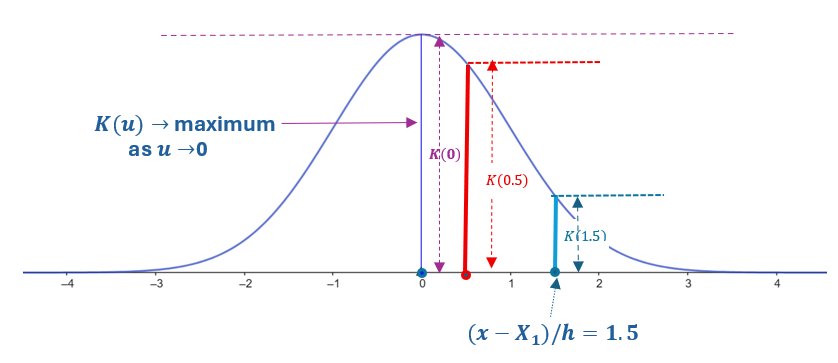

```{css, echo = FALSE}
#TOC::before {
  content: "Table of Contents";
  font-weight: bold;
  font-size: 1.2em;
  display: block;
  color: navy;
  margin-bottom: 10px;
}


div#TOC li {     /* table of content  */
    list-style:upper-roman;
    background-image:none;
    background-repeat:none;
    background-position:0;
}

h1.title {    /* level 1 header of title  */
  font-size: 22px;
  font-weight: bold;
  color: DarkRed;
  text-align: center;
  font-family: "Gill Sans", sans-serif;
}

h4.author { /* Header 4 - and the author and data headers use this too  */
  font-size: 15px;
  font-weight: bold;
  font-family: system-ui;
  color: navy;
  text-align: center;
}

h4.date { /* Header 4 - and the author and data headers use this too  */
  font-size: 18px;
  font-weight: bold;
  font-family: "Gill Sans", sans-serif;
  color: DarkBlue;
  text-align: center;
}

h1 { /* Header 1 - and the author and data headers use this too  */
    font-size: 20px;
    font-weight: bold;
    font-family: "Times New Roman", Times, serif;
    color: darkred;
    text-align: center;
}

h2 { /* Header 2 - and the author and data headers use this too  */
    font-size: 18px;
    font-weight: bold;
    font-family: "Times New Roman", Times, serif;
    color: navy;
    text-align: left;
}

h3 { /* Header 3 - and the author and data headers use this too  */
    font-size: 16px;
    font-weight: bold;
    font-family: "Times New Roman", Times, serif;
    color: navy;
    text-align: left;
}

h4 { /* Header 4 - and the author and data headers use this too  */
    font-size: 14px;
  font-weight: bold;
    font-family: "Times New Roman", Times, serif;
    color: darkred;
    text-align: left;
}

/* Add dots after numbered headers */
.header-section-number::after {
  content: ".";

body { background-color:white; }

.highlightme { background-color:yellow; }

p { background-color:white; }

}
```

```{r setup, include=FALSE}
# code chunk specifies whether the R code, warnings, and output 
# will be included in the output files.
if (!require("knitr")) {
   install.packages("knitr")
   library(knitr)
}
if (!require("pander")) {
   install.packages("pander")
   library(pander)
}
if (!require("ggplot2")) {
  install.packages("ggplot2")
  library(ggplot2)
}
if (!require("tidyverse")) {
  install.packages("tidyverse")
  library(tidyverse)
}

if (!require("plotly")) {
  install.packages("plotly")
  library(plotly)
}
if (!require("mixtools")) {
  install.packages("mixtools")
  library(mixtools)
}
## library(mixtools)
knitr::opts_chunk$set(echo = TRUE,       # include code chunk in the output file
                      warning = FALSE,   # sometimes, you code may produce warning messages,
                                         # you can choose to include the warning messages in
                                         # the output file. 
                      results = TRUE,    # you can also decide whether to include the output
                                         # in the output file.
                      message = FALSE,
                      comment = NA
                      )  
```

\


# Introduction

This note covers the fundamental concepts of probability distributions and their characterization through various functions, followed by non-parametric estimation methods for these distributions from data. 

Probability distributions form the bedrock of statistical analysis, providing the mathematical framework to describe and analyze random phenomena. The complete behavior of any random variable can be understood through four key functions: 

* **Cumulative Distribution Function (CDF)** captures the probability of observing values up to a certain point; 

* **Probability Density Function (PDF)** which describes the relative likelihood at specific values for continuous variables; 

* **Survival Function** measures the probability of exceeding a given value; and 

* **Hazard Function** quantifies the instantaneous risk of an event occurring. 

These interrelated functions provide complementary perspectives on the same underlying distribution, each offering unique insights for different analytical contexts. Understanding these fundamental concepts is crucial not only for theoretical probability but also for practical statistical inference, as they enable us to move from abstract mathematical descriptions to concrete data analysis through estimation techniques like empirical distributions and kernel density estimation.


# Probability Distribution Functions

This section discusses the four key functions that characterize a general distribution.

## Cumulative Distribution Function (CDF)

The Cumulative Distribution Function (CDF) of a random variable $X$ is defined as:

$$
F(x)=P(X \le x)
$$
**Properties**:

* $F(x)$ is non-decreasing

* $\lim_{x \to -\infty} F(x) = 0$

* $\lim_{x \to \infty} F(x) = 1$

* $F(x)$ is right-continuous


**Example**: A graphical representation of the **standard normal distribution CDF**:

$$
\Phi(x) = F(x) = \int_{-\infty}^x \frac{1}{\sqrt{2\pi}} \exp\left[-\frac{t^2}{2} \right]dt, \ \ -\infty < x < \infty.
$$

```{r}
# Create sequence of x values
x <- seq(-4, 4, length.out = 1000)

# Calculate CDF for normal distribution
cdf.normal <- pnorm(x)      # CDF

# Create data frame for plotting
cdf.df <- data.frame(x = x, CDF = cdf.normal)

# Plot CDF
cdf.plt <- ggplot(cdf.df, aes(x = x, y = CDF)) +
  geom_line(color = "blue", linewidth = 1) +
  geom_hline(yintercept = c(0, 1), linetype = "dashed", alpha = 0.5) +
  labs(title = "Cumulative Distribution Function (CDF) of Standard Normal",
       x = "percentiles of standard normal distribution", y = "Cumulative Distribution: F(x)") +
  theme(plot.title = element_text(hjust = 0.5),
        plot.margin = margin(t = 35, r = 20, b = 30, l = 30, unit = "pt"))
ggplotly(cdf.plt)
```

# Probability Density Function (PDF)

For continuous random variables, the Probability Density Function (PDF) is the derivative of the CDF:

$$
f(x)= \frac{dF(x)}{dx}
$$


**Properties**:

* $f(x) \geq 0$ for all $x$

* $\int_{-\infty}^{\infty} f(x) dx = 1$

* $P(a \leq X \leq b) = \int_a^b f(x) dx$

**Relationship with CDF**:

$$
F(x)=\int_{-\infty}^x f(t)dt
$$


**Example**: The graphical representation of the **standard normal distribution PDF**:

$$
\phi(x) = \frac{1}{\sqrt{2\pi}}\exp\left[\frac{x^2}{2}\right]
$$

```{r}
# Create sequence of x values
x <- seq(-4, 4, length.out = 1000)

# Calculate PDF for normal distribution
pdf.normal <- dnorm(x)

# Create data frame for plotting
pdf.df <- data.frame(x = x, PDF = pdf.normal)

# Plot PDF
pdf.plt <- ggplot(pdf.df, aes(x = x, y = PDF)) +
  geom_line(color = "red", linewidth = 1) +
  labs(title = "Probability Density Function (PDF) of Standard Normal",
       x = "percentiles of standard normal distribution", y = "Density Function: f(x)") +
  theme(plot.title = element_text(hjust = 0.5),
        plot.margin = margin(t = 35, r = 20, b = 30, l = 30, unit = "pt"))
ggplotly(pdf.plt)
```


The relationship between CDF and PDF are depicted by the following animated graph.

```{r fig.align='center', out.width= "49%", fig.alt="Animated graph depicting relationship between CDF and PDF", fig.cap="The botton left-tail area of the PDF is equal to the the heigh of the top CDF"}
include_graphics("CDFandPDF.gif")
```


# Survival Function

The Survival Function gives the probability that a random variable with density $f(x)$ exceeds a certain value ($x$):

$$
S(x)=P(X>x) = \int_x^\infty f(f) dt=1−F(x)
$$


This is particularly useful in survival analysis and reliability engineering in which positive random variables are used to model survival times and system reliability. The distribution is called lifetime distribution. 


**Example**: Visual representation of **exponential distribution survival function**. Recall that the exponential distribution has density function

$$
f(x) = \lambda e^{-\lambda x}, \ \ 0 \lt x \lt \infty.
$$

where $\lambda > 0$ is called **rate** (inverse scale).


```{r}
# Exponential distribution example
x.exp <- seq(0, 5, length.out = 1000)
survival.exp <- 1 - pexp(x.exp, rate = 1)

survival.df <- data.frame(x = x.exp, Survival = survival.exp)

surv.fun.plt <- ggplot(survival.df, aes(x = x, y = Survival)) +
  geom_line(color = "green", linewidth = 1) +
  labs(title = "Survival Function of Exponential(1) Distribution",
       x = "survival time", y = "survial function: S(x)") +
  theme(plot.title = element_text(hjust = 0.5),
        plot.margin = margin(t = 35, r = 20, b = 30, l = 30, unit = "pt"))
ggplotly(surv.fun.plt)
```


# Hazard Rate Function

The Hazard Function (or hazard rate) represents the instantaneous failure rate at time $x$, given survival up to time $x$:

$$
\lambda(x)=\lim_{\Delta\to 0} \frac{P(x\le X< {x+\Delta x}|X \ge x)}{\Delta x}. 
$$ 
 
Note that

$$
P(x\le X< x+\Delta x) = \int_x^{x+\Delta x} f(t)dt \approx f(x)\Delta x
$$

$$
P(x\le X< x+\Delta x|X \ge x) = \frac{P(x\le X< x+\Delta x \cap X \ge x)}{P(X \ge x)} = \frac{f(x)\Delta x}{S(x)}
$$

Therefore

$$
\lambda(x)=\lim_{\Delta\to 0} \frac{P(x\le X< {x+\Delta x}|X \ge x)}{\Delta x} = \frac{f(x)}{S(x)}. 
$$ 


**Components**:

* $\lambda(x)$: Hazard function

* $f(x)$: Probability density function

* $S(x)$: Survival function


**Example**: Graphical representation of **Weibull Distribution Hazard Function**. Note that Weibull distribution with scale parameter $\lambda$ and shape parameter $k$ has density

$$
f(x) = \frac{k}{\lambda}\left(\frac{x}{\lambda} \right)^{k-1}\exp(-x/\lambda )^k, \ \ x \ge 0. 
$$

We can derive the CDF in the following

$$
F(x) = 1 - \exp[-x/\lambda]^k.
$$


```{r}
# Weibull distribution hazard function
x.weibull <- seq(0.1, 5, length.out = 1000)

# PDF, CDF, and Survival for Weibull(shape=2, scale=1)
pdf.weibull <- dweibull(x.weibull, shape = 2, scale = 1)
survival.weibull <- 1 - pweibull(x.weibull, shape = 2, scale = 1)
hazard.weibull <- pdf.weibull / survival.weibull

hazard.df <- data.frame(
  x = x.weibull,
  Hazard = hazard.weibull,
  PDF = pdf.weibull,
  Survival = survival.weibull
)

haz.plt <- ggplot(hazard.df, aes(x = x, y = Hazard)) +
  geom_line(color = "purple", linewidth = 1) +
  labs(title = "Hazard Function of Weibull(shape=2, scale=1)",
       x = "Survival time", 
       y = expression(paste("Hazard rate function:", lambda, "(x)"))) +
  theme(plot.title = element_text(hjust = 0.5),
        plot.margin = margin(t = 35, r = 20, b = 30, l = 30, unit = "pt"))
ggplotly(haz.plt)
```


# Estimation of CDF and PDF

We only focus on the nonparametric estimation of CDF and PDF in this section.

## Empirical Distribution Function (EDF)

The Empirical Distribution Function is a non-parametric estimator of the true CDF:

$$
F_n(x) =\frac{1}{n}\sum_{i=1}^n I(X_i \le x) = \frac{[\ \text{Number of  } X_i \le x]}{n}
$$

where $I(\cdot)$ is the indicator function.

**Properties**:

* **Consistent estimator** of the true CDF

* Step function with jumps at observed data points

* Unbiased estimator


**Example**: Empirical Distribution

```{r}
set.seed(123)
# Generate sample data
sample_data <- rnorm(100, mean = 0, sd = 1)

# Create empirical CDF
empirical_cdf <- ecdf(sample_data)

# Plot empirical vs theoretical CDF
plot_df <- data.frame(
  x = seq(-3, 3, length.out = 1000),
  Empirical = empirical_cdf(seq(-3, 3, length.out = 1000)),
  Theoretical = pnorm(seq(-3, 3, length.out = 1000))
)

plot_df_long <- plot_df %>%
  pivot_longer(cols = c(Empirical, Theoretical), 
               names_to = "Type", values_to = "CDF")

Fn.plt <- ggplot(plot_df_long, aes(x = x, y = CDF, color = Type)) +
  geom_line(linewidth = 1) +
  scale_color_manual(values = c("Empirical" = "blue", "Theoretical" = "red")) +
  labs(title = "Empirical vs Theoretical CDF",
       subtitle = "Sample size n = 100 from Standard Normal",
       x = "x", y = "CDF") +
  theme(plot.title = element_text(hjust = 0.5),
        plot.margin = margin(t = 35, r = 20, b = 30, l = 30, unit = "pt"))
ggplotly(Fn.plt)
```


## Kernel Density Estimation (KDE)

Kernel Density Estimation provides a smooth estimate of the PDF:

$$
\hat{f}_h(x) = \frac{1}{nh}\sum_{i=1}^n K\left( \frac{x-X_i}{h}\right) = \frac{1}{n}\sum_{i=1}^n\left[\frac{K\left( \frac{x-X_i}{h}\right)}{h} \right]
$$

where:

* $K(\cdot)$ is the **kernel function** serves as a **weighting function** that assigns a probability density to a given point based on its proximity to the data points. Its primary purposes are:
  + **Smoothing**: Replaces jagged histograms with a continuous, differentiable curve.
  + **Local Weighting**: Determines how much influence a data point $x_i$ has on the density estimate at a target point $x$, based on their proximity.
  + **Normalization**: Guarantees the final result is a valid probability density function (integrates to 1).
  + **Flexibility**: The choice of kernel (Gaussian, Epanechnikov, etc.) allows the user to control the smoothness properties of the final estimate, though the bandwidth (h) is far more important.

* $h > 0$ is the bandwidth parameter
  + **Small h (in-focus)**: The blobs are very small. You see fine details (individual data points), but the image is very "noisy" and jagged (overfitting).
  + Large h (out-of-focus): The blobs are very large and spread out. The image is very smooth, but you lose all the detail and structure of the data (underfitting).
 
* $n$ is the sample size


**Why Kernels Are Related to "Weights"**


We will use the Gaussian kernel as an example; other kernels can be explained similarly. 

1. For a given value (not necessary an observed data value) in the domain of the underlying random variable $X$, $(x - X_i)/h$ is a **scaled deviation** that measures how the $i$-th data value $x_i$ from the given value $x$. If $X_i$ is close to the given value $x$, $(x - X_i)/h \to 0$.

2. As $(x - X_i)/h \to 0$, $K[(x - X_i)/h] \to \text{maximum}$. This implies that data values that are closer to the given value $x$ will contribute more to the value of the density at $x$. In other words, kernel is an **implicit weight function**.

The following figure shows the above logic.

```{r  echo = FALSE, fig.align='center', out.width= "70%"}

```


**To understand the role of $h$ in the kernel density estimator**, we examine the Gaussian kernel.

$$
K(u) = \frac{1}{\sqrt{2\pi}} \exp(-u^2/2)
$$

Substituting the Gaussian kernel into the density estimator, we rewrite $\hat{f}(x)$ as:

$$
\hat{f}_h(x) = \frac{1}{nh}\sum_{i=1}^n K\left( \frac{x-X_i}{h}\right) = \frac{1}{nh}\sum_{i=1}^n \left(\frac{1}{\sqrt{2\pi}} e^{-\frac{(x-X_i)^2}{2h^2}}\right)
$$

$$
= \frac{1}{n}\sum_{i=1}^n \left(\frac{1}{\sqrt{2\pi}\cdot h} e^{-\frac{(x-X_i)^2}{2h^2}}\right) \equiv \frac{1}{n}\sum_{i=1}^n w_{X_i}(x),
$$

where the term 

$$
w_{X_i}(x)=\frac{1}{\sqrt{2\pi}\cdot h} e^{-\frac{(x-X_i)^2}{2h^2}}
$$

is the Gaussian density centered at $X_i$ and having <font color = "red">**standard deviation $h$**</font>. Thus, <font color = "blue">**the kernel density estimate is the average of Gaussian densities centered at each data point $X_i$, all with standard deviation $h$**.</font>

\

<font color = "darkred" size = 3>**Therefore, in Gaussian kernel, the pre-selected bandwidth $h$ is the standard deviation.**</font>

\

The R function translate the above Gaussian kernel estimator

```{r}
my.kerf <- function(in.data, h, out.x){
  n <- length(in.data)     # sample size
  den <- NULL              # density vector to store output values
  for (i in 1:length(out.x)){
    den[i] <- sum(dnorm(out.x[i], mean=in.data, sd = h))/n  # kernel density formula
  }
  den  # return density values based on the out.x values
}
```

\

The following figure illustrates the Gaussian kernel density estimation for data generated from a **two-component Gaussian mixture model (distribution)** with different bandwidths.

* Built-in KDE: h = 0.4
* Manual KDE: h = 0.35

```{r}
# Complete KDE visualization
set.seed(123)
## mixture density with mixing proportion alpha = 0.5 (i.e., 50% to 50%)
dat1 <- rnorm(30, mean = -1, sd = 0.7)
dat2 <- rnorm(30, mean = 2, sd = 0.5)
sample.data <- c(dat1, dat2)
##
## true mixture density
x.true= seq(-3.5, 4,length = 200)
true.den <- 0.5*dnorm(x.true, mean = -1, sd = 0.7) + 0.5*dnorm(x.true, mean = 2, sd = 0.5)

# KDE based on built-in function density(): bandwidth = 0.4
kde <- density(sample.data, bw = 0.35)
kde.y <-approx(kde$x, kde$y, xout = x.true)$y

## Manual calculation with h = 0.35
my.kde <- my.kerf(in.data = sample.data, h = 0.35, out.x = x.true)

# Create individual kernels plot: the bandwidth = standard deviation
individual.kernels <- data.frame()
for (i in 1:length(sample.data)) {
  n <- length(sample.data)
  kernel.y <- dnorm(x.true, mean = sample.data[i], sd = 0.35) / n
  individual.kernels <- rbind(individual.kernels,
                             data.frame(x = x.true, y = kernel.y, 
                                       point = as.factor(i)))
}

# Create comparison data frame
kde.comparison <- data.frame(
  x = x.true,
  true.den = true.den,
  builtin.den = kde.y, 
  my.den = my.kde 
)

## Make long table
kde.comparison.long <- kde.comparison %>%
  pivot_longer(cols = c(true.den, builtin.den, my.den), 
               names_to = "Den.Type", values_to = "Density")

# ggplot KDE with different bandwidths
kde.type.effect.plt <- ggplot(kde.comparison.long,  aes(x = x, y = Density, color = Den.Type)) +
  geom_line(linewidth = 1) +
  geom_line(data = individual.kernels, aes(x = x, y = y, group = point), 
            color = "steelblue", alpha = 0.5, linewidth = 0.3) +
  geom_rug(data = data.frame(x = sample.data), aes(x = x, y = 0), 
           inherit.aes = FALSE, alpha = 0.3) +
  scale_color_manual(
    values = c("true.den" = "blue", "builtin.den" = "red", "my.den" = "orange"),
  ) +
  labs(title = "Kernel Density Estimation Comparison: Built-in vs Manual ",
       x = "x", y = "Density") +
   theme(plot.title = element_text(hjust = 0.5),
        plot.margin = margin(t = 35, r = 20, b = 30, l = 30, unit = "pt"))
ggplotly(kde.type.effect.plt )

```


**Common Kernel Functions**:

Gaussian: $K(u) = \frac{1}{\sqrt{2\pi}} e^{-\frac{1}{2}u^2}$

Epanechnikov: $K(u) = \frac{3}{4}(1 - u^2)$ for $|u| \leq 1$

Rectangular: $K(u) = \frac{1}{2}$ for $|u| \leq 1$


## Bandwidth Selection


**Bandwidth Selection**: The bandwidth $h$ controls the smoothness of the estimate:

* Small $h$: under-smoothing (high variance)

* Large $h$: over-smoothing (high bias)

The bandwidth $h$ is a hyperparameter that is chosen by users. There are **different** algorithms for estimating it based on different criteria. However, there are **baseline formulas** to select an initial bandwidth. The following is list of formulas for different kernels.

Denote `sd = sample standard deviation`, `IQR = interquartile range`, and `n = sample size`. We can calculate these statistics from the given data.


* The optimal initial bandwidth selection for a **Gaussian kernel**, under the assumption of normally distributed data, is the **Normal Reference Distribution, rule-of-thumb 0 (nrd0)**. This serves as the default bandwidth in R's `density()` function.

$$
\text{bw} = 0.9 \times \min(\text{sd}, \text{IQR}/1.34) \times n^{-1/5}
$$


* For the **Epanechnikov kernel**, the initial suggested choice is

$$
\text{bw} = 2.34 \times \text{sd}  \times n^{-1/5}
$$

* For **rectangular kernel**, the initial suggested choice is 

$$
\text{bw} = 1.84 \times \text{sd}  \times n^{-1/5}
$$
\


**Example**: Effect of binwidth in **Kernel Density Estimation**. We still use the 2-component Gaussian mixture as an example. The three bandwidths used in the example are $h = 0.5$ (default), 0.2 and 1.

```{r}
# Generate sample data
set.seed(123)
sample.data <- c(rnorm(200, mean = -1, sd = 0.8), 
                 rnorm(200, mean = 2, sd = 1))

# Create KDE with different bandwidths
kde.default <- density(sample.data, kernel = "gaussian")
kde.small.bw <- density(sample.data, bw = 0.2, kernel = "gaussian")
kde.large.bw <- density(sample.data, bw = 1, kernel = "gaussian")

# Create comparison data frame
kde.comparison <- data.frame(
  x = kde.default$x,
  Default = kde.default$y,
  Small.BW = kde.small.bw$y,
  Large.BW = kde.large.bw$y
)

kde.comparison.long <- kde.comparison %>%
  pivot_longer(cols = c(Default, Small.BW, Large.BW), 
               names_to = "Bandwidth", values_to = "Density")

# Plot KDE with different bandwidths
bin.effect.plt <- ggplot(kde.comparison.long, aes(x = x, y = Density, color = Bandwidth)) +
  geom_line(linewidth = 1) +
  geom_rug(data = data.frame(x = sample.data), aes(x = x, y = 0), 
           inherit.aes = FALSE, alpha = 0.3) +
  scale_color_manual(
    values = c("Default" = "blue", "Small.BW" = "red", "Large.BW" = "orange")#,
    #labels = c("Default (bw = 0.5)", "Small (bw = 0.2)", "Large (bw = 1.0)")
  ) +
  labs(title = "Kernel Density Estimation with Different Bandwidths",
       #subtitle = "Sample from mixture of two normal distributions",
       x = "x", y = "Density") +
   theme(plot.title = element_text(hjust = 0.5),
        plot.margin = margin(t = 35, r = 20, b = 30, l = 30, unit = "pt"))
ggplotly(bin.effect.plt )
```


**Comparison of Different Kernels**: The next figure shows the difference among the above mentioned three kernel functions.

```{r}
# Compare different kernel functions
x.kernel <- seq(-3, 3, length.out = 1000)

# Define kernel functions
gaussian.kernel <- dnorm(x.kernel)
epanechnikov.kernel <- ifelse(abs(x.kernel) <= 1, 0.75 * (1 - x.kernel^2), 0)
rectangular.kernel <- ifelse(abs(x.kernel) <= 1, 0.5, 0)

kernels.df <- data.frame(
  x = x.kernel,
  Gaussian = gaussian.kernel,
  Epanechnikov = epanechnikov.kernel,
  Rectangular = rectangular.kernel
)

kernels.long <- kernels.df %>%
  pivot_longer(cols = c(Gaussian, Epanechnikov, Rectangular), 
               names_to = "Kernel", values_to = "Density")

dif.kern.plt  <- ggplot(kernels.long, aes(x = x, y = Density, color = Kernel)) +
  geom_line(linewidth = 1) +
  labs(title = "Common Kernel Functions",
       x = "u", y = "K(u)") +
  theme(plot.title = element_text(hjust = 0.5),
        plot.margin = margin(t = 35, r = 20, b = 30, l = 30, unit = "pt"))
ggplotly(dif.kern.plt )
```


# Practical Implementation in R

## Distribution of Commute Times

Consider commute times (in minute) of a company located in a downtown of a city:

```
12, 15, 17, 18, 19, 20, 20, 21, 22, 23, 24, 25, 26, 27, 55, 58, 60, 62, 63, 65, 
65, 66, 67, 68, 70, 72, 73, 75, 25, 19, 60, 64
```

We are interested in estimating the distribution of commute times using an empirical distribution function and a Gaussian kernel density estimator.

**Solution** We first estimate the empirical cumulative distribution function $\hat{F}_n(t)$ with explicit expression

$$
\hat{F}_n(t) = \frac{\text{Number of } T_i \le t}{n}.
$$

```{r fig.align='center', fig.width=5, fig.height=4}
times <- c(12, 15, 17, 18, 19, 20, 20, 21, 22, 23, 24, 25, 26, 27, 55, 58, 60, 62, 63, 65, 
65, 66, 67, 68, 70, 72, 73, 75, 25, 19, 60, 64)
uniq.time <- sort(unique(times))   # need to sort the data values
## R function
my.ECDF <- function(indat, outx){
  # outx - a vector of given values
  freq.table <- table(indat)                          # frequency table
  uniq <- as.numeric(names(freq.table))          # unique data values
  rep.time <- as.vector(freq.table)                   # frequencies of the unique data values
  cum.rel.feq <- cumsum(rep.time)/sum(rep.time)       # cumulative relative frequencies: CDF
  cum.prob <- NULL
  for (i in 1:length(outx)){
    intvl.id <- which(uniq <= outx[i])      # identify the index meeting the condition
    cum.prob[i] <- cum.rel.feq[max(intvl.id)] # extract the cumulative prob according to CDF 
  }
  cum.prob             
}
##
plot(uniq.time, my.ECDF(indat = times, outx = uniq.time), type = "s",
     main = "ECDF of Commuting Times",
     xlab = "Commuting Times",
     ylab = "Cumulative Probability")
```

Next, we estimate the probability density function. Histograms are commonly used to visualize the shape of the distribution.


```{r fig.align='center'}
hist(times, breaks = 18, freq = FALSE)
```

The distribution of commute times is clearly bimodal. In the following section, we will implement the Gaussian kernel density estimator in R. 

**Pseudo-code**:

Input:   in.dat = input data (fix data set)
              h = bandwidth
          out.x = input x for evaluating the density (could be a vector)
Output: density values evaluated at x


```{r}
# in.dat = times
# h = 12
# x = c(20,50)
# in.data = times
###
my.kerf <- function(in.data, h, out.x){
  n <- length(in.data)     # sample size
  den <- NULL              # density vector to store output values
  for (i in 1:length(out.x)){
    den[i] <- sum(dnorm(out.x[i], mean=in.data, sd = h))/n  # kernel density formula
  }
  den  # return density values based on the out.x values
}
```


**R Built-in Estimator: `density()`**

Base R has a built-in density estimator `density()` with the following basic syntax:

```{}
density(x, bw = "nrd0", adjust = 1,
        kernel = c("gaussian", "epanechnikov", "rectangular",
                   "triangular", "biweight",
                   "cosine", "optcosine"),
        weights = NULL, window = kernel, width,
        give.Rkern = FALSE, subdensity = FALSE,
        warnWbw = var(weights) > 0,
        n = 512, from, to, cut = 3, ext = 4,
        old.coords = FALSE,
        na.rm = FALSE, ...)
```

The built-in function approx() is used in conjunction with density() to evaluate the kernel density estimate at specific input values.

```{}
approx   (x, y = NULL, xout, method = "linear", n = 50,
          yleft, yright, rule = 1, f = 0, ties = mean, na.rm = TRUE)
```


**Comparing `my.kerf()` with `density()`**

We expect the two functions to behave similarly. Any minor differences are due to approximation through interpolation.

```{r fig.align='center'}
xx = seq(0,100, length=200)
##  
my.den <- my.kerf(in.data = times, h = 12, out.x = xx)
## density()
kde <- density(times, bw = 12, kernel = "gaussian")
##
kde.y <-approx(kde$x, kde$y, xout = xx)$y
## base R plot
plot(xx, my.den, type = "l", main = "Comparing Kernel Density Estimators",
     xlab = "Commuting Times",
     ylab = "Kernel Density",
     lty = 1,
     lwd = 2,
     col = "navy")
## add density curve based on the built-in density()
lines(xx, kde.y, lty = 2, lwd = 2, col = "orange")
legend("topright", c("my.kerf()", "density()"), lty =c(1,2), lwd = rep(2,2),
       col = c("navy", "orange"), cex = 0.8, bty = "n")
```


## Simulated Data - Two-component Normal Mixture Distribution

**Complete Example**: Distribution Analysis

```{r}
# Generate sample data from a mixture distribution
set.seed(123)
n <- 1000
data.mixture <- c(rnorm(n*0.6, mean = 0, sd = 1), 
                  rnorm(n*0.4, mean = 3, sd = 0.5))

# Calculate empirical CDF
emp.cdf <- ecdf(data.mixture)

# Kernel density estimation
kde.mixture <- density(data.mixture)

# True PDF (for comparison - known in this simulation)
true.pdf <- function(x) {
  0.6 * dnorm(x, mean = 0, sd = 1) + 0.4 * dnorm(x, mean = 3, sd = 0.5)
}

# Create comprehensive plot
x.plot <- seq(-3, 6, length.out = 1000)

plot.data <- data.frame(
  x = x.plot,
  True.PDF = true.pdf(x.plot),
  KDE = approx(kde.mixture$x, kde.mixture$y, xout = x.plot)$y,
  Empirical.CDF = emp.cdf(x.plot),
  True.CDF = 0.6 * pnorm(x.plot, mean = 0, sd = 1) + 
             0.4 * pnorm(x.plot, mean = 3, sd = 0.5)
)

# PDF comparison
pdf.plot <- ggplot(plot.data, aes(x = x)) +
  geom_line(aes(y = True.PDF, color = "True PDF"), linewidth = 1) +
  geom_line(aes(y = KDE, color = "KDE"), linewidth = 1, linetype = "dashed") +
  geom_histogram(data = data.frame(x = data.mixture), 
                 aes(x = x, y = ..density..), 
                 fill = "gray", alpha = 0.5, bins = 30) +
  scale_color_manual(values = c("True PDF" = "gold", "KDE" = "purple")) +
  labs(title = "",
       x = "x", y = "Density", color = "") +
  theme_minimal()

# CDF comparison
cdf.plot <- ggplot(plot.data, aes(x = x)) +
  geom_line(aes(y = True.CDF, color = "True CDF"), linewidth = 1) +
  geom_line(aes(y = Empirical.CDF, color = "Empirical CDF"), 
            linewidth = 1, linetype = "dashed") +
  scale_color_manual(values = c("True CDF" = "red", "Empirical CDF" = "blue")) +
  labs(title = "",
       x = "x", y = "CDF", color = "") +
  theme_minimal()

# Display plots side by side
library(gridExtra)
subplot(ggplotly(pdf.plot), ggplotly(cdf.plot))
```


# Summary 

The following table summarizes distributions functions and their estimators and properties.

```{r}
summary_table <- data.frame(
  Function = c("CDF", "PDF", "Survival", "Hazard", "Empirical CDF", "KDE"),
  Definition = c(
    "$F(x) = P(X \\leq x)$",
    "$f(x) = \\frac{d}{dx}F(x)$",
    "$S(x) = P(X > x) = 1 - F(x)$",
    "$\\lambda(x) = \\frac{f(x)}{S(x)}$",
    "$\\hat{F}_n(x) = \\frac{1}{n}\\sum I(X_i \\leq x)$",
    "$\\hat{f}_h(x) = \\frac{1}{nh}\\sum K(\\frac{x-X_i}{h})$"
  ),
  Properties = c(
    "Non-decreasing, right-continuous",
    "Non-negative, integrates to 1",
    "Non-increasing, right-continuous",
    "Instantaneous failure rate",
    "Step function, unbiased",
    "Smooth, depends on bandwidth"
  )
)

kable(summary_table, caption = "Summary of Distribution Functions and Estimators")
```


**Key Points and Future Applications**

* CDF/ECDF provides complete information about the distribution of a random variable. It is widely used in
  + Classical Statistics
    - Finding quantiles which is the inverse of CDF, $F^{-1}(p)$, with $p = $ left-tail probability.
    - Defining goodness-of-fit tests that measures the discrepancy between two distributions.
    - Generating random numbers in simulations studies.
  + Data Science
    - ROC curves to compare two classification models/algorithms.
    - Anomaly/novelty detection focus on the tail probability $1 - F(t)$.
    - Exploratory data analysis (EDA) and visualization 

* PDF describes the relative likelihood of a continuous random variable. It is used in both parametric and nonparametric methods.
  + Parametric Statistical Models
    - Likelihood-based inference with applications in all areas with medium sized data sets
    - Bayesian modeling (to be introduced in the last part of this semester)
  + Distribution-free (through kernel density estimation) Applications in Statistics and Data Science
    - Modeling different processes with no specific parametric distributions
    
* Survival (S) and Hazard (h) functions are essential for survival and reliability analysis

* Kernel Density Estimation provides smooth PDF estimates but requires careful bandwidth selection

* The choice of kernel typically has less impact than bandwidth selection in KDE


