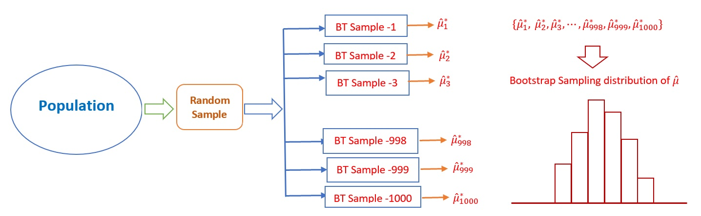
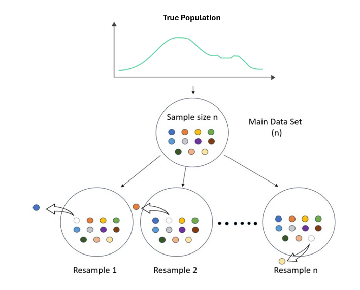
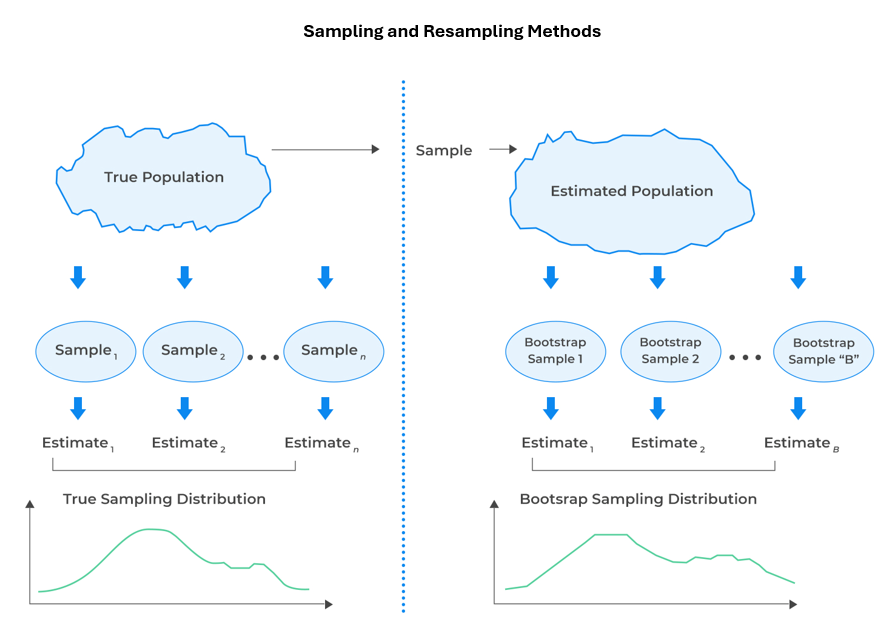

```{css, echo = FALSE}
#TOC::before {
  content: "Table of Contents";
  font-weight: bold;
  font-size: 1.2em;
  display: block;
  color: navy;
  margin-bottom: 10px;
}


div#TOC li {     /* table of content  */
    list-style:upper-roman;
    background-image:none;
    background-repeat:none;
    background-position:0;
}

h1.title {    /* level 1 header of title  */
  font-size: 22px;
  font-weight: bold;
  color: DarkRed;
  text-align: center;
  font-family: "Gill Sans", sans-serif;
}

h4.author { /* Header 4 - and the author and data headers use this too  */
  font-size: 15px;
  font-weight: bold;
  font-family: system-ui;
  color: navy;
  text-align: center;
}

h4.date { /* Header 4 - and the author and data headers use this too  */
  font-size: 18px;
  font-weight: bold;
  font-family: "Gill Sans", sans-serif;
  color: DarkBlue;
  text-align: center;
}

h1 { /* Header 1 - and the author and data headers use this too  */
    font-size: 20px;
    font-weight: bold;
    font-family: "Times New Roman", Times, serif;
    color: darkred;
    text-align: center;
}

h2 { /* Header 2 - and the author and data headers use this too  */
    font-size: 18px;
    font-weight: bold;
    font-family: "Times New Roman", Times, serif;
    color: navy;
    text-align: left;
}

h3 { /* Header 3 - and the author and data headers use this too  */
    font-size: 16px;
    font-weight: bold;
    font-family: "Times New Roman", Times, serif;
    color: navy;
    text-align: left;
}

h4 { /* Header 4 - and the author and data headers use this too  */
    font-size: 14px;
  font-weight: bold;
    font-family: "Times New Roman", Times, serif;
    color: darkred;
    text-align: left;
}

/* Add dots after numbered headers */
.header-section-number::after {
  content: ".";

body { background-color:white; }

.highlightme { background-color:yellow; }

p { background-color:white; }

}
```

```{r setup, include=FALSE}
# code chunk specifies whether the R code, warnings, and output 
# will be included in the output files.
if (!require("knitr")) {
   install.packages("knitr")
   library(knitr)
}
if (!require("pander")) {
   install.packages("pander")
   library(pander)
}
if (!require("ggplot2")) {
  install.packages("ggplot2")
  library(ggplot2)
}
if (!require("tidyverse")) {
  install.packages("tidyverse")
  library(tidyverse)
}

if (!require("boot")) {
  install.packages("boot")
  library(boot)
}
if (!require("fitdistrplus")) {
  install.packages("fitdistrplus")
  library(fitdistrplus)
}
## library(fitdistrplus)
knitr::opts_chunk$set(echo = TRUE,       # include code chunk in the output file
                      warning = FALSE,   # sometimes, you code may produce warning messages,
                                         # you can choose to include the warning messages in
                                         # the output file. 
                      results = TRUE,    # you can also decide whether to include the output
                                         # in the output file.
                      message = FALSE,
                      comment = NA
                      )  
```

\

# Introduction

We have discussed the sampling distribution of sample statistics based on theory. In this module, we are interested in sampling distribution using simulation approaches.

In statistics, Monte Carlo simulation refers to using computer-generated random numbers from population $F(x:\theta)$ to approximate statistical quantities that are **difficult** or **impossible to compute analytically**. It's essentially computational experimentation that lets you study statistical behavior through simulation rather than mathematical derivation.

A special Monte Carlo simulation we are going to introduce in this model is called Bootstrap Simulation (or Bootstrap resampling). The bootstrap sampling method is unequivocally a Monte Carlo simulation technique that generate random numbers from $F_n(x)$. It is perhaps the most influential and widely used Monte Carlo method in applied statistics over the last 40 years, precisely because it replaces difficult mathematical derivations with computationally intensive random sampling from the empirical data distribution.

This module focuses on non-parametric distribution and sampling from the non-parametric (empirical) distribution. The goal is to use samples taken from empirical distribution to approximate the sampling distributions of estimated parameters such as sample means, standard deviations, correlation coefficients, etc. Later, we will introduce Bootstrap confidence interval and Bootstrap hypothesis testing. Bootstrap methods and ideas are widely used in practice.


**Parametric vs. Nonparametric Approaches** and their applications will be detailed in this module:

-   **Parametric**: Assume data follows specific distribution with known probability distribution function (e.g., normal, exponential)
-   **Nonparametric**: Make minimal assumptions about underlying distribution


We will explain how to estimate an unknown **cumulative (probability) distribution function (CDF)** based on random sample taken from that population and how to repeated taken random sample of the **estimated cumulative (probability) distribution function (ECDF)**. The later is commonly called empirical cumulative distribution function (ECDF).


# Empirical Distribution Function (EDF) Revisited

**Mathematical Definition**

For a sample $X_1, X_2, \ldots, X_n$, the EDF $\hat{F}_n(x)$ is:

$$
\hat{F}_n(x) = \widehat{P}(X < x) = \frac{1}{n} \sum_{i=1}^n I(X_i \leq x) = \frac{ \# [ \text{ (data values}) < x]}{n}
$$

where $I(\cdot)$ is the indicator function.

**Example** Consider the distribution of customer waiting time at a restaurant. We randomly selected customers and recorded their waiting times (in minute) \$ \mathbf{X} ={2, 5, 10, 12, 15, 20, 35 }\$.

We plot relative frequency histogram and cumulative relative frequency histogram in the following.

```{r fig.align='center', fig.height=5, fig.width=8}
XX = c(2, 5, 10, 12, 15, 20, 35 )
par(mfrow = c(1,2))
# Method 1: Using hist() with cumulative = TRUE
h0 <- hist(XX, breaks = 8, freq = FALSE, plot = FALSE)
h0$counts <- h0$counts/sum(h0$counts)   # relative frequency
##
plot(h0, 
     col = "skyblue",
     ylim=c(0,1),
     main = "Relative Freq Histogram",
     xlab = "Waiting Time",
     ylab = "Relative Frequency")

##
h <- hist(XX, breaks = 8, freq = FALSE, plot = FALSE)
h$counts <- cumsum(h$counts)/sum(h$counts)  # cumulative relative frequency
plot(h, 
     col = "skyblue",
     ylim=c(0,1),
     main = "Cumulative Relative Freq. Histogram",
     xlab = "Waiting Time",
     ylab = "Relative Cumulative Frequency")
```

The histogram approximates the shape of the probability density function, while the cumulative histogram approximates the true cumulative distribution function (CDF).


**Properties**

-   Step function with jumps of size $1/n$ at each observation
-   Consistent estimator: $\hat{F}_n(x) \to F(x)$ as $n \to \infty$ (Glivenko-Cantelli theorem)
-   Nonparametric maximum likelihood estimator

**Algorithm for Constructing EDF**

-   **Sort** observations: $x_{(1)} \leq x_{(2)} \leq \ldots \leq x_{(n)}$
-   **Initialize** $\hat{F}_n(x) = 0$ for $x < x_{(1)}$
-   **For** each $i = 1, \ldots, n-1$:
    -   $\hat{F}_n(x) = i/n$ for $x_{(i)} \leq x < x_{(i+1)}$
-   **Set** $\hat{F}_n(x) = 1$ for $x \geq x_{(n)}$

**Pseudo-code**

```         
function empirical_cdf(data, x_values):
    # Input: data (array of n observations), x_values (points to evaluate)
    # Output: Fn values at x_values
    
    sorted_data = sort(data)
    n = length(data)
    Fn = empty_array(length(x_values))
    
    for j in 1:length(x_values):
        x = x_values[j]
        count = 0
        for i in 1:n:
            if sorted_data[i] <= x:
                count = count + 1
        Fn[j] = count / n
    
    return Fn
```

# Sampling Populations

Sampling is the process of selecting a subset of individuals from a larger population to estimate characteristics of the whole population. The core purposes are:

* **Practicality and Cost-Effectiveness**: It is often impossible, too expensive, and too time-consuming to study an entire population (a census). Sampling makes research feasible.

* **Speed**: Data can be collected and analyzed much faster from a sample than from an entire population.

* **Accuracy and Manageability**: With limited resources, you can ensure higher data quality (e.g., better-trained interviewers, more precise measurements) on a smaller sample. A small, well-managed study can be more accurate than a large, messy census.

* **Inference**: The fundamental goal is to make statistical inferences—to use sample statistics (e.g., mean, proportion) to estimate population parameters and draw conclusions about the population.

We have previously discussed that most established statistical methods are built on the assumption of independent and identically distributed (iid) sampling. To achieve iid samples, it is essential to distinguish between finite and infinite populations.

A finite population consists of a fixed, countable number of elements—such as registered voters in an election or items in a warehouse inventory. When sampling from such a population, the ratio of sample size to population size (*n/N*) is important. If this ratio is large, a finite population correction (FPC) should be applied to adjust standard errors. This adjustment accounts for the reduced variability that occurs when sampling without replacement from a limited pool. Typically, a complete sampling frame exists for finite populations, enabling approaches such as simple random sampling or stratified sampling.

In contrast, an infinite population is theoretical or effectively unbounded—such as all potential outputs of a continuous manufacturing process. In this case, sampling one unit does not affect the probability of selecting another, so no FPC is necessary, and standard formulas assuming independence apply directly. In practice, very large populations—for example, all global smartphone users—are often treated as infinite due to their immense scale and the absence of a complete sampling frame.


## Sampling True Population $F(x:\theta)$

The entire logic of statistical inference from a single sample to conclusions about a population rests on understanding the properties of this unobserved but fundamental **true sampling distribution**. As was discussed earlier, <font color = "red">**the true sampling distribution (i.e., exact sampling distribution) is used for exact inference.**</font> 

When the sampling distribution of a statistic is too complex to derive analytically, and thus no simple pivotal quantity exists for exact inference, the **Monte Carlo method** that takes samples from the <font color = "red">**true population**</font> provides a powerful simulation-based alternative. The general algorithm is outlined in the following

*  Choose estimator $\hat{\theta}$ for parameter $\theta$.
* **For a grid of possible $\theta$ values**
  + Simulate $B$ datasets from the <font color = "red">**true population $F(\cdot; \theta)$**</font>.
  + Compute $\hat{\theta}^*_1, \dots, \hat{\theta}^*_B$ from each sample.
  + Use the empirical distribution of $\hat{\theta}^*$ to estimate the **sampling distribution under this $\theta$**.
* Using the above Monte Carlo sampling distribution to make inference.

**Remarks**: 

1. <font color = "red">**An estimator of population parameter $\theta$, denoted by $\hat{\theta}$, is a function of data values**.</font>

2. Key Use Cases of Monte Carlo for Sampling Distributions

   2.1 When analytical derivation of the sampling distribution is intractable: eg., median and quantiles, etc.
  
   2.2 Ratio estimators such BMI ($w/h^2$) with very complex sampling distribution.
  
   2.3 Nonlinear functions of statistics
  
   2.4 Small sample inference

\

The above algorithm is outlined graphicall in the following.

```{r echo = FALSE, fig.align='center', out.width="95%"}
include_graphics("MonteCarlo.png")
```

\

**Example** Assume that the particular numeric characteristics of the WCU student population are the heights of all students.

We don’t know the distribution of the heights.

We also don’t know whether a specific sample size is large enough to use the central limit theorem. This means we don’t know whether it is appropriate to use the central limit theorem to characterize the sampling distribution of the mean height.

Due to the above constraints, we cannot find the sampling distribution of the sample means using only the knowledge of elementary statistics. However, if sampling is not expensive, we take repeated samples with the same sample size. The resulting sample means can be used to approximate the sampling distribution of the sample mean.


```{r fig.align='center', fig.width=4, fig.height=4}
wcu.height <- read.table("https://pengdsci.github.io/STA506/w04/w02-wcuheights.txt", header = TRUE)
##
sample.mean.vec = NULL      # define an empty vector to hold sample means of 
                            # repeated samples.
for(i in 1:1000){           # starting for-loop to take repeated random samples 
                            # with n = 81
  ith.sample = sample( x = wcu.height$Height, # population of all WCU students heights
                       size = 81,                # sample size = 81 values in the sample
                       replace = FALSE    # sample without replacement
                     )                    # this is the i-th random sample
   sample.mean.vec[i] = mean(ith.sample)  # calculate the mean of i-th sample and save it in
                                          # the empty vector: sample.mean.vec 
}
## histogram
hist(sample.mean.vec,                           # data used for histogram
     probability = TRUE,                       # relative frequency
     breaks = 14,                               # specify number of vertical bars
     xlab = "sample means of repeated samples", # change the label of x-axis
     # add a title to the histogram
     main="Approximated Sampling Distribution  \n  of Sample Means",
     cex.main = 0.9,
     col.main = "navy")   
lines(density(sample.mean.vec), col = "skyblue", lwd = 2)
```

The above Monte Carlo sampling distribution of sample mean (with n = 91) is approximately symmetric.


## Bootstrap Sampling Distribution

Standard bootstrap sampling involves repeatedly drawing samples, with replacement, from the empirical distribution of the observed data. This method treats the original sample as a proxy for the true population. It is formally justified by the Glivenko-Cantelli theorem, which ensures the empirical distribution converges uniformly to the true distribution as the sample size grows. Consequently, for large samples, resampling from this empirical approximation effectively replicates the process of drawing new samples from the underlying population, enabling robust non-parametric inference.


**The Bootstrap Principle**

*  **Idea**: Use the EDF $\hat{F}_n$ as an approximation to the true $F$
*  **Bootstrap world**: Sampling from $\hat{F}_n$ $\approx$ sampling from $F$ in real world
*  **Key insight**: Resample from the observed data with replacement


**Mathematical Algorithm**

Given data $X = (X_1, \ldots, X_n)$ and statistic $T(X)$:

* **Compute** the estimated parameter, denoted by $t_{\text{obs}} = T(X)$, from original sample
*  **For** $b = 1$ to $B$ ($B =$ number of bootstrap samples):
   + Draw $X^*_1, \ldots, X^*_n \sim \hat{F}_n$ (i.i.d.). More specifically, we use <font color = "red">**sampling with replacement**</font> from the original sample data set.
   + Compute $t^*_b = T(X^*)$
*  **Bootstrap distribution**: $\{t^*_1, \ldots, t^*_B\}$
*  **Estimate** standard error, confidence intervals, bias, etc.


**Pseudo-code for Bootstrap**

```         
function bootstrap(data, statistic, B):
    # Input: data (array), statistic (function), B (number of bootstrap samples)
    # Output: bootstrap distribution
    
    n = length(data)
    t_obs = statistic(data)
    bootstrap_dist = empty_array(B)
    
    for b in 1:B:
        # Resample with replacement
        indices = sample(1:n, n, replace=TRUE)
        bootstrap_sample = data[indices]
        bootstrap_dist[b] = statistic(bootstrap_sample)
    
    return list(observed=t_obs, distribution=bootstrap_dist)
```

The above standard Bootstrap algorithm is described in the following figure


```{r echo = FALSE, fig.align='center', out.width="95%"}

```


**Example** We still use the same simulated data of WCU students' height.

```{r fig.align='center', fig.width=4, fig.height=4}
### read the delimited data from URL
url = "https://pengdsci.github.io/STA506/w04/w02-wcuheights.txt"
wcu.height = read.table(url, header = TRUE)
# taking the original random sample from the population
original.sample = sample( wcu.height$Height,    # population of all WCU students heights
                       81,                      # sample size = 81 values in the sample
                       replace = FALSE          # sample without replacement
                 )                              
### Bootstrap sampling begins 
bt.sample.mean.vec = NULL      # define an empty vector to hold sample means of repeated samples.
for(i in 1:1000){              # starting for-loop to take bootstrap samples with n = 81
  ith.bt.sample = sample(x = original.sample, # Original sample with 81 WCU students' heights
                       size = 81,             # sample size = 81 MUST be equal to the sample size!!
                    replace = TRUE            # MUST use WITH REPLACEMENT!!
                       )                      # this is the i-th Bootstrap sample
  bt.sample.mean.vec[i] = mean(ith.bt.sample) # calculate the mean of i-th bootstrap sample and 
                                              # save it in the empty vector: sample.bt.mean.vec 
}
###
hist(bt.sample.mean.vec,                     # data used for histogram
     breaks = 14,                            # specify number of vertical bars
     probability = TRUE,
       xlab = "Bootstrap sample means",      # change the label of x-axis
      # add a title to the histogram
        main="Bootstrap Sampling Distribution \n of Sample Means",
          cex.main = 0.9,
       col.main = "navy")   
lines(density(bt.sample.mean.vec), col = "skyblue", lwd = 2)

```


**Remarks**

* **Mimicking the Original Sampling Process**: The bootstrap aims to simulate what would happen if you repeated the original data-collection experiment. If the original study collected $n$ observations, then each simulated experiment should also collect $n$ observations to preserve the inherent variability (standard error) of the estimator, which typically scales with $1/\sqrt{n}$.

* **Consistency and Theoretical Foundation**: The bootstrap's validity relies on the empirical distribution converging to the true distribution (per Glivenko-Cantelli). Drawing a smaller sample ($m < n$) would unnecessarily increase the Monte Carlo error and is less efficient. Drawing a larger sample ($m > n$) would incorrectly suggest you have more information than you actually do, artificially shrinking estimated standard errors and confidence intervals, leading to anti-conservative (overly confident) inference.

* **Preserving the Data Structure**: Many statistical properties (e.g., bias) are functions of sample size. Using $m \ne n$ would estimate the sampling distribution for a different hypothetical study size, not the one you actually conducted.


## Jackknife (Leave-one-out) Resampling


The Jackknife (leave-one-out) is a deterministic resampling method for bias reduction and variance estimation. Unlike the bootstrap's random sampling, it systematically creates *n* new datasets, each formed by omitting a single observation from the original *n*-sized sample. This process measures the sensitivity of a statistic to each data point, providing a direct, nonparametric assessment of the estimator's stability. The Jackknife is computationally efficient and particularly effective for smooth statistics (e.g., means, ratios), though it can fail for non-smooth estimators like the median. Its core outputs are closed-form estimates for bias and standard error, forming a foundation for more complex resampling techniques.

The above simple idea is depicted in the following figure.

```{r echo = FALSE, fig.align='center', out.width="75%"}

```

The pseudo code is based on the following algorith

**Algorithm**

1.  **Initialization:** Start with the observed sample $X = (x_1, x_2, \dots, x_n)$. Compute the original estimate $\hat{\theta} = s(X)$ for the statistic of interest.

2.  **Generate Pseudo-Values:** For each $i = 1, \dots, n$:
    a. Construct the *i*-th Jackknife sample $X_{(-i)}$ by removing observation $x_i$.
    b. Compute the corresponding statistic $\hat{\theta}_{(-i)} = s(X_{(-i)})$.

3.  **Calculate the Mean Replicate:** Compute the average of the Jackknife replicates:  
    $\bar{\theta}_{(\cdot)} = \frac{1}{n} \sum_{i=1}^{n} \hat{\theta}_{(-i)}$.

4.  **Estimate Bias & Variance:**  
    - **Bias:** $\widehat{\text{bias}}_{\text{jack}} = (n-1)(\bar{\theta}_{(\cdot)} - \hat{\theta})$.  
    - **Variance:** $\widehat{\text{var}}_{\text{jack}} = \frac{n-1}{n} \sum_{i=1}^{n} (\hat{\theta}_{(-i)} - \bar{\theta}_{(\cdot)})^2$.

5.  **Produce Corrected Estimate (Optional):**  
    A bias-corrected estimate is $\hat{\theta}_{\text{jack}} = \hat{\theta} - \widehat{\text{bias}}_{\text{jack}} = n\hat{\theta} - (n-1)\bar{\theta}_{(\cdot)}$.


**Example** The same simulated data will used in this Kackknife sampling distribution

```{r fig.align='center', fig.width=4, fig.height=4}
### read the delimited data from URL
url = "https://pengdsci.github.io/STA506/w04/w02-wcuheights.txt"
wcu.height = read.table(url, header = TRUE)

## Take an original random sample from the population
original.sample = sample( wcu.height$Height,    # population of all WCU students heights
                       81,                      # sample size = 81 values in the sample
                       replace = FALSE          # sample without replacement
                 )   

## Define a vector to store Jackknife sample means
jack.vec.avg <- NULL      # unspecified empty vector

## calculate jackknife sample means

for (i in 1:81){
  jack.vec <- original.sample[-i]  # leave one out
  jack.vec.avg[i] <- mean(jack.vec)
}

###
hist(jack.vec.avg,                     # data used for histogram
     breaks = 14,                            # specify number of vertical bars
     probability = TRUE,
       xlab = "Jackknife sample means",      # change the label of x-axis
      # add a title to the histogram
        main="Jackknife Sampling Distribution \n of Sample Means",
          cex.main = 0.9,
       col.main = "navy")   
lines(density(jack.vec.avg), col = "skyblue", lwd = 2)
```


## Comparisons Among The  

The Monte Carlo, bootstrap, and jackknife are foundational resampling methods with distinct approaches. 

* **Monte Carlo simulation** draws repeated samples from a known theoretical distribution, offering precise inference under correct model specification but becoming unreliable if the model is wrong. 

* In contrast, **the bootstrap resamples** with replacement from the observed data itself, providing flexible, nonparametric inference without strong distributional assumptions, making it a modern default despite its computational demands. 

* **The jackknife**, a deterministic and efficient alternative, systematically leaves out one observation at a time, yielding simple closed-form estimates of bias and variance for smooth statistics but lacking the bootstrap’s generality for complex estimators.


Choosing among them involves balancing assumptions, computation, and robustness. Monte Carlo excels when the underlying model is trusted; the bootstrap delivers versatile, data-driven inference for most applied problems; and the jackknife serves well for quick diagnostics and variance estimation. Together, they enable rigorous, computationally informed statistical analysis across diverse settings.

The following figure shows the steps of Monte Carlo and Bootstrap sampling distribution of a sample statistic


```{r echo = FALSE, fig.align='center', out.width="85%"}

```


# An Example: Correlation Coefficient

In this example, we study explore the sampling distribution of **sample correlation coefficient**. Since this application involves two variables, we need to set up the problem.

* **Definition and Setup:**
  + **Parameter of Interest**: The population correlation coefficient, $\rho$, estimated by the sample Pearson correlation $r$ computed from $n$ paired observations $(X_i, Y_i)$.
  + **Goal**: Estimate the sampling distribution of $r$ using the bootstrap, i.e., approximate the variability and shape of $r$ across hypothetical repeated samples from the population.

* **Original Sample:**
  + Data: $\mathbf{D} = \{(x_1, y_1), (x_2, y_2), \dots, (x_n, y_n)\}$
  + Compute original statistic:
$$
r_{\text{orig}} = \frac{\sum (x_i - \bar{x})(y_i - \bar{y})}{\sqrt{\sum (x_i - \bar{x})^2 \sum (y_i - \bar{y})^2}}
$$

* **Resampling:**
  + Draw $B$ bootstrap samples ($B$ large, e.g., 10,000) by sampling $n$ pairs **with replacement** from $\mathbf{D}$.
  + Each bootstrap sample $\mathbf{D}^*_b$ has the same size $n$, but some pairs appear multiple times, others not at all.

* **Compute Bootstrap Replicates:**
  + For each $\mathbf{D}^*_b$, compute the correlation coefficient $r^*_b$.
   
* **Empirical Distribution:** The collection $\{r^*_1, r^*_2, \dots, r^*_B\}$ forms the bootstrap approximation of the sampling distribution of $r$.

\

**Example**: When bootstrapping correlation, it is **critical** to resample the **entire ordered pair** $(X_i, Y_i)$ for each observation, rather than resampling the $X$ and $Y$ variables independently. This approach preserves the inherent joint structure of the original dataset, ensuring the bootstrap samples accurately reflect the true bivariate relationship.


```{r fig.align='center', fig.width=8, fig.height=4}
# Generate correlated data
set.seed(789)
n <- 40
true_rho <- 0.7      # true correlation coefficient in the simulation
x <- rnorm(n)
y <- true_rho * x + sqrt(1 - true_rho^2) * rnorm(n)
data_corr <- data.frame(x, y)

# R Function for Bootstrap correlation coefficient
bootstrap_correlation <- function(data, B = 10000) {
  n <- nrow(data)
  original_cor <- cor(data$x, data$y)     # sample correlation coefficient
  bootstrap_cors <- numeric(B)            # B-dimensional zero vector
  
  for (i in 1:B) {
    # Resample pairs (rows) to preserve correlation structure
    indices <- sample(1:n, n, replace = TRUE)
    bootstrap_sample <- data[indices, ]
    bootstrap_cors[i] <- cor(bootstrap_sample$x, bootstrap_sample$y)
  }
 bootstrap_cors
}

# Run bootstrap
cor_results <- bootstrap_correlation(data_corr, B = 5000)

# Visualization
par(mfrow = c(1, 2))
plot(x, y, main = "Original Data", pch = 19, col = "blue",
     xlab = "X", ylab = "Y")
abline(lm(y ~ x), col = "red", lwd = 2)

hist(cor_results, breaks = 30, 
     main = "Bootstrap Distribution\nof Correlation",
     xlab = "Correlation Coefficient", col = "steelblue",
     probability = TRUE, xlim = c(0, 1))
```


**Example**: Using boot Package to perform Bootstrap sampling and estimation.

```{r}
# Using the boot package for more sophisticated analyses
library(boot)

# Define statistic function - 
mean_stat <- function(data, indices) {
  d <- data[indices]  # Allows boot to select resamples
  return(mean(d))
}

# Run bootstrap using boot()
set.seed(123)
sample_data <- rgamma(25, shape = 2, rate = 1)
boot_results <- boot(sample_data, statistic = mean_stat, R = 5000)

# Basic bootstrap
plot(boot_results)
```


# Practical Considerations

**When to Use Bootstrap**

-   Small to moderate sample sizes
-   Complex statistics without known sampling distribution
-   Assessment of estimator variability
-   Bias estimation and correction

**Limitations and Caveats**

-   **Sample representativeness**: Bootstrap assumes sample represents population
-   **Small samples**: May perform poorly with $n < 20$
-   **Heavy-tailed distributions**: May require more bootstrap replications
-   **Dependence structure**: Requires modification for time series/spatial data
-   **Boundary issues**: Problems with statistics near boundaries

**Choosing Number of Bootstrap Samples (**$B$)

-   **Standard errors**: $B \geq 200$ often sufficient
-   **Confidence intervals**: $B \geq 1000$ recommended
-   **BCa intervals**: $B \geq 5000$ for stable results
-   **Percentile methods**: Larger $B$ for accurate tail estimation

# Summary

**Key Takeaways**

-   **Empirical Distribution Function** provides nonparametric estimate of CDF
-   **Bootstrap** samples from EDF to approximate sampling distribution
-   **Implementation in R** is straightforward with **sample()** or **{boot}** package
-   **Applications** include standard error estimation, confidence intervals, bias correction
-   **Multiple methods** exist (percentile, BCa) with different properties

**Practice Exercise**

-   Implement a bootstrap procedure for median estimation
-   Compare bootstrap standard errors with asymptotic approximations
-   Investigate how bootstrap performance changes with sample size using simulation
-   Apply bootstrap to a real dataset of your choice


