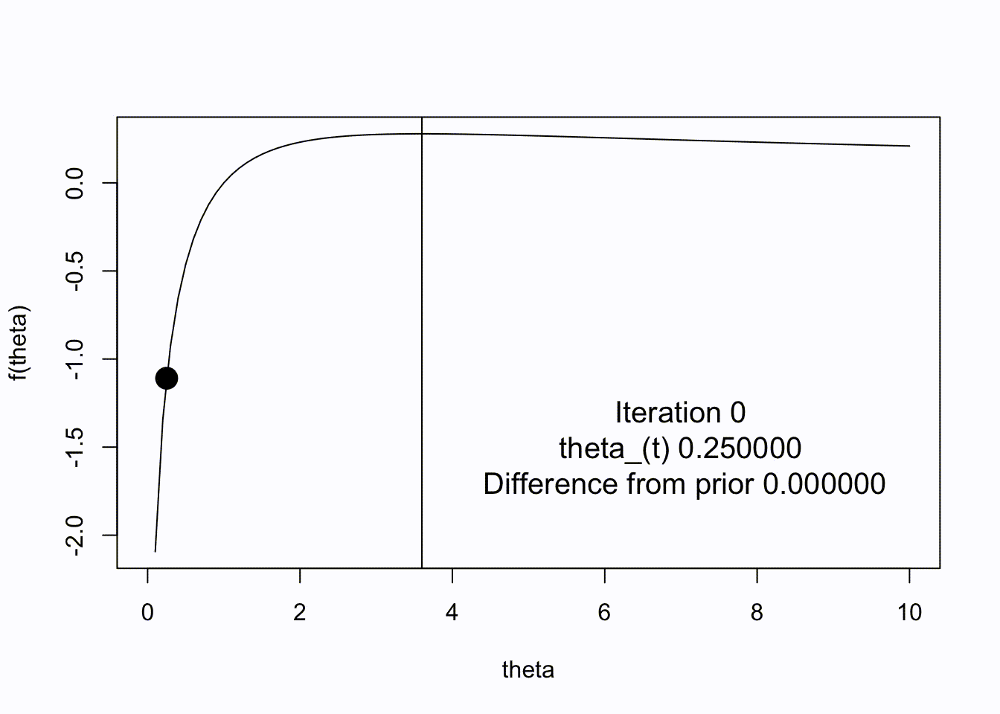
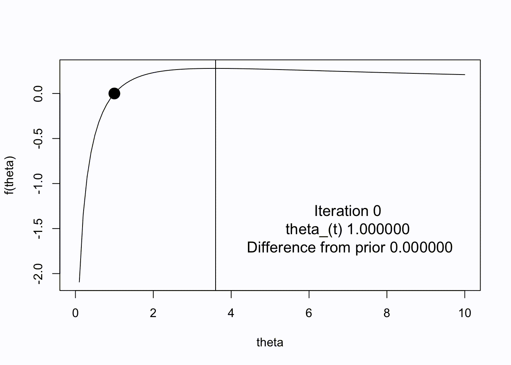
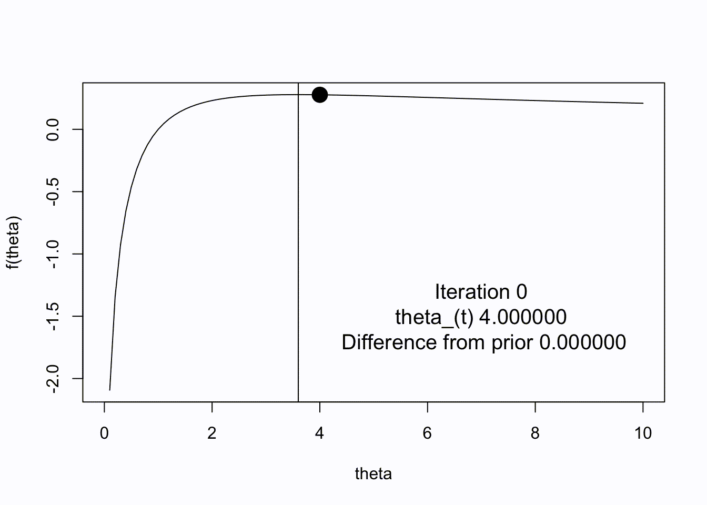
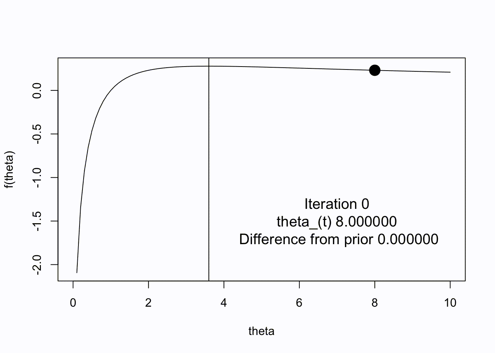
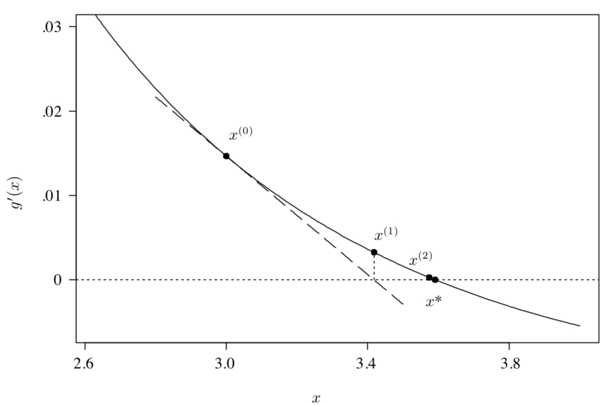
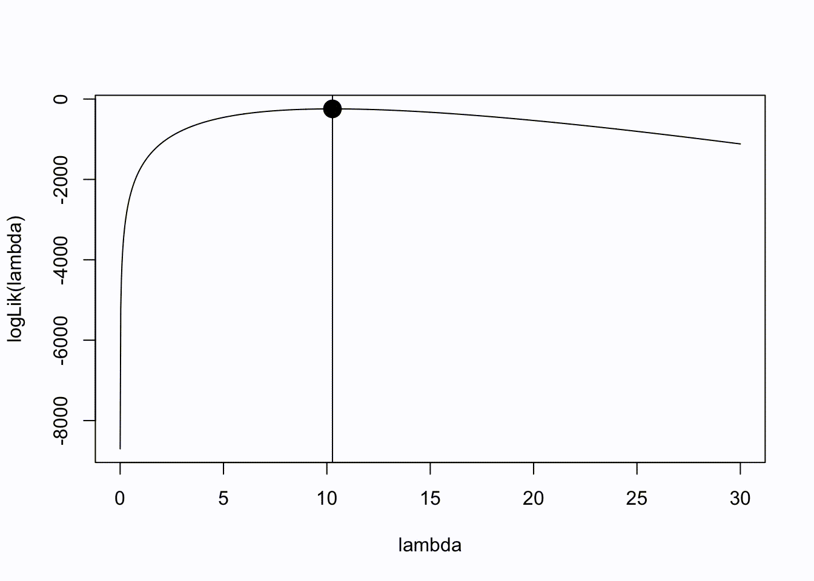

```{css, echo = FALSE}
#TOC::before {
  content: "Table of Contents";
  font-weight: bold;
  font-size: 1.2em;
  display: block;
  color: navy;
  margin-bottom: 10px;
}


div#TOC li {     /* table of content  */
    list-style:upper-roman;
    background-image:none;
    background-repeat:none;
    background-position:0;
}

h1.title {    /* level 1 header of title  */
  font-size: 22px;
  font-weight: bold;
  color: DarkRed;
  text-align: center;
  font-family: "Gill Sans", sans-serif;
}

h4.author { /* Header 4 - and the author and data headers use this too  */
  font-size: 15px;
  font-weight: bold;
  font-family: system-ui;
  color: navy;
  text-align: center;
}

h4.date { /* Header 4 - and the author and data headers use this too  */
  font-size: 18px;
  font-weight: bold;
  font-family: "Gill Sans", sans-serif;
  color: DarkBlue;
  text-align: center;
}

h1 { /* Header 1 - and the author and data headers use this too  */
    font-size: 20px;
    font-weight: bold;
    font-family: "Times New Roman", Times, serif;
    color: darkred;
    text-align: center;
}

h2 { /* Header 2 - and the author and data headers use this too  */
    font-size: 18px;
    font-weight: bold;
    font-family: "Times New Roman", Times, serif;
    color: navy;
    text-align: left;
}

h3 { /* Header 3 - and the author and data headers use this too  */
    font-size: 16px;
    font-weight: bold;
    font-family: "Times New Roman", Times, serif;
    color: navy;
    text-align: left;
}

h4 { /* Header 4 - and the author and data headers use this too  */
    font-size: 14px;
  font-weight: bold;
    font-family: "Times New Roman", Times, serif;
    color: darkred;
    text-align: left;
}

/* Add dots after numbered headers */
.header-section-number::after {
  content: ".";

body { background-color:white; }

.highlightme { background-color:yellow; }

p { background-color:white; }

}
```

```{r setup, include=FALSE}
# code chunk specifies whether the R code, warnings, and output 
# will be included in the output files.
if (!require("knitr")) {
   install.packages("knitr")
   library(knitr)
}
if (!require("pander")) {
   install.packages("pander")
   library(pander)
}
if (!require("ggplot2")) {
  install.packages("ggplot2")
  library(ggplot2)
}
if (!require("tidyverse")) {
  install.packages("tidyverse")
  library(tidyverse)
}

if (!require("plotly")) {
  install.packages("plotly")
  library(plotly)
}
if (!require("fitdistrplus")) {
  install.packages("fitdistrplus")
  library(fitdistrplus)
}
## library(fitdistrplus)
knitr::opts_chunk$set(echo = TRUE,       # include code chunk in the output file
                      warning = FALSE,   # sometimes, you code may produce warning messages,
                                         # you can choose to include the warning messages in
                                         # the output file. 
                      results = TRUE,    # you can also decide whether to include the output
                                         # in the output file.
                      message = FALSE,
                      comment = NA
                      )  
```

\


# Introduction

A common task in statistics is maximizing (or minimizing) complex univariate or multivariate functions. This is typically done in the context of maximizing likelihood functions with respect to a vector of unknown parameters, given the observed data.

The term "parameter estimation" may be one that you may have commonly heard in the past during discussions of fitting statistical models to data. More generally, this task pertains to an "optimization" problem, where we seek to find a set of parameter values that minimizes or maximizes some pre-defined objective function. When this objective function is a log likelihood function, this reduces to the problem of maximum likelihood estimation.

As we will see in this lecture, there are many potential approaches to use for optimization in this context. How best to optimize a function of interest depends on the nature of the function to be optimized, as well as practical concerns regarding a candidate procedure to be used. As such, another goal of this lecture is to explain the pros and cons of different approaches to help narrow down which approach may best for your particular problem.

Our discussion of optimization in this lecture will give a broad overview of existing approaches for unconstrained optimization, touching the many of the special cases that may have been covered in previous coursework. In a later lecture we will discuss the topic of "constrained" optimization, where the potential set of allowable solutions is no longer unrestricted. We focus on the class of problems where the function to be optimized is smooth, real valued, and is differentiable.


# Likeliood Function Optimization


## Example data

Let us assume that we have obtained a random sample of 100 individuals from WCU. Let us define $\mathbf{y} = (y_1, \ldots, y_{100})$, where $y_i$ pertains to the measured height of the $i$th individual in inches, for $i = 1, \ldots, 100$.

Let us further assume that the distribution of these heights is distributed normally with some unknown mean $\mu$ and known variance $\sigma^2 = 10$. That is, we assume that $y_i \sim N(\mu, \sigma^2)$, where $\sigma^2 = 10$.


A common question in this situation is what is the "best" estimate of $\mu$ given the data, and how do we obtain it? Answering this question can depend on the domain of the question being asked.


From introductory statistical courses, one may remember that an estimator for $\mu$, say $\hat{\mu}$, in this setting may be $\bar{y}$, or the mean of the observed heights. In more advanced statistical courses, you may have shown why this is the case via analytically deriving the maximum likelihood estimator for $\mu$, and proving its optimality relative to other potential estimators.


We can also re-express the original form of this problem as an intercept-only linear regression model: $y_i = X_i\beta + \epsilon_i$ where $\epsilon_i \sim N(0, \sigma^2)$, $X_i = 1$, and $\beta = \mu$, a scalar parameter in this setting. Again, $\sigma^2$ is known in this case. Given this, we can show that an estimate for $\beta$ ($\mu$) is also $\bar{y}$. Based on the normal equations from the linear model framework, we have closed form solution $\hat{\beta} = (X'X)^{-1}X'y$, which, plugging in $X$ and $y$ from this situation, also yields $\bar{y}$.

Regardless of the approach used here, we can show that we can obtain $\hat{\mu}$ analytically via optimizing some function of the data with respect to the parameter of interest $\mu$. In the linear regression case, we are minimizing the residual sum of squares of the model with respect to $\beta$ ($\mu$), and in the latter, we are maximizing the likelihood function assumed for the data with respect to $\mu$.

## Likelihood Function

The likelihood function $L(\theta)$, given the assumptions we made, for this sample can be written as

$$
L(\theta) = f(y_1 \mid \mu, \sigma^2) f(y_2 \mid \mu, \sigma^2) \dots f(y_{100} \mid \mu, \sigma^2)
= \prod_{i=1}^{100} f(y_i \mid \mu, \sigma^2)
= \frac{1}{(2\pi\sigma^2)^{n/2}} e^{-\frac{1}{2\sigma^2} \sum_{i=1}^{100} (y_i - \mu)^2}
$$

Here, $\theta = \mu$ since we are assuming that $\sigma^2$ is known. Taking logs of both sides, we can write the optimization of $L(\theta)$ above in terms of the optimization of $l(\theta)$, the log-likelihood, as it is a monotonic transformation of the original likelihood function.

**Why does this matter?** This implies that the maximum of one function will be the maximum of the other function, as the log transformation is a one-to-one mapping from the likelihood to the log-likelihood (example in figure below). Using approaches from prior courses, we can show that this function is smooth and convex in $\theta$, and therefore the maximum of the log-likelihood (and hence the likelihood) will be attained at the value of $\theta$ where the first derivative of $l(\theta)$ is equal to zero.

In the current problem, the MLE for $\mu$, $\hat{\mu} = \bar{y}$, is then obtained by setting the 1st derivative of the log-likelihood (also known as the **score function**) equal to 0 and then solving for $\mu$. In other words, we find the root of the score function with respect to $\mu$. For the regression based approach, we are simply minimizing the residual sum of squares (RSS), defined as $\sum_{i=1}^{100} (y_i - \mu)^2$.

We know that this log transformation often facilitates the calculation of derivatives when analytically solving for $\mu$. This approach of using another function as a proxy of the original function to simplify maximization can be found in several examples of optimization we will cover this semester.

## Visualizing the Optimization Problem for $\mu$


We can illustrate this approach using the following simulation example:

```{r}
mu <- 67
sigma2 <- 10
n <- 100

# generate random normally distributed samples
set.seed(123) # for reproducibility
y <- rnorm(n, mu, sd = sqrt(sigma2))

# print MLE of mu, mu_hat
cat("mean of y\n")
mean(y)

# print estimate of mu in linear model framework (intercept only model)
cat("\nbeta_hat from intercept only linear model\n")
lm(y ~ 1)$coef
```

Now, lets write some functions to help generate some figures in the next code chunk. These functions will help plot the likelihood, log likelihood, and RSS with respect to $\mu$ based on the setup above.

```{r}
# returns a vector of likelihood values over a given range of mu values
# helps for plotting later
lik <- function(mu, sigma2, y) {
  # create empty vector
  likelihood.vector <- rep(NA, length(mu))
  
  # for each mu, calculate the likelihood value
  for (i in 1:length(likelihood.vector)) {
    likelihood.vector[i] <- prod(dnorm(y, mu[i], sqrt(sigma2)))
  }
  
  # return vector of likelihood values spanning range of mu
  return(likelihood.vector)
}

# define the log-likelihood function with respect to mu
loglik <- function(mu, sigma2, y) {
  # create empty vector
  log.likelihood.vector <- rep(NA, length(mu))
  
  # calculate log likelihood
  for (i in 1:length(log.likelihood.vector)) {
    log.likelihood.vector[i] <- sum(dnorm(y, mu[i], sqrt(sigma2), log = TRUE))
  }
  
  return(log.likelihood.vector)
}

# define the residual sum of squares function with respect to mu
RSS <- function(mu, sigma2, y) {
  # create empty vector
  RSS.vector <- rep(NA, length(mu))
  
  # calculate log likelihood
  for (i in 1:length(RSS.vector)) {
    RSS.vector[i] <- sum((y - mu[i]) ^ 2)
  }
  
  return(RSS.vector)
}
```


Now that we got that out of the way, lets plot each of these functions with respect to $\mu$:

```{r fig.align='center', fig.width=7, fig.height=4}
# range of mu to plot over
range <- seq(45, 85, length.out = 1000)

# arrange the two plots in 1 row, three columns
par(mfrow = c(1, 3))

# likelihood plot
plot(
  range,
  lik(mu = range, sigma2 = sigma2, y = y),
  type = "l",
  ylab = "likelihood",
  xlab = "mu",
  main = "Likelihood Function"
)

# add vertical line at the mean of y
abline(v = mean(y), lty = 2, col = "grey")

# log likelihood plot
plot(
  range,
  loglik(mu = range, sigma2 = sigma2, y = y),
  type = "l",
  ylab = "log likelihood",
  xlab = "mu",
  main = "Log-Likelihood Function"
)

# vertical line at the mean of y
abline(v = mean(y), lty = 2, col = "grey")

# RSS plot
plot(
  range,
  RSS(mu = range, sigma2 = sigma2, y = y),
  type = "l",
  ylab = "RSS",
  xlab = "mu",
  main = "Residual Sum of Squares"
)

# vertical line at the mean of y
abline(v = mean(y), lty = 2, col = "grey")

# reset par
par(mfrow = c(1, 1))

```


We can clearly see that the maximum of the likelihood, log-likelihood, and RSS functions occurs at the MLE of μ, $\hat{\mu} = r round(mean(y), 5)$. At the MLE, we can see that the derivative of each of the functions are equal to zero, following the intuition of the procedures used to solve for $\hat{\mu}$. We will see that many of the algorithms proposed in this section are based upon this principle when trying to find the minimum/maximum of a function when no closed form solutions are available.


## MLE of $\lambda$ in Poisson

We know that the PMF for a Poisson random variable $Y$ with mean $\lambda$ may be written as $\text{Po}(Y=y|\lambda) = \frac{e^{-\lambda}\lambda^y}{y!}$, where $y$ is a draw from this distribution. Suppose we draw a sample of $n$ observations from this distribution and we wish to determine the MLE of $\lambda$, $\hat{\lambda}$.

As discussed in prior courses, the MLE can be obtained by simply taking the first derivative of the likelihood (or more easily, the log likelihood), setting it equal to 0, and then solving for the parameter of interest.

The log likelihood here is $l(\lambda) = -n\lambda + \left(\sum_{i=1}^n y_i\right)\log(\lambda) - \sum_{i=1}^n \log(y_i!)$. Then, taking the first derivative of the log likelihood, also known as the score function, we then solve the following: $0 = -n + (\sum_{i=1}^n y_i)/\lambda$ which gives the MLE $\hat{\lambda} = (\sum_{i=1}^n y_i)/n$.

In this example, as in the prior one, we can derive closed form solutions to obtain a parameter estimate for $\lambda$ by maximizing log-likelihood function. You can imagine the task of optimization as not too different from that of root finding. In the context of maximum likelihood estimation, this is akin to finding the root of the score equation.

However, what if we do not have such nice closed-form solutions for the model at hand?


# Univariate Optimization


In this module we will discuss some fundamental methods for the optimization of smooth nonlinear functions (Givens and Hoeting Chapter 2), beginning with single univariate functions and then discussing extensions to the multivariate case. Combinatorial optimization (Givens and Hoeting Chapter 3) will not be emphasized here but students can read this chapter if interested. We will also cover the EM algorithm (Givens and Hoeting Chapter 4) in more detail in a later lecture. There we will discuss the optimization of functions with missing data and also how the algorithm has been widely applied to general problems in statistics.

Let us consider the numerical optimization of the following function $f(\theta)$, which we seek to maximize with respect to $\theta$: 

$$
f(\theta) = \frac{\log(\theta)}{1+\theta}
$$. 


The traditional approach to maximizing $f(\theta)$, such as the one described in the previous example, is difficult to apply here as the analytical solution for $\theta$ after setting $f'(\theta) = 0$ is not easy to determine.

Here, 


$$
f'(\theta) = \frac{1+\theta - \theta\log(\theta)}{\theta(1+\theta)^2}
$$. 

So...not easy to solve for.

Let's first plot this function to determine its shape:

```{r}
# define function
f1 <- function(theta) {
  log(theta) / (1 + theta)
}

# make a plot with this function, where the x-axis ranges from 0 to 10
plot(
  f1,
  from = 0.1,  # start from 0.1 to avoid log(0)
  to = 10,
  ylab = "f(theta)",
  xlab = "theta",
  main = expression(f(theta) == frac(log(theta), 1 + theta)),
  lwd = 2
)

# add grid for better visualization
grid()
```


Plotting this function, the maximum of $f(\theta)$ appears to be between 3 and 4. So how exactly do we find the maximum of this function, and the value of $\theta$ that pertains to the maximum, $\hat{\theta}$?


## Basics of Numerical Optimization

Most numerical optimization methods are iterative and rely on the concept of successive approximations to find the value of $\theta$ pertaining to the minimum or maximum of the function of interest. Such algorithms require a starting value $\theta^{(0)}$, an initial guess for $\hat{\theta}$.

From this point, an algorithm will iteratively update its guess for $\hat{\theta}$ based on a predefined updating formula. Each update may be referred to an "iteration".


Ideally, the value of $\hat{\theta} \to \theta^*$ as $t \to \infty$, where $t$ is the iteration number such that $t > 0$ and $\theta^*$ is the “true” value of $\theta$ where the maximum of $f(\theta)$ is achieved. That is, as the number of iterations increases, we hope that $\hat{\theta}$ will approach its true optimum $\theta^*$, or converge to $\theta^*$.

However, given the iterative updating nature of these algorithms, $\hat{\theta}$ will never equal the value of $\theta^*$ exactly, and will only approach $\theta^*$ as $t$ increases. As a result, we need to define criteria or stopping rules indicating that the algorithm has converged, meaning that $\hat{\theta}$ is reasonably close to the prior estimate of $\hat{\theta}$ within some tolerance or distance.

In some cases, the algorithm may converge to some value other than $\theta^*$, or may not converge at all. We will discuss these situations later in this lecture.


### Graphical Illustration

To illustrate an application of numerical optimization to $f(\theta)$ (introduced earlier), see the following plot. Here, we utilized the commonly used Newton-Raphson algorithm to optimize $f(\theta)$. In it, we choose a starting value $\theta^{(0)} = 0.25$ to initialize the algorithm.

```{r fig.align='center', out.width="80%"}

```

You can see that the algorithm appears to converge in approximately 12 iterations to `3.59112` (the value of $\theta$ pertaining to the true maximum of $f(\theta)$), where the difference between the value of $\hat{\theta}$ at the 11th step ($\hat{\theta}^{(11)}$) and the 12th step ($\hat{\theta}^{(12)}$) is very small, and our final estimate for $\hat{\theta}^{(11)}$ is `3.59112`.


### Criteria for convergence

If we define our tolerance for convergence, or convergence threshold, at step $t$ as some small fixed value $\epsilon$, we may formally terminate the algorithm when $|\hat{\theta}^{(t)} - \hat{\theta}^{(t-1)}| < \epsilon$. Here, the optimal value of $\theta$ is $\theta^* = 3.59112$.

Clearly, larger values of $\epsilon$ will result in convergence in fewer iterations; however, the resulting $\hat{\theta}$ may be less accurate (further away from $\theta^*$). Depending on the application, a higher or lower convergence threshold may be warranted, where in some cases 10 decimal places of accuracy (and potentially requiring many more iterations for meeting the convergence threshold) may not be necessary.

Other criteria for determining convergence exist. You may notice from the definition above that the algorithm converges if the raw difference in $\theta^{(t+1)}$ and $\theta^{(t)}$ becomes small. However, if $\theta^*$ is generally large in scale (say, typically $> 10000$ in value), an $\epsilon$ of $10^{-6}$ may be too restrictive or difficult to reach, whereas if $\theta^*$ is in the range of $10^{-12}$–$10^{-16}$, an $\epsilon$ of $10^{-6}$ may simply be too liberal. All in all, the threshold’s stringency may depend on the scale of $\theta^*$.

For these reasons, some may prefer a relative convergence threshold, such as

$$
\frac{|\theta^{(t+1)} - \theta^{(t)}|}{|\theta^{(t)}|} < \epsilon,
$$

where convergence is now met if the change relative to $\theta^{(t)}$ is smaller than some proportion $\epsilon$. For example, we may instead want to terminate the algorithm when the change is less than, say, 1% of the previous value, rather than specifying an exact value of the difference. However, relative convergence criteria can become problematic if $\theta^{(t)}$ or $\theta^*$ is very close to zero. In that case, an alternative criterion

$$
\frac{|\theta^{(t+1)} - \theta^{(t)}|}{|\theta^{(t)}| + \epsilon} < \epsilon
$$

may help prevent instability in the criterion.

It is also helpful to add a maximum iteration limit to prevent runaway divergence or to halt poorly converging algorithms (sometimes indicative of bad starting points). This limit may also be reached if your convergence threshold is too stringent, and/or the iteration limit is too low. Printing a warning message when this limit is reached is common among algorithms.


In summary, when implementing optimization algorithms, we need criteria to determine when to stop the iterations. Common criteria include:

* **Absolute convergence**: Stop when $|\theta^{(k+1)} - \theta^{(k)}| < \epsilon$, where $\epsilon$ is a small tolerance.

* **Relative convergence**: Stop when $\frac{|\theta^{(k+1)} - \theta^{(k)}|}{|\theta^{(k)}|} < \epsilon$.

* **Function value convergence**: Stop when $|f(\theta^{(k+1)}) - f(\theta^{(k)})| < \epsilon$.


### Impact of starting values on convergence

The choice of starting values can significantly impact convergence. Let's demonstrate this with a simple example:

Lets now examine the impact of a different starting point for the algorithm, $\theta^{(0)} = 1$

```{r echo = FALSE, fig.align='center', out.width="80%"}

```

$\theta^{(0)} = 4$

```{r echo = FALSE, fig.align='center', out.width="80%"}

```

$\theta^{(0)} = 8$

```{r echo = FALSE, fig.align='center', out.width="80%"}

```


In some cases, the end result of the algorithm is the same regardless of the chosen starting point of the algorithm; however, fewer iterations may be required for $\theta^{(t)} \to \theta^*$ (due to a better starting point). In other cases, you can see that the model may converge to a value other than $\theta^*$, representing a *local optimum* rather than the *global optimum*. Or, the algorithm may not converge at all (diverges), as in the last example above.

In general, utilizing a starting value closer to $\theta^*$ results in convergence in fewer iterations. This illustrates the importance of choosing an informative starting point for the algorithm, and there are several strategies to do this—strategies that can vary by application.

Evaluating several starting points (perhaps chosen randomly) and choosing the starting point that ends in the best value of the objective function is the best way to avoid getting trapped in a local optimum or hitting convergence failures. Other strategies include:  

- **Graphing/plotting** the objective function  

- **Preliminary estimates** (based on simpler models, or method-of-moments estimates) 

- **Educated guesses** derived from domain knowledge  

- **Trial and error** to find reasonable initial values


### Basics of Numerical Optimization Summary

To summarize, the following concepts are important for understanding the set of optimization algorithms covered in the rest of this module:

* Optimization algorithms are iterative

* They require starting values

* Convergence criteria determine when to stop

* The choice of algorithm depends on the problem characteristics

* For univariate optimization, methods like golden section search, parabolic interpolation, or gradient-based methods can be used

In the next few sections we will go into detail regarding various approaches for numerical optimization and their pros and cons for use. We will also discuss algorithm-specific aspects of computational complexity and convergence speed of each approach to help you decide which algorithm may be better to utilize for your specific application.


## Newton-Raphson

In the previous illustration we used a common technique called **Newton–Raphson (NR)** to optimize the function of interest with respect to $\theta$. This approach is also referred to as **Newton’s Method**, and is an iterative updating scheme to arrive at $\hat{\theta}$.

One notable requirement of this method is that expressions for the first and second derivatives of the function of interest must be given. In some situations such derivatives may be difficult to derive or evaluate in practice. We will introduce several alternative numerical optimization procedures to handle these situations later in this lecture.

Let $\theta^{(0)}$ denote the starting value for the estimate of $\theta$ and assume that we wish to maximize some function $f(\theta)$. Then, based on this scheme, we update our estimate of $\theta$ at the $t$-th step of the algorithm ($\theta^{(t)}$) using the following expression:

$$
\theta^{(t+1)} = \theta^{(t)} + h^{(t)},
$$

where 

$$
h^{(t)} = -\frac{f'\!\bigl(\theta^{(t)}\bigr)}{f''\!\bigl(\theta^{(t)}\bigr)},
$$

$f'(\theta)$ is the first derivative of $f(\theta)$ with respect to $\theta$ evaluated at $\theta^{(t)}$, and $f''(\theta)$ is the second derivative of $f(\theta)$ with respect to $\theta$ evaluated at $\theta^{(t)}$.

If we sought to instead *minimize* $f(\theta)$, the same update would apply. After choosing an appropriate starting point for the algorithm and stopping rule, we can apply the updating rule above as we had in the previous example to arrive at $\hat{\theta}$.

---

**A few obvious questions:**

- How did we get this expression?  

- Why would we even expect $\theta^{(t)} \to \theta^*$?  

- Under what conditions do we expect the algorithm to work well or not work well?  

- How quickly would we expect $\theta^{(t)} \to \theta^*$ in $t$?  

There may be situations where the algorithm may not converge or do so in a suitable timeframe. Understanding the rationale behind this approach and its properties may help navigate these situations and provide clues to what alternative approaches may work.


### Rationale and Derivation

Let us suppose that $f'(\theta)$ is continually differentiable, $f''(\theta)$ exists, and that $f''(\theta) \neq 0$ (suggesting that the first derivative is non-constant). At a given iteration $t$, $f'(\theta^*)$ can be approximated by a linear Taylor Series Expansion about $\theta^*$, the unknown true value of $\theta$ that maximizes $f(\theta)$. Yes, we do not know what $\theta^*$ is in reality, but this term is important when we talk about the conditions that may impact the performance of this approach later on.

Under this approximation, we have

$$
0 = f'(\theta^*) \;\approx\; f'\bigl(\theta^{(t)}\bigr) + \bigl(\theta^* - \theta^{(t)}\bigr) \, f''\bigl(\theta^{(t)}\bigr).
$$

Let's unpack what this means for one second. If you recall, most analytic approaches to optimizing algorithms start with setting the 1st derivative to 0 and solving for the value of $\theta$ satisfying this equality. In this setting, we assume that such an analytic solution does not exist. Therefore, we approximate this derivative using this linear Taylor Series approximation around $\theta^*$, and then set this approximation to zero. Here, $f'(\theta^*)$ is approximated by the tangent line at $\theta^{(t)}$ (see figure below).

```{r fig.align='center', out.width="80%"}

```

*Example of Newton–Raphson in the context of the previous illustration.* The algorithm approximates $g'$ by its tangent line at $\theta^{(t)}$, whose root $\theta^{(t+1)}$ serves as the next approximation of the true root $\theta^*$.

Since we are approximating $f'(\theta^*)$ with its tangent line at $\theta^{(t)}$, it makes sense that we can approximate the *root* of $f'(\theta^*)$ (the point at which it equals 0) with the root of the tangent line at $\theta^{(t)}$ (see example in the figure above at step 1). Under this rationale, we solve for $\theta^*$ in the linear Taylor Series approximation above. Doing this, we have

$$
\theta^* \;=\; \theta^{(t)} - \frac{f'\bigl(\theta^{(t)}\bigr)}{f''\bigl(\theta^{(t)}\bigr)} \;=\; \theta^{(t)} + h^{(t)}.
$$

In other words, the value for $\theta^*$ at iteration $t$ is approximated using the current guess $\theta^{(t)}$ and a refinement step $h^{(t)}$. Successive iterations of this approach will yield closer and closer approximations to $\theta^*$.


### Updating Equation

Using the above rationale, we can define the updating strategy as

$$
\theta^{(t+1)} = \theta^{(t)} - \frac{f'\bigl(\theta^{(t)}\bigr)}{f''\bigl(\theta^{(t)}\bigr)} = \theta^{(t)} + h^{(t)}.
$$

When the optimization of $f$ corresponds to maximum likelihood estimation, where $\hat{\theta}$ is the solution to $l'(\theta) = 0$, the updating equation is given as

$$
\theta^{(t+1)} = \theta^{(t)} - \frac{l'\bigl(\theta^{(t)}\bigr)}{l''\bigl(\theta^{(t)}\bigr)}.
$$


### Requirements and Convergence

But how do we know that successive iterations using the updating equation above will result in convergence to $\theta^*$, rather than diverging or converging to some other value? In practice, this depends on the shape of the function you are maximizing as well as your chosen starting value.

As we can see from the prior examples, choosing starting values too far away from $\theta^*$ results in slower convergence or even divergence. Choosing values closer to $\theta^*$ results in quicker convergence.

We can show that if $f'''(\theta)$ is continuous and $\theta^*$ is a simple root of $f'(\theta)$ (implying $f'(\theta^*) = 0$), then there exists a neighborhood around $\theta^*$ for which NR converges to $\theta^*$ from any starting value $\theta^{(0)}$ within that neighborhood (GH 2.1.1, eq. 2.18). The definition of “neighborhood” in this sense is somewhat arbitrary, but is meant to indicate that convergence is likely if you are in some close vicinity of $\theta^*$. GH provides this proof using arguments based upon the error of a quadratic Taylor Series approximation for $f'(\theta)$ in Section 2.1.1.

More specifically, if $f'(\theta)$ is twice differentiable, is convex, and has a root, then NR will converge from any point! These conditions are typically met by common likelihood functions in statistics (but not always).

If you are starting in some arbitrary interval $[a,b]$, you can check the following conditions to determine whether the NR algorithm will converge from any $\theta^{(0)}$ in that interval:


1. $f''(\theta) \neq 0$ on $[a,b]$  

2. $f'''(\theta)$ does not change sign on $[a,b]$  

3. $f'(a) f'(b) < 0$, and  

4. $|f'(a) / f''(a)| < b - a$ and $|f'(b) / f''(b)| < b - a$


These statements follow from the proof given in GH 2.1.1. In practice, most do not manually evaluate these statements before applying NR, but in cases where problems arise, they can help explain convergence difficulties.

Rephrased, we can translate these conditions into the following:

- **Condition 1**: The 2nd derivative is never equal to zero in the interval → $f'(\theta)$ is never flat on $[a,b]$ → $f'(\theta)$ can potentially intersect 0 in the interval → $f'(\theta)$ has the potential to have a root in $[a,b]$.

- **Condition 2**: The third derivative does not change sign on $[a,b]$ → the sign of the second derivative stays the same in the interval on $[a,b]$ → no change in convexity/concavity in the interval.

- **Condition 3**: The 1st derivative at $a$ is positive and negative at $b$ (or vice versa) → $f'(\theta)$ changes sign at some point in $[a,b]$ → implies a root for $f'(\theta)$ must exist in $[a,b]$.

- **Condition 4**: The absolute value of $h$ at $a$ or at $b$ is less than the length of the interval → the step size (refinement) assuming $\theta^{(0)} = a$ or $\theta^{(0)} = b$ is smaller than the length of the interval being considered. If this is not true, the update will definitely not be contained in $[a,b]$.

Using similar arguments, we can show that the convergence order for NR is **quadratic**, meaning the accuracy of the solution will double with each iteration $t$. Higher convergence order implies that accurate approximations for the parameter(s) of interest are achieved in fewer iterations.

However, we will see that algorithms with higher convergence orders may also be less robust to different conditions and may fail more frequently than slower algorithms. For example, NR is relatively more sensitive to the starting value compared to other methods.


### Pros and Cons


* **Pros**
  +  **Speed:** Extremely fast (quadratic) convergence

* **Cons**

  + Requires derivation and evaluation of 1st and 2nd derivatives

  + Relatively more sensitive to the choice of starting value

  + In the multivariate setting, need checks on the Hessian to avoid singularities and other issues

  + If the derivatives and/or likelihood are complicated, NR may not be an attractive choice

  + Additional evaluations of derivatives may be costly (e.g., when the likelihood involves numerical integration)

With respect to NR, John Nash in *Nonlinear parameter optimization using R tools* summarizes:

> There are lots of dangerous beasts in the night-time optimization forest.

The apparent difficulties with NR in the multivariate setting are why it was not included in the original R general-purpose optimization functions `optim` and `optimx`.


### Example of Newton Raphson 

Let's determine the 1st and 2nd derivatives of the simple Poisson example from earlier. This is the same approach that we will apply to the Poisson Regression example, but that will be left for a later section.

Here

$$
l'(\lambda) = -n + \frac{\sum_{i=1}^n y_i}{\lambda}
$$

and the second derivative is

$$
l''(\lambda) = -\frac{\sum_{i=1}^n y_i}{\lambda^2}.
$$

Now, let's generate some data and apply NR:


```{r}
# generate 100 poisson(10) samples
set.seed(10)
n = 100
lambda = 10
y = rpois(n, lambda)
mean(y)
```

Now lets get our functions in order

```{r}
# log likelihood function
logLik = function(lambda, y) {
  value = sum(dpois(y, lambda = lambda, log = T))
  return(value)
}

# lets write a function for the first derivative
d1 = function(lambda, y) {
  first = -length(y) + sum(y) / lambda
  return(first)
}

# now the second
d2 = function(lambda, y) {
  second = -sum(y) / lambda ^ 2
  return(second)
}
```


Now lets apply NR. We pick a tolerance level (tol) and starting value (lam). Here the choice of starting value is arbitrary. We can vary this to see its impact on the final value later. It’s also helpful to specify a maximum number of iterations (maxit) to halt the algorithm so it does not loop infinitely if there is a convergence issue. We can also add conditions to check whether $\lambda (t)>0$.

```{r}
# now lets apply NR. First lets set the tolerance and choose a starting value
# the start
tol = 10^-4
lam = 0.1
maxit = 50
iter = 0 # iteration counter
eps = Inf # keeps track of current difference
start = Sys.time() # record start time

while (eps > tol & iter < maxit) {
  # save the previous value
  lam0 = lam
  
  # calculate h, the increment
  h = -d1(lambda = lam, y = y) / d2(lambda = lam, y = y)
  
  # update lambda
  lam = lam + h
  
  # update the log likelihood
  logL = logLik(lambda = lam, y = y)
  
  # calculate the diff in lambda, could also use the log likelihood if we wanted
  eps  = abs(lam - lam0)
  
  # update the iteration number
  iter = iter + 1
  if (iter == maxit)
    warning("Iteration limit reached without convergence")
  
  # print out info to keep track
  cat(sprintf("Iter: %d logL: %f lam: %f h: %f eps:%f\n", iter, logL, lam, h, eps))
}
```

```{r}
end = Sys.time()
print(end - start)
```

We can also visualize this below

```{r echo = FALSE, fig.align='center', out.width="80%"}

```


## Fisher Scoring

Fisher Scoring is an alternative to NR when performing maximum likelihood estimation, where we simply replace $l''\!\bigl(\theta^{(t)}\bigr)$ with $I\!\bigl(\theta^{(t)}\bigr)$, the expected Fisher Information matrix at iteration $t$. We can show that $-l''(\theta)$ — the observed Fisher Information — is an approximation for $I(\theta)$ (GH 1.4), so it is not surprising that the asymptotic properties for NR and FS are similar.

The updating equation is given as

$$
\theta^{(t+1)} = \theta^{(t)} + I\!\bigl(\theta^{(t)}\bigr)^{-1} \, l'\!\bigl(\theta^{(t)}\bigr).
$$

Given the particular problem at hand, NR or FS may be easier to derive analytically, where the latter only needs knowledge of the 1st derivatives and avoids computation of the 2nd derivatives. According to GH, FS may be used in early iterations for rapid improvements, and NR can be used to make better refinements near the end.

* **Pros**

  + Avoids derivation and computation of the 2nd derivative

  + Similar asymptotic properties to NR

  + In the multivariate setting, may be more stable than NR (will talk about this later)

  + Often works better in the beginning to make rapid improvements

* **Cons**

  + May not be as fast for refinement near the end


## Secant Method

This approach is similar to NR, except that the second derivative in the updating equation is replaced with a finite‑difference approximation, where now the updating equation is  

$$
\theta^{(t+1)} = \theta^{(t)} - f'\!\bigl(\theta^{(t)}\bigr) \,
\frac{\theta^{(t)} - \theta^{(t-1)}}{f'\!\bigl(\theta^{(t)}\bigr) - f'\!\bigl(\theta^{(t-1)}\bigr)} .
$$

Conditions for convergence are similar to NR, but we can show through similar arguments that the convergence order for the secant method is $\phi \approx 1.618$ (the golden ratio) instead of 2.  

To initialize this approach, **two starting values** have to be provided. Typically the first value is picked in a manner not dissimilar to the other approaches described in this lecture, and the second value is picked relatively close to the first one. Then we may compute the first update and proposal for $\theta^{(1)}$ and start the algorithm.

* **Pros**

  + Avoids derivation and computation of the 2nd derivative
  
  + Similar asymptotic properties to NR

* **Cons**

  + Slower convergence relative to NR (order ~1.618 vs. quadratic)


## Examples

Let’s apply FS to our simple Poisson problem. To do this, let’s first calculate the expected information \(I(\theta)\), which in the univariate setting is  

$$
I(\theta) = \mathbb{E}\!\bigl[l'(\theta)^2\bigr] = \mathbb{E}\!\bigl[-l''(\theta)\bigr].
$$

This expression can be calculated by brute force using the following steps:

$$
\begin{aligned}
\mathbb{E}\!\bigl[l'(\theta)^2\bigr]
&= \mathbb{E}\!\left[ \left(-n + \frac{\sum_{i=1}^n y_i}{\lambda}\right)^2 \right] \\[4pt]
&= \mathbb{E}\!\left[ \frac{\bigl(\sum_{i=1}^n y_i\bigr)^2}{\lambda^2}
   \;-\; \frac{2n \bigl(\sum_{i=1}^n y_i\bigr)}{\lambda}
   \;+\; n^2 \right] \\[4pt]
&= \frac{\mathbb{E}\!\bigl[(\sum_{i=1}^n y_i)^2\bigr]}{\lambda^2}
   \;-\; \frac{2n \sum_{i=1}^n \mathbb{E}[y_i]}{\lambda}
   \;+\; n^2 \\[4pt]
&= \frac{n\lambda + (n\lambda)^2}{\lambda^2}
   \;-\; \frac{2n \bigl(\sum_{i=1}^n \lambda\bigr)}{\lambda}
   \;+\; n^2 \\[4pt]
&= \frac{n}{\lambda} + n^2 \;-\; 2n^2 \;+\; n^2 \\[4pt]
&= \frac{n}{\lambda}.
\end{aligned}
$$

We can see this has a nice form and avoids having to analytically determine a second derivative.

```{r}
# now lets apply FS using same framework as before
# the start
tol = 10 ^ -4
lam = 0.1
maxit = 50
iter = 0
eps = Inf

start = Sys.time()
while (eps > tol & iter < maxit) {
  # save the previous value
  lam0 = lam
  
  # calculate h, the increment. 
  h = d1(lambda = lam, y = y) / (n / lam)
  
  # update lambda
  lam = lam + h
  
  # lambda cant be less than or equal to 0, so put a check for this
  if (lam <= 0)
    stop("lambda leq 0")
  
  # update the log likelihood
  logL = logLik(lambda = lam, y = y)
  
  # calculate the diff, could also use the log likelihood if we wanted
  eps  = abs(lam - lam0)
  
  # update the iteration number
  iter = iter + 1
  if (iter == maxit)
    warning("Iteration limit reached without convergence")
  
  # print out info to keep track
  cat(sprintf("Iter: %d logL: %f lam: %f h: %f eps:%f\n", iter, logL, lam, h, eps))
}
```


```{r}
end = Sys.time()
print(end - start)
```


# Multivariate Optimization

The approaches that we have described also extend to the multivariate setting, where we seek to optimize a function with respect to more than one parameter at the same time. More formally, we wish to find the optimum of some real‑valued function $f(\boldsymbol{\theta})$, where $\boldsymbol{\theta}$ is now a $p$-dimensional vector of parameters such that  

$$
\boldsymbol{\theta} = (\theta_1, \dots, \theta_p)^T.
$$

Similar to before, the estimate of $\boldsymbol{\theta}$ at step $t$ will be denoted as $\boldsymbol{\theta}^{(t)}$. Most of the prior concepts covered in univariate maximization—such as the choice of starting points, iterative updating, and specification of convergence criteria for termination—also apply here.


## Convergence in the multivariate setting

Obviously in the multivariate setting we cannot directly utilize the same convergence criteria defined earlier. To extend this to the multivariate setting, we may use distance‑based measures for convergence, for example based on the sum of the absolute differences between iterations  

$$
D(\mathbf{u},\mathbf{v}) = \sum_{i=1}^p |u_i - v_i|,
$$

or the Euclidean distance between iterations  

$$
D(\mathbf{u},\mathbf{v}) = \sqrt{\sum_{i=1}^p (u_i - v_i)^2 }.
$$

The output of these functions are scalars, so given a particular choice of $D(\mathbf{u},\mathbf{v})$, we can define an absolute convergence threshold $\epsilon$ to terminate the algorithm such that  

$$
D\!\bigl(\boldsymbol{\theta}^{(t+1)}, \boldsymbol{\theta}^{(t)}\bigr) < \epsilon.
$$

We can similarly define a relative convergence threshold $\epsilon$ such that  

$$
\frac{D\!\bigl(\boldsymbol{\theta}^{(t+1)}, \boldsymbol{\theta}^{(t)}\bigr)}{D\!\bigl(\boldsymbol{\theta}^{(t)}, \mathbf{0}\bigr)} < \epsilon.
$$

As before, we may also decide to use the value of the objective function itself as the basis for our criterion for convergence (the estimated likelihood at iteration $t$, for example). In some cases, particularly when the dimension of the parameter space is high, this approach may be simpler to utilize.

We will now discuss multivariate extensions to the methods introduced in the previous section.


## Newton-Raphson and Fisher Scoring

Using the rationale described in the univariate setting, we can define the NR updating algorithm in this setting using a quadratic Taylor Series expansion around $f(\boldsymbol{\theta}^*)$:

$$
f(\boldsymbol{\theta}^*) = f\bigl(\boldsymbol{\theta}^{(t)}\bigr) 
+ \bigl(\boldsymbol{\theta}^* - \boldsymbol{\theta}^{(t)}\bigr)^T 
  f'\bigl(\boldsymbol{\theta}^{(t)}\bigr)
+ \frac{1}{2} \bigl(\boldsymbol{\theta}^* - \boldsymbol{\theta}^{(t)}\bigr)^T 
  f''\bigl(\boldsymbol{\theta}^{(t)}\bigr) 
  \bigl(\boldsymbol{\theta}^* - \boldsymbol{\theta}^{(t)}\bigr).
$$

If we take the derivative of this expansion and set it equal to zero, we get

$$
0 = f'\bigl(\boldsymbol{\theta}^{(t)}\bigr) 
    + f''\bigl(\boldsymbol{\theta}^{(t)}\bigr) 
      \bigl(\boldsymbol{\theta}^* - \boldsymbol{\theta}^{(t)}\bigr),
$$

which provides the update

$$
\boldsymbol{\theta}^{(t+1)} = \boldsymbol{\theta}^{(t)} 
                            - f''\bigl(\boldsymbol{\theta}^{(t)}\bigr)^{-1} 
                              f'\bigl(\boldsymbol{\theta}^{(t)}\bigr).
$$

As a side note: if you recall, in our derivation from the univariate setting we started with a linear Taylor Series expansion of $f'(\theta^*$. Doing the same here would allow us to arrive at the same expression given above (here we take the derivative of the expansion around $f(\boldsymbol{\theta}^*)$).  

Thus, our increment $\mathbf{h}^{(t)}$ is simply  

$$
\mathbf{h}^{(t)} = - f''\bigl(\boldsymbol{\theta}^{(t)}\bigr)^{-1} 
                     f'\bigl(\boldsymbol{\theta}^{(t)}\bigr).
$$

Fisher scoring in this case also has a similar updating function:

$$
\boldsymbol{\theta}^{(t+1)} = \boldsymbol{\theta}^{(t)} 
                            + I\bigl(\boldsymbol{\theta}^{(t)}\bigr)^{-1} 
                              l'\bigl(\boldsymbol{\theta}^{(t)}\bigr).
$$

The properties of these algorithms will be similar to those described in the univariate section.

We will illustrate these multivariate results with an example in the next section.


### GLMs: NR, FS, and IRLS

Generalized Linear Models (GLMs) encompass a large family of models including linear regression, logistic regression (binary responses), Poisson regression (count responses), and many others. In contrast to linear regression, the class of models encompassed by GLMs can handle response variables of different distributions, where such distributions are members of what we call the **“exponential family”** of distributions.

The exponential family has the general form  

$$
f(y;\theta,\phi) = \exp\!\left\{ \frac{y\theta - b(\theta)}{a(\phi)} + c(y,\phi) \right\},
$$

where $\theta$ is called the **“natural”** or **“canonical”** parameter and $\phi$ is a fixed **dispersion parameter**. The following distributions can be factored into this form, and therefore belong to the exponential family:

- Bernoulli
- Poisson
- Normal
- Exponential
- Gamma
- Chi‑Squared
- Beta
- Dirichlet
- Wishart
- Geometric
- Binomial (fixed number of trials)
- Negative Binomial (fixed number of failures or fixed overdispersion parameter)
- Multinomial (fixed number of trials)

> **Note:** The last three distributions have *conditional* membership to this family, which in some cases impacts how likelihood functions based on these distributions are maximized (an example of this will be given later).

For these distributions, we can factor their densities into the form above to determine $b(\theta)$, $a(\phi)$, and $c(y,\phi)$. We can then utilize these quantities to estimate the parameters of interest in our model in a general unified framework. For example, we can show that  

$$
\mathbb{E}[Y] = b'(\theta) \quad \text{and} \quad \operatorname{Var}[Y] = b''(\theta)\,a(\phi).
$$

Similar to linear regression, we often wish to model $Y_i$ with respect to some vector of covariates $\mathbf{X}_i$ (the $i$-th row of an $n \times p$ matrix of covariates $\mathbf{X}$). Let us define $\mu_i = \mathbb{E}[Y_i \mid \mathbf{X}_i]$. In a GLM, we assume that the relationship between $\mathbf{X}_i$ and $\mu_i$ is given by  

$$
g(\mu_i) = \mathbf{X}_i\boldsymbol{\beta} = \eta_i,
$$

where 

- $g$ is called the **link function**,  
- $\boldsymbol{\beta}$ is a vector of unknown parameters to be estimated, and  
- $\eta_i$ is called the **linear predictor**.  

The inverse link function, $g^{-1}(\eta_i) = \mu_i$, can be used to back‑transform the linear predictor for subject $i$ to obtain $\mu_i$. That is, we model some function of $\mathbb{E}[Y_i \mid \mathbf{X}_i]$ with a set of regression coefficients, where this function is the selected link $g$.

For example, in linear regression $g$ is simply the **identity link** where $\mathbb{E}[Y_i \mid \mathbf{X}_i] = \mu_i = \mathbf{X}_i\boldsymbol{\beta}$, and no transformation is performed. For each member of the exponential family, different link functions may be utilized, although some may be more mathematically convenient than others, as we will see.

In general, if we find that $b'(\theta_i) = g^{-1}(\theta_i)$, then this implies $\theta_i = \eta_i$ and that $g(\cdot)$ is the **canonical link function**, an example of such a mathematically convenient link. If this is new to you, don’t worry. You will learn GLMs in some specialized courses. We will not dive deep in the GLM.

\

## Newton-like methods

A wide variety of “Newton‑Like” or “Quasi‑Newton” approaches exist, where the updating equation takes on a form similar to NR but usually **approximates the matrix of 2nd derivatives (Hessian)**. Here, expressions for only the first derivatives of the function of interest are needed and analytical forms for the second derivatives are not required.

This is helpful when the second derivatives may be difficult to derive, have a complicated form, or are computationally expensive to evaluate in practice.

In this class of methods we may write the updating equation as  

$$
\boldsymbol{\theta}^{(t+1)} = \boldsymbol{\theta}^{(t)} - \bigl(\mathbf{M}^{(t)}\bigr)^{-1} f'(\boldsymbol{\theta}),
$$

where $\mathbf{M}^{(t)}$ is a $p \times p$ matrix approximating the Hessian $f''(\boldsymbol{\theta})$ (assuming $\boldsymbol{\theta}$ is a $p$-dimensional vector).

We may choose to do this because either  

1. evaluating the Hessian is too computationally expensive, or  

2. the steps selected by NR may not go uphill (if maximizing), as it is not guaranteed that $f\bigl(\boldsymbol{\theta}^{(t+1)}\bigr) > f\bigl(\boldsymbol{\theta}^{(t)}\bigr)$ when we are maximizing some function $f(\boldsymbol{\theta})$ (see NR divergence example from earlier). We will talk about the method of “steepest ascent/descent” later that tries to ensure improvements in the objective function with each update.

Alternatively, we can choose an $\mathbf{M}^{(t)}$ that can guarantee $f\bigl(\boldsymbol{\theta}^{(t+1)}\bigr) > f\bigl(\boldsymbol{\theta}^{(t)}\bigr)$ (ascent).  

Due to time constraints, we will not cover Discrete Newton, Fixed Point Methods, or Gauss‑Newton in detail. However, if interested you can find these topics covered in GH 2.2.2. We will instead cover more commonly used algorithms such as **BFGS** (which in general has better performance than the aforementioned methods), **Nelder‑Mead**, **gradient descent/ascent**, and **stochastic gradient descent/ascent**.

In general, one may try to avoid calculation of the Hessian matrix by approximating it using an approach akin to the secant‑based finite‑difference approaches detailed in the univariate maximization portion of this lecture (discrete Newton or fixed point methods also do this). However, this can become computationally burdensome especially if $\mathbf{M}$ is of larger dimension and because $\mathbf{M}^{(t)}$ may have to be updated at each iteration to ensure faster convergence.


### Quasi-Newton Methods: BFGS

Instead, we can use **Quasi‑Newton** methods where $\mathbf{M}^{(t)}$ is updated with knowledge of the curvature of $f$ in the direction of the proposed step $\mathbf{h}^{(t)}$ near $\boldsymbol{\theta}^{(t)}$ while we are performing the update  

$$
\boldsymbol{\theta}^{(t+1)} = \boldsymbol{\theta}^{(t)} + \mathbf{h}^{(t)} .
$$

We would like to avoid computing the approximation of each element of the Hessian matrix one‑by‑one to reduce computational burden. At the same time, we would also like to retain a similar secant‑type condition where  

$$
f'\!\bigl(\boldsymbol{\theta}^{(t+1)}\bigr) - f'\!\bigl(\boldsymbol{\theta}^{(t)}\bigr) = \mathbf{M}^{(t+1)}\bigl(\boldsymbol{\theta}^{(t+1)} - \boldsymbol{\theta}^{(t)}\bigr),
$$

essentially approximating the finite‑difference approach using $\mathbf{M}^{(t+1)}$. This equation implies that the specification of some matrix $\mathbf{M}^{(t+1)}$ times the difference in the estimate of $\boldsymbol{\theta}$ between iterations is equal to the finite‑difference approximation, preserving the secant condition.  

Essentially, we need an approach to generate $\mathbf{M}^{(t+1)}$ from $\mathbf{M}^{(t)}$ that minimizes the number of calculations needed and preserves the above condition.

The question is: how do we obtain an $\mathbf{M}^{(t+1)}$ that satisfies this condition and can be determined in a computationally efficient way? Quasi‑Newton (or “variable step”) methods are one such approach that can do this when approximating the Hessian at each iteration. The update to the Hessian has the following form  

$$
\begin{aligned}
\mathbf{M}^{(t+1)} = \mathbf{M}^{(t)}
&-\frac{\mathbf{M}^{(t)}\mathbf{z}^{(t)}\bigl(\mathbf{M}^{(t)}\mathbf{z}^{(t)}\bigr)^T}
      {\bigl(\mathbf{z}^{(t)}\bigr)^T\mathbf{M}^{(t)}\mathbf{z}^{(t)}}
+\frac{\mathbf{y}^{(t)}\bigl(\mathbf{y}^{(t)}\bigr)^T}
      {\bigl(\mathbf{z}^{(t)}\bigr)^T\mathbf{y}^{(t)}} \\
&+\delta^{(t)}\bigl(\bigl(\mathbf{z}^{(t)}\bigr)^T\mathbf{M}^{(t)}\mathbf{z}^{(t)}\bigr)
   \mathbf{d}^{(t)}\bigl(\mathbf{d}^{(t)}\bigr)^T,
\end{aligned}
$$

where  

$$
\mathbf{d}^{(t)} = \frac{\mathbf{y}^{(t)}}{\bigl(\mathbf{z}^{(t)}\bigr)^T\mathbf{y}^{(t)}}
                  -\frac{\mathbf{M}^{(t)}\mathbf{z}^{(t)}}{\bigl(\mathbf{z}^{(t)}\bigr)^T\mathbf{M}^{(t)}\mathbf{z}^{(t)}},
$$

with $\mathbf{z}^{(t)} = \boldsymbol{\theta}^{(t+1)} - \boldsymbol{\theta}^{(t)}$ and $\mathbf{y}^{(t)} = f'\!\bigl(\boldsymbol{\theta}^{(t+1)}\bigr) - f'\!\bigl(\boldsymbol{\theta}^{(t)}\bigr)$.

This class of algorithms is indexed by the value of $\delta^{(t)}$, where $\delta^{(t)} = 0$ represents the popular **BFGS** update. BFGS is generally regarded as the best performing method in this class and is commonly used. In general, through the use of **backtracking** (which we will discuss in more detail in the next section) during the calculation of $\mathbf{M}^{(t)}$, we can ensure ascent.

Another nice property of BFGS is that the **positive definiteness** of the Hessian approximation is also ensured, meaning that we can take the inverse of this matrix, leading to increased robustness of the method. If you recall, one of the downsides of NR in the multivariate setting is the lack of this guarantee, leading to potential instability of the approach (especially as the dimension grows). We will touch more on this later.

We won’t worry about the specific details regarding how this update was derived. Many off‑the‑shelf methods are available implementing this procedure, given a known likelihood function and 1st derivative (we will give an example of this later), so no manual implementation of this approach is necessary. Convergence is slower than NR (order is between $1$ and $2$), however BFGS may be faster in terms of overall time, depending on how expensive it is to calculate the Hessian in NR.

Lastly, you may more commonly see **L‑BFGS‑B** in applications instead of BFGS, which is a variant of BFGS that  

1. approximates the Hessian update using a limited amount of computer memory, and  

2. can place **box constraints** (bounds) on the parameters being estimated.

The latter is helpful in cases where you want to prevent the algorithm from proposing updates to the parameters that are out of the range of the support for that parameter (for example, values less than or equal to zero for $\lambda$ from our simple Poisson example).


### Performance and stability improvement

Performance of BFGS is sensitive to the starting value of $\mathbf{M}^{(0)}$.  
- For maximum likelihood estimation, it is good to set $\mathbf{M}^{(0)} = -I\!\bigl(\boldsymbol{\theta}^{(0)}\bigr)$, the negative expected Fisher Information Matrix.  
- For other problems, setting $\mathbf{M}^{(0)} = -\mathbf{I}_{p \times p}$ (the negative identity matrix) may work well if all parameters are on similar scales.

**Rescaling parameters** is generally helpful if parameters are on very different scales – for example, if you have a function  

$$
f(\theta_1,\theta_2) = \exp(1 + \theta_1) + \theta_2 .
$$

Clearly, similar changes in $\theta_1$ and $\theta_2$ will have very different impacts on $f(\theta_1,\theta_2)$. Rescaling can also prevent the stopping criterion from being dominated by the variables that have the largest units or the most influence on the function to be maximized.

In some cases it may be easier to work with the **log** or **exp** of a parameter rather than the original scale of the parameter itself (reparameterization). Some transformations also impose a natural lower bound on the parameter space, reducing the need for box constraints. We will go into more detail on how to do this in the section on `optimx` in R. More information is given in Chapter 16 of the Nash book.


## Gradient Descent

Depending on who you talk to, **gradient descent** may also be referred to as **“steepest descent”** (as defined in GH). Likewise, it may be called **gradient ascent** or **“steepest ascent”**, depending on whether the objective function is being maximized rather than minimized. In other circles, it may refer to a class of methods that include steepest descent/ascent as a special case.

Simply put, steepest ascent replaces $\mathbf{M}$ in the quasi‑Newton update with the identity matrix $\mathbf{I}$ (or $-\mathbf{I}$ for descent), and does away with using the Hessian or any approximation of it completely. In this manner we completely avoid any computational expense of computing/approximating/storing/inverting the Hessian, which can become prohibitive in high dimensions.

That is, the update in this setting is simply  

$$
\mathbf{x}^{(t+1)} = \mathbf{x}^{(t)} - \alpha^{(t)} f'\!\bigl(\mathbf{x}^{(t)}\bigr),
$$

where $f(\mathbf{x})$ is the function to be **minimized**. In this manner, the update takes the direction of steepest descent at $\mathbf{x}^{(t)}$. The step size may be scaled by some value $\alpha^{(t)} > 0$; if the direction taken at $\mathbf{x}^{(t)}$ is negative, $\alpha^{(t)}$ may be halved repeatedly to decrease the step size until a sufficiently small step size finds a downhill route ($\alpha^{(t)}=1$ initially), where “downhill” is determined by the change in the objective function from the original position. This approach is called **backtracking**. A more general version of this approach are **line search** methods, where such methods ensure the change in the objective function is greater than a certain amount and other helpful qualities (detailed in GH 2.2.2.1).  

For **maximization**, flip the sign to $+\alpha^{(t)} f'\!\bigl(\mathbf{x}^{(t)}\bigr)$ in the above expression.

The intuition behind this approach may be described as trying to find one’s way down a hill when blindfolded. The only information available is how steep the hill is at the point where you are standing, and you move in the direction where the slope appears the steepest. We do not have an idea of the curvature (change in the slope) around that point, so we just follow the slope instead.

**Gradient Descent**, depending on the context, may be thought of as a more general form of steepest descent that instead fixes $\alpha^{(t)}$ (sometimes called the **“learning rate”**) rather than letting it vary within each iteration. In other cases, it is referred to as a class of methods where both $\alpha^{(t)}$ and the gradient may be scaled with each iteration.

Regardless, the idea is similar in that it avoids computing the Hessian and uses the gradient to choose the direction for the next update. For the same reasons, gradient descent is very popular for machine learning methods, particularly for high‑dimensional problems (no need to store or approximate a $p \times p$ Hessian).

However, for very large‑sample problems the computation may become prohibitive. Standard gradient descent described above can be called **batch gradient descent**, where all data points are utilized for computing the next search direction. For example, in the Poisson regression model we wish to estimate $\boldsymbol{\beta}$:

$$
\boldsymbol{\beta}^{(t+1)} = \boldsymbol{\beta}^{(t)} + \alpha^{(t)} \, l'\!\bigl(\boldsymbol{\beta}^{(t)}\bigr).
$$

One thing that is clear is that  

$$
l'(\boldsymbol{\beta}) = \sum_{i=1}^n \bigl( y_i - \exp(\mathbf{X}_i\boldsymbol{\beta}) \bigr) \mathbf{X}_i^T,
$$

which is computed from $n$ observations. When $n$ is very large, these updates can become computationally prohibitive.

An important note is that the input features are often **scaled** in GD/SGD to put model parameters on similar ranges, because there is no inverse Hessian (or its approximation) to cancel out variations in scale seen in the gradient function due to differences in scale in the original parameters. Instead, the gradient is multiplied by a constant (the learning rate), which is the same for all elements of the gradient. This is somewhat similar to why covariates are often standardized prior to the application of penalized likelihood approaches – that way the same penalty value will approximately mean the same for different coefficients in the model.


## Stochastic Gradient Descent (SGD)

Stochastic gradient descent instead randomly subsamples the data and performs an update for $\boldsymbol{\beta}$ with a random observation drawn from the data. Rather than updating $\boldsymbol{\beta}$ with a full pass over the data, we instead update $\boldsymbol{\beta}$ with a single draw from the data, such that now  

$$
\boldsymbol{\beta}^{(s+1)} = \boldsymbol{\beta}^{(s)} - \alpha \, l'_{i(s)}\!\bigl(\boldsymbol{\beta}^{(s)}\bigr),
$$

where $s > 0$ is the **subsample index**, $i(s)$ is the index of the sample that is randomly drawn in the $s$-th subsample, and $l'_{i(s)}\!\bigl(\boldsymbol{\beta}^{(s)}\bigr)$ is the value of the gradient computed from the $i$-th subject.  

One continues to draw samples until convergence is observed in $\boldsymbol{\beta}^{(s+1)}$, which may take multiple loops over the entire data set. Other variants include in‑order looping across observations rather than random sampling.

Modifications of this approach include **mini‑batching**, where instead of a single sample drawn from the dataset, a group of $m$ samples is drawn. This reduces variability between iterations and assists with convergence. While the theoretical convergence rate of SGD is lower than that of GD (SGD is said to be **sub‑linear**), in practice for large‑$n$ problems it may be much faster, as the per‑iteration cost for SGD is much lower than GD. In any case, SGD is helpful in those situations when one cannot read all of the data into memory.

This is also why GD (as defined in the previous section) is sometimes called **Batch Gradient Descent**, as it requires looping over the entire dataset for each update rather than a subsample (mini‑batch).

Given the variability from sample to sample, $\alpha^{(t)}$ is often held **fixed** rather than varied; however, the convergence and speed depend heavily on the optimal selection of this fixed value. In deep learning and other methods, this value is often determined through **hyperparameter tuning** (tuning parameter selection). Too large a learning rate may lead to problems with convergence, and too small may lead to slow convergence.  

Other approaches may automatically adjust $\alpha^{(t)}$ as the algorithm runs, decreasing $\alpha^{(t)}$ by some preset schedule (sometimes called a **“learning rate schedule”**). This approach may address some of the shortcomings of fixing $\alpha^{(t)}$, but it is highly dependent on the parameters that determine the rate of decrease, as they are not data‑adaptive.  

To address these issues and others, more sophisticated methods for determining $\alpha^{(t)}$ or scaling the gradient during GD/SGD have been proposed, such as the **ADAM** and **ADAGRAD** optimizers. More detail on these approaches can be found in the references (https://arxiv.org/abs/1609.04747).

## Nelder-Mead

In certain situations we may find that neither the first nor the second derivative may be easily derived or computationally easy to evaluate. **Nelder–Mead**, sometimes called the **“Simplex Search Method”**, is one such algorithm that only requires the specification and evaluation of the objective function $f(\boldsymbol{\theta})$ in order to perform optimization. Hence, this algorithm falls into the class of iterative **direct search** algorithms because it only evaluates the function at possible solutions to suggest a better place for the algorithm to move in the parameter space.

In the maximum likelihood estimation context, this means that only the **likelihood function** is evaluated during optimization. This method may also be applied in more general situations where an objective function exists that you wish to maximize or minimize but where clear analytical derivatives are not available.

Prior descriptions of this algorithm describe it as **“amoeba-like”**, where the algorithm sequentially updates the “best” set of model parameters, crawling uphill or downhill on the objective function surface until it reaches an optimal set of parameters. The specific algorithm and its development are somewhat out of the scope of this course, but we will cover it briefly here.

The main idea behind this approach is similar to the prior two classes of algorithms covered so far: the algorithm starts from an initial set of guesses for the parameter estimates and then iteratively updates until some convergence criterion is met.


The basic idea behind this algorithm is based upon the definition of the **simplex**. The simplex contains $p+1$ vertices, each a $p$-dimensional vector representing a particular combination of the $p$ parameter values. The method begins with an initial simplex constructed from a starting point $\boldsymbol{\theta}^{(0)}$ through a predefined initialization rule. These vertices are then **ranked from best to worst** in terms of their function value, and in each iteration the worst-ranked vertex is updated.

In general, the worst vertex is moved toward the direction of the better vertices in the simplex. In this iterative fashion, the vertices slowly move toward regions of higher (or lower) objective‑function value until no further update yields an appreciable improvement. The simplex may also **shrink** in size to better encapsulate promising regions when proposed moves do not result in significant gains.

Overall, at each iteration the algorithm attempts to improve the worst point in the simplex (which corresponds to one particular parameter vector in the original model).

The details of this updating procedure are given in GH 2.2.4. (https://github.com/OscarRunsCode/Comp-Stat/blob/main/Computational%20Statistics%2C%20Second%20Edition-Geof%20H.%20Givens%2C%20Jennifer%20A.%20Hoeting.pdf) We illustrate the process graphically in the video below, which shows the optimization of a two‑parameter model.

# Two Key References

Two major references cover the topics in this note:

1. Givens, G. H., & Hoeting, J. A. (2012). Computational statistics. John Wiley & Sons. (https://github.com/OscarRunsCode/Comp-Stat/blob/main/Computational%20Statistics%2C%20Second%20Edition-Geof%20H.%20Givens%2C%20Jennifer%20A.%20Hoeting.pdf)

2. Nash, J. C. (2014). Nonlinear parameter optimization using R tools. John Wiley & Sons. (Accessible through WCU's library: https://klnpa-wcu.primo.exlibrisgroup.com/discovery/fulldisplay?docid=alma9918846407503573&context=L&vid=01SSHELCO_WCHESTER:VE&lang=en&search_scope=MyInst_and_CI&adaptor=Local%20Search%20Engine&tab=Everything&query=any,contains,Nonlinear%20Parameter%20Optimization%20Using%20R%20Tools%20(John%20Nash))

