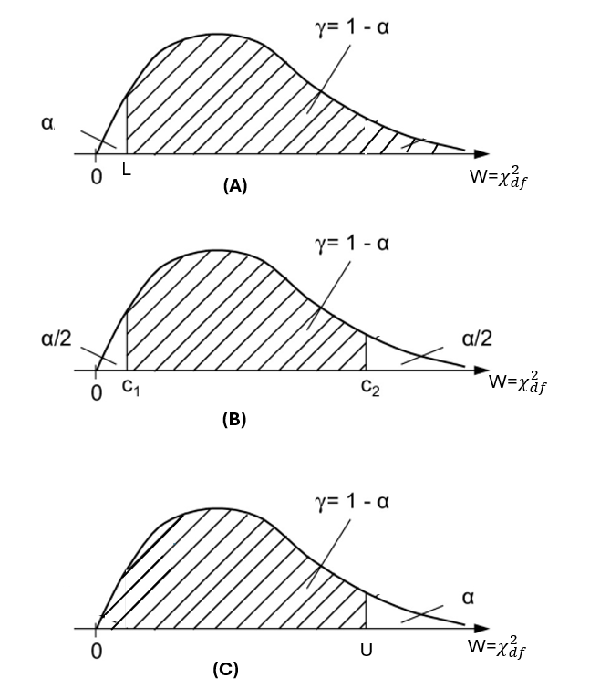
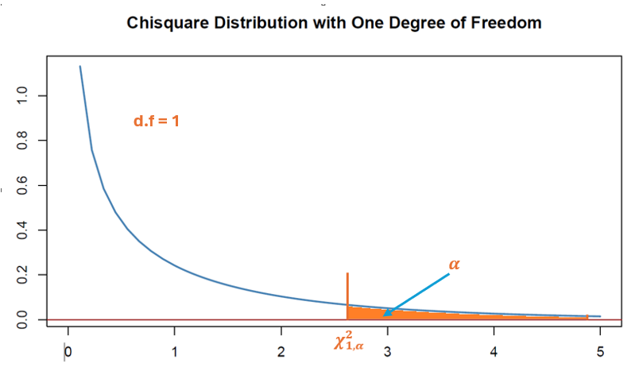
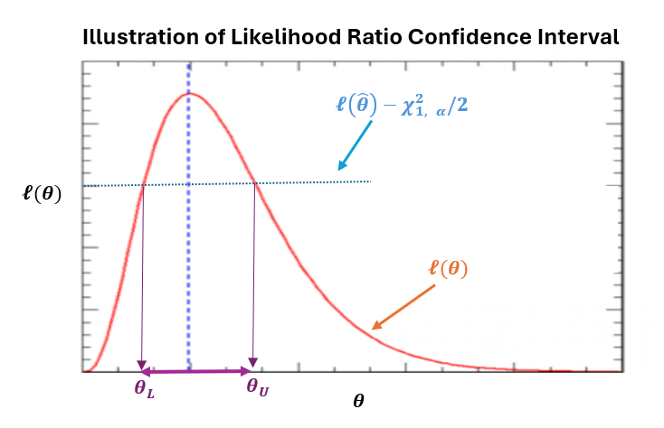

```{css, echo = FALSE}
#TOC::before {
  content: "Table of Contents";
  font-weight: bold;
  font-size: 1.2em;
  display: block;
  color: navy;
  margin-bottom: 10px;
}


div#TOC li {     /* table of content  */
    list-style:upper-roman;
    background-image:none;
    background-repeat:none;
    background-position:0;
}

h1.title {    /* level 1 header of title  */
  font-size: 22px;
  font-weight: bold;
  color: DarkRed;
  text-align: center;
  font-family: "Gill Sans", sans-serif;
}

h4.author { /* Header 4 - and the author and data headers use this too  */
  font-size: 15px;
  font-weight: bold;
  font-family: system-ui;
  color: navy;
  text-align: center;
}

h4.date { /* Header 4 - and the author and data headers use this too  */
  font-size: 18px;
  font-weight: bold;
  font-family: "Gill Sans", sans-serif;
  color: DarkBlue;
  text-align: center;
}

h1 { /* Header 1 - and the author and data headers use this too  */
    font-size: 20px;
    font-weight: bold;
    font-family: "Times New Roman", Times, serif;
    color: darkred;
    text-align: center;
}

h2 { /* Header 2 - and the author and data headers use this too  */
    font-size: 18px;
    font-weight: bold;
    font-family: "Times New Roman", Times, serif;
    color: navy;
    text-align: left;
}

h3 { /* Header 3 - and the author and data headers use this too  */
    font-size: 16px;
    font-weight: bold;
    font-family: "Times New Roman", Times, serif;
    color: navy;
    text-align: left;
}

h4 { /* Header 4 - and the author and data headers use this too  */
    font-size: 14px;
  font-weight: bold;
    font-family: "Times New Roman", Times, serif;
    color: darkred;
    text-align: left;
}

/* Add dots after numbered headers */
.header-section-number::after {
  content: ".";

body { background-color:white; }

.highlightme { background-color:yellow; }

p { background-color:white; }

}
```

```{r setup, include=FALSE}
# code chunk specifies whether the R code, warnings, and output 
# will be included in the output files.
if (!require("knitr")) {
   install.packages("knitr")
   library(knitr)
}
if (!require("pander")) {
   install.packages("pander")
   library(pander)
}
if (!require("ggplot2")) {
  install.packages("ggplot2")
  library(ggplot2)
}
if (!require("tidyverse")) {
  install.packages("tidyverse")
  library(tidyverse)
}

if (!require("plotly")) {
  install.packages("plotly")
  library(plotly)
}
if (!require("fitdistrplus")) {
  install.packages("fitdistrplus")
  library(fitdistrplus)
}
## 
knitr::opts_chunk$set(echo = TRUE,       # include code chunk in the output file
                      warning = FALSE,   # sometimes, you code may produce warning messages,
                                         # you can choose to include the warning messages in
                                         # the output file. 
                      results = TRUE,    # you can also decide whether to include the output
                                         # in the output file.
                      message = FALSE,
                      comment = NA
                      )  
```

\

# Introduction

We have introduced different methods for estimating a parameter based on a random sample - point estimator. However, A point estimate gives a single number without indicating how precise or reliable it is.

A **confidence interval (CI)** provides a range of plausible values for an unknown parameter $\theta$ with a specified confidence level $(1-\alpha)100\%$. Formally, for data $X_1,\ldots,X_n$:

$$
P[L(X) \le \theta \le U(X)] = 1 - \alpha
$$

where $L(X)$ and $U(X)$ are the lower and upper bounds that are **expression of data values only**. 

The key logic of confidence interval is that if we repeated the sampling process infinitely many times and constructed a CI from each sample, a $(1-\alpha)\%$ of those intervals would contain the true parameter value.


**Goodness Measures of CI**

* **Coverage probability**: $P(\theta \in CI) = 1-\alpha$. It also called confidence level.

* **Width**: $U(X) - L(X)$ - calculate based on sample (estimated from the data), hence, it is random.

* **Expected length**: $E[U(X) - L(X)]$ - A theoretical length that is independent on the random sample.

\

A confidence interval tells us what values of the parameter are compatible with the observed data at a specified confidence level, based on the sampling distribution of the estimator.


# Pivotal Quantity and Confidence Interval

**Mathematical Formulation**

A **pivotal quantity** $Q(X,\theta)$ is a function of both data and parameter whose distribution **does not** depend on $\theta$.

Some examples we learned before. Let $\{X_1, X_2, \cdots, X_n \}$ be i.i.d. random sample from $N(\mu, \sigma^2)$. Let $\bar{X}$ be the sample mean and $S^2$ be the sample variance. The following are expressions are pivotal quantities.


$$
Z(\mu) = \frac{\bar{X}-\mu}{\sigma_0/\sqrt{n}}, \ \ \ T(\mu) = \frac{\bar{X}-\mu}{s/\sqrt{n}}, \ \ \ W(\sigma) = \frac{(n-1)S^2}{\sigma^2}, \ \ \text{ etc.}
$$

Clearly, $Z(\mu)\xrightarrow{d} N(0, 1)$, $T(\mu) \xrightarrow{d}  t_{n-1}$, and $W(\sigma) \xrightarrow{d}  \chi_{n-1}^2$. The notation $\xrightarrow{d}$ simply means **follows in distribution**. Furthermore, $N(0, 1), t_{n-1}$ and $\chi_{n-1}^2$ are not independent on parameters. Therefore, $Z(\mu), T(\mu)$, and $W(\sigma)$ are **pivotal quantities**.

To explain why a pivotal quantity can be used to construct confidence interval of a population parameter, we use the third pivotal quantity $W(\sigma)$. Let $1-\alpha$ be the confidence interval (see the area of the shaded region in the following figures)


```{r fig.align='center', out.width="60%"}

```

* **In Figure A (top panel)**, the area of the shaded region satisfies

$$
P(W > L) = 1-\alpha \ \ \text{ which is equivalent to } \ \ P\left[ \frac{(n-1)S^2}{\sigma^2} > L\right] = 1-\alpha
$$

Solving inequality for $\sigma^2$, we have 

$$
 \frac{(n-1)S^2}{\sigma^2} > L \quad \Rightarrow \quad \sigma^2 < \frac{(n-1)S^2}{L} \ \ \text{ i.e. }  \ \ \sigma^2 \in \left(0, \frac{(n-1)S^2}{L} \right).
$$

where $L$ is $100\alpha$-th quantile one $\alpha$ is given. Note also that the low limit 0 is due the fact that variance $\sigma^2$ is greater than zero.


* **In Figure B (middle panel)**, the area of the shaded region satisfies

$$
P(c_1 < W < c_2) = 1-\alpha \ \ \text{ which is equivalent to } \ \ P\left[c_1 < \frac{(n-1)S^2}{\sigma^2} < c_2\right] = 1-\alpha
$$

We can similarly solve for $\sigma^2$ and obtain the range of $\sigma^1$ as follows

$$
\frac{(n-1)S^2}{c_2} <\sigma^2 < \frac{(n-1)S^2}{c_1}
$$


* **In Figure C (bottom panel)**, the area of the shaded region satisfies

$$
P(W < U) = 1-\alpha \ \ \text{ which is equivalent to } \ \ P\left[ \frac{(n-1)S^2}{\sigma^2} < U\right] = 1-\alpha
$$

Solving inequality for $\sigma^2$, we have 

$$
 \frac{(n-1)S^2}{\sigma^2} < U \quad \Rightarrow \quad \sigma^2 > \frac{(n-1)S^2}{U} \ \ \text{ i.e. }  \ \ \sigma^2 \in \left( \frac{(n-1)S^2}{L}, \infty \right).
$$

The above three scenarios represent two major types confident intervals: one-sided and two-sided confidence intervals:

* **One-sided confidence intervals** - bound parameter from above or below. That is, the following two confidence intervals are one-sided.

$$
\sigma^2 \in \left( \frac{(n-1)S^2}{L}, \infty \right) \ \ \text{ and } \ \ \sigma^2 \in \left(0, \frac{(n-1)S^2}{L} \right)
$$

* **Two-sided confidence interval** - Estimate a parameter's value within a range. The following is the two-sided confidence interval.

$$
\sigma^2 \in \left(\frac{(n-1)S^2}{c_2},  \frac{(n-1)S^2}{c_1}\right)
$$


# Steps for Constructing CI

Now that we have covered pivotal quantities and their role in constructing confidence intervals, we formalize the step-by-step procedure for using a pivotal quantity to build confidence intervals at a desired confidence level.


**Step 1: Identify an Appropriate Pivotal Quantity**

Find $Q(X,\theta)$ whose distribution is known and independent of $\theta$. 


**Step 2: Determine the Probability Statement**

For confidence level (1-α), find constants a and b such that: 

$$
P(a ≤ Q(X, \theta) ≤ b) = 1 - \theta
$$

Typically choose $a$ and $b$ as **quantiles**: $a = F^{-1}(\alpha/2), b = F^{-1}(1-\alpha/2)$)


**Step 3: Algebraically Invert the Inequality**

Manipulate the inequality $a ≤ Q(X, \theta) ≤ b$ to isolate $\theta$: 

$$
P(a ≤ Q(X, \theta) ≤ b) = 1 - \alpha \quad \Longleftrightarrow \quad
P[L(X) ≤ \theta ≤ U(X)] = 1 - α
$$

where L(X) and U(X) are functions of data only.


**Step 4: State the Confidence Interval**

The $(1-\alpha)\%$ confidence interval for $\theta$ is: $[L(X), U(X)]$.


**Example 1**: Normal Distribution with Known Variance

For $X_i \sim N(\mu, \sigma^2)$ with known $\sigma^2$, the pivotal quantity is:

$$
Q(X,\mu) = \frac{\bar{X} - \mu}{\sigma/\sqrt{n}} \sim N(0,1)
$$

The $(1-\alpha)100\%$ CI for $\mu$ is:

$$
\bar{X} \pm z_{1-\alpha/2} \frac{\sigma}{\sqrt{n}}
$$

where $z_{1-\alpha/2}$ is the $(1-\alpha/2)$-quantile of $N(0,1)$.


**R Implementation Example**: Pivotal CI for Normal Mean

```{r}
# Example: Pivotal CI for normal mean (known variance)
set.seed(123)
n <- 30
mu_true <- 5
sigma <- 2
data <- rnorm(n, mu_true, sigma)

alpha <- 0.05
z_critical <- qnorm(1 - alpha/2)
x_bar <- mean(data)
ci_pivotal <- c(
  x_bar - z_critical * sigma/sqrt(n),
  x_bar + z_critical * sigma/sqrt(n)
)

cat("Pivotal 95% CI for \U00B5 (known \U03C3 = 2): [", ci_pivotal, "] \n",
"True \U00B5:", mu_true, "\n",
"Coverage:", ci_pivotal[1] <= mu_true & mu_true <= ci_pivotal[2], "\n")
```


\


# Asymptotic Confidence Intervals

In section 2, we introduced a few pivotal quantities based on based on normal distribution. These quantities follow exact distributions such standard normal, t, and $\chi^2$ distributions that are independent on the unknown parameters $\mu$ and $\sigma$ of the normal distribution.


For i.i.d. random variables $X_1,\ldots,X_n$ with $E[X_i] = \mu$ and $Var(X_i) = \sigma^2$, the **Central Limit Theorem (CLT)** states:

$$
\frac{\bar{X} - \mu}{\sigma/\sqrt{n}} \xrightarrow{d} N(0,1)
$$


When $\sigma^2$ is unknown, use the sample variance $S^2$:

$$
\frac{\bar{X} - \mu}{S/\sqrt{n}} \xrightarrow{d} N(0,1) \quad \text{for large } n.
$$


**General Construction**

For parameter $\theta$ with estimator $\hat{\theta}$:

* Find asymptotic distribution: $\hat{\theta} \xrightarrow{d} N(\theta, \widehat{Var}(\hat{\theta}))$

* Standardize: $\frac{\hat{\theta} - \theta}{\sqrt{\widehat{Var}(\hat{\theta})}} \xrightarrow{d} N(0,1)$

* Construct CI: $\hat{\theta} \pm z_{1-\alpha/2} \sqrt{\widehat{Var}(\hat{\theta})}$
 

**Example Using R**: A public health agency wants to estimate the proportion of adults willing to receive a new COVID-19 booster vaccine. They survey n = 1,200 randomly selected adults and find that x = 780 are willing to get vaccinated. What proportion of the entire adult population is willing to receive the booster vaccine?. 

Recall that when $np > 10$ and $n(1-p) > 10$, by CLT, we have

$$
\frac{\hat{p}-p}{\sqrt{\frac{\hat{p}(1-\hat{p})}{n}}} \xrightarrow{\text{Asymptotically}} N(0, 1)
$$

Therefore,

$$
T = \frac{\hat{p}-p}{\sqrt{\frac{\hat{p}(1-\hat{p})}{n}}}
$$

is an asymptotic pivotal quantity. $100(1-\alpha)\%$ two-sided confidence interval of $p$ satisfies

$$
P\left[ Z_{\alpha/2} <\frac{\hat{p}-p}{\sqrt{\frac{\hat{p}(1-\hat{p})}{n}}} < Z_{1-\alpha/2}\right] = 1 - \alpha
$$

Solving $p$ from the inequality,

$$
Z_{\alpha/2} <\frac{\hat{p}-p}{\sqrt{\frac{\hat{p}(1-\hat{p})}{n}}} < Z_{1-\alpha/2}
$$

we have

$$
\hat{p} - Z_{1-\alpha/2}\sqrt{\frac{\hat{p}(1-\hat{p})}{n}} < p < \hat{p} - Z_{\alpha/2}\sqrt{\frac{\hat{p}(1-\hat{p})}{n}}
$$

The R code below translates the confidence interval formula presented earlier, using a $95\%$ confidence level.


```{r}
# Example: CLT-based CI for binomial proportion
x <- 780
n <- 1200
p_hat = x/n
#
se <- sqrt(p_hat * (1 - p_hat) / n)
#
ci.low <- p_hat - qnorm(1 - 0.025) * se
ci.up <-  p_hat - qnorm(0.025) * se
ci <- c(ci.low, ci.up)
#
cat("CLT-based 95% CIs for proportion:\n",
 "Asymptotic CI: [", ci, "] \n")
```

\

# Likelihood-Ratio Confidence Intervals

**Likelihood-based confidence intervals**, often called **profile likelihood confidence intervals** or **likelihood ratio intervals**, are a versatile and theoretically well-founded method for constructing confidence intervals for parameters in parametric models. They are based on the likelihood ratio test and often yield more accurate intervals than those based on **asymptotic normality**, especially for **small** or **moderate** sample sizes.

## Likelihood Ratio

Let $L(\theta; x)$ be the likelihood function for a parameter $\theta$ given data $x$ and $\hat{\theta}_{\text{MLE}}$ be the maximum likelihood estimate of $\theta$. We define the **likelihood ratio function** in the following

$$
\Lambda(\theta) = \frac{L(\theta; x)}{L(\hat{\theta}_{MLE}; x)}
$$

where the denominator is the likelihood function evaluated at the MLE.  

**Wilks' Theorem**: Assume that $\theta$ is the true unknown population parameter If sample size $n$ is large, we have  

$$
LR(\theta)=-2\log\Lambda(\theta) = 2\left[ \log L(\hat{\theta}_{MLE}; x) -\log L(\theta; x)\right]\xrightarrow{d} \chi^2_1
$$

> <font color = "darkred">Thus, $LR(\theta)$ constitutes an **asymptotic pivotal quantity** with a $\chi^2_1$ distribution that does not depend on the parameter $\theta$.</font>


## Likelihood Ratio Confidence Intervals


We can similarly construct one- and two- sided confidence intervals.

**Two-Sided Likelihood Ratio CI (Standard Case)**

For a parameter $\theta$ with MLE $\hat{\theta}$, a two-sided $100(1-\alpha)%$ likelihood ratio CI consists of all $\theta_0$ satisfying:

$$
P[LR(\theta) \le \chi^2_{1,\alpha}]= 1 - \alpha
$$


```{r echo = FALSE, fig.align='center', out.width="60%"}

```

We re-expression the inequality in the above probability (left-hand side) as follows

$$
\log L(\hat{\theta}_{MLE}; x) -\log L(\theta; x) \le \chi^2_{1,\alpha}/2
$$

or equivalently

$$
l(\theta) \ge l(\hat{\theta}) - \frac{\chi^2_{1, \alpha}}{2}
$$

```{r echo = FALSE, fig.align='center', out.width="60%"}

```


The confidence limits for $\theta$, denoted by $\theta_0$ and $\theta_1$, are roots of the following nonlinear equations respectively

$$
l(\theta)  = l(\hat{\theta}) - \frac{\chi^2_{1, \alpha}}{2}.
$$
\

In summary, we use the following steps for constructing LR confidence intervals:

* **Find the MLE**: $\hat{\theta}$ and compute $\ell_{\max} = \ell(\hat{\theta})$.
    
* **Define the profile log-likelihood**: for $\theta$ (if there are nuisance parameters, maximize over them for each fixed $\theta$).
    
* **Solve for the two points**: $l(\theta)  = l(\hat{\theta}) - \chi^2_{1, \alpha}/2.$. Let $\theta_L = \min \{\theta_0, \theta_1 \}$ and $\theta_U = \max \{\theta_0, \theta_1 \}$. The two-sided CI for $\theta \in [\theta_L,  \theta_U]$.

\

**One-Sided Likelihood Ratio CIs**

A $100(1-\alpha)%$ one-sided CI consists of all $\theta_0$ such that:


$$
2[\ell(\hat{\theta}) - \ell(\theta_0)] \leq \chi^2_{1,1-2\alpha} \quad \text{(for $\alpha < 0.5$)}
$$


## A Case Study on Exponential Distribution

Let $X_1, X_2, \dots, X_n$ be i.i.d. $\text{Exp}(\lambda)$ with PDF:

$$
f(x|\lambda) = \lambda e^{-\lambda x}, \quad x > 0, \ \lambda > 0
$$

The likelihood function is:

$$
L(\lambda) = \lambda^n e^{-\lambda \sum_{i=1}^n x_i}
$$

The log-likelihood of the the true $\lambda$ is:

$$
\ell(\lambda) = n \ln \lambda - \lambda \sum_{i=1}^n x_i = n\ln\lambda -n\lambda \bar{x}
$$

Taking derivative with respect to $\lambda$, we have

$$
\frac{d\ell}{d\lambda} = \frac{n}{\lambda} - n\bar{x} = 0
$$

$$
\hat{\lambda} = \frac{n}{\sum_{i=1}^n x_i} = \frac{1}{\bar{x}}.
$$

The maximum log-likelihood:

$$
\ell_{\max} = \ell(\hat{\lambda}) = n \ln \hat{\lambda} - n = n\ln (\bar{x})^{-1} - n = -n[1+\ln (\bar{x})].
$$


The likelihood ratio statistic is:

$$
\lambda_{LR} = 2\left[ \ell(\hat{\lambda}) - \ell(\lambda) \right] = 2\left\{-n[1+\ln (\bar{x})] - n[\ln\lambda -\lambda \bar{x}] \right\} .
$$

Since $\lambda$ is the true exponential parameter (rate), by **Wilk's Theorem**,

$$
2\left\{-n[1+\ln (\bar{x})] - n[\ln\lambda -\lambda \bar{x}] \right\} \xrightarrow{d} \chi^2_{1}
$$

Where $\chi^2_{1, 1-\alpha}$ is the $(1-\alpha)$ quantile of $\chi^2_1$.

The interval endpoints $\lambda_0$ and $\lambda_1$ of $100(1-\alpha)\%$ CI for $\theta$ satisfy:

$$
n[\ln\lambda -\lambda \bar{x}] \ge -n[1+\ln (\bar{x})] - \chi^2_{1,\alpha}/2
$$

The above two equations are nonlinear and have no closed form solution, we need to use numerical procedure to find the solution. We will use R built-in function to illustrate the way of finding numerical solution.

**Demo of Numerical Procedure**: Let $n = 50$, $\bar{x} = 1.21$. We want find $95\%$ CV: $\chi^2_{1, 0.05} = 3.841459$ (upper tail)so:

$$
50[\ln\lambda -1.21\lambda] \ge -50[1+\ln (1.21)] - 3.841459/2
$$
we use `uniroot()` to find the root of the above nonlinear equation in the following code


```{r}
xx <- seq(0,3,length=50)
fun <- function(x) 50*(log(x) - 1.21*x) +50*(1 + log(1.21)) + 3.841459/2
plot(xx, fun(xx), type = "l", lwd = 2, main = "LR Confidence Interval of Exponential Rate",
     xlab = "lambda",
     ylab = "")
abline(h=0, col = "blue")
lambda_0 <- uniroot(fun, interval = c(0.01, 1))$root
lambda_1 <- uniroot(fun, interval = c(1 , 1.5))$root
abline(v=c(lambda_0, lambda_1), col = "red")
```

```{r echo = FALSE}
c(lambda.left = lambda_0, lambda.right = lambda_1)
```


\

# Applications and Practical Considerations
 
\
 
<font color = "blue">**Goodness of Confidence Interval**</font>

A good CI honestly represents uncertainty, uses appropriate methods, and provides information useful for inference and decision-making—not just a ritualistic statistical procedure. Particularly, it should

* **have correct coverage**: Should contain the true parameter value in exactly (or approximately) the stated percentage of repeated samples. For example, a 95% CI should contain the true parameter in 95% of studies if repeated infinitely

* **be short (minimum expected length)**, i.e., as narrow as possible for given confidence level and sample size. Note that that a **balanced** CI is important: not artificially narrow (underestimating uncertainty) or excessively wide (uninformative)

* **Methodologically Sound**: This includes
  + **Appropriate assumptions met** for the data type
  + **Robust** to reasonable violations of assumptions
  + Uses **correct distribution** (t vs. normal, exact vs. approximate methods)
  + **Transparent methodology** clearly reported

* **Consistent with Data Properties**


<font color = "blue">**Choosing the Right Method**</font>


| **Method** |  **When to Use** | **Assumptions** |
|:-----------|:-------------------------|:----------------------|
| Pivotal |  Exact distribution known |  Full distributional knowledge | 
| CLT-based |  Large samples or approx. normal |  Finite variance, independence | 
| Likelihood |  General parametric models |  Correct model specification | 


<font color = "blue">**Comparison Table**</font>


| **Property** | **Pivotal** | **CLT-based** | **Likelihood**|
|:-------------|:---------------|:----------------|:----------------|
| Exactness |  Exact |  Asymptotic |  Asymptotic | 
| Assumptions |  Strong |  Moderate |  Moderate | 
| Computation |  Simple |  Simple |  Iterative | 
| Range |  May be infinite |  Finite |  Can be asymmetric | 


<font color = "blue">**Important Formulas**</font>


* **Pivotal CI**:

$$
\theta \in \{\theta: c_1 \le Q(X,\theta) \le c_2\}
$$
    
* **Wald CI**:

$$
\hat{\theta} \pm z_{1-\alpha/2} \sqrt{\widehat{Var}(\hat{\theta})}
$$
    
* **Likelihood CI**:

$$
\{\theta: -2\log\Lambda(\theta) \le \chi^2_{1,\alpha}\}, \ \ \text{ where } \alpha \text{ is the right-tailed area }
$$
    
* **Coverage**:

$$
CP(\theta) = P_\theta(L(X) \le \theta \le U(X))
$$


<font color = "blue">**Practical Recommendations**:</font>

* Use pivotal methods when exact distribution is known

* Use CLT-based methods for large samples

* Use likelihood methods for complex parameters

* Always check assumptions and consider bootstrap alternatives

* Report both point estimate and confidence interval


