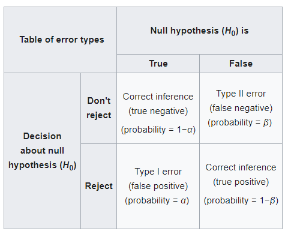
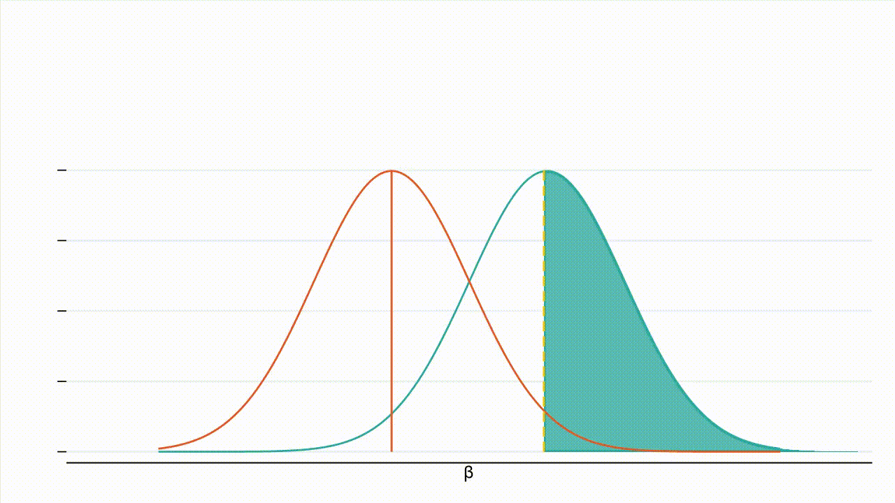
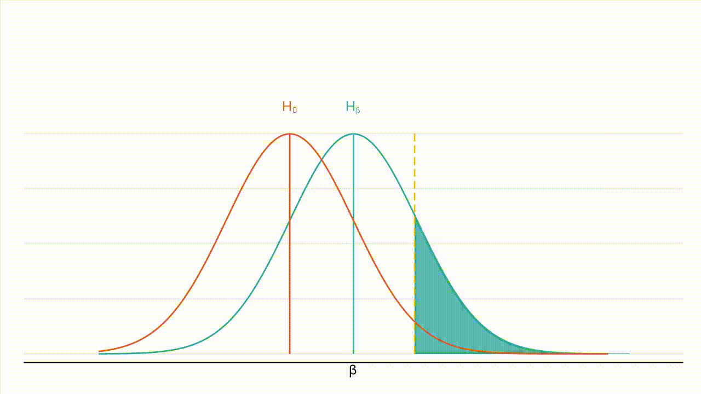
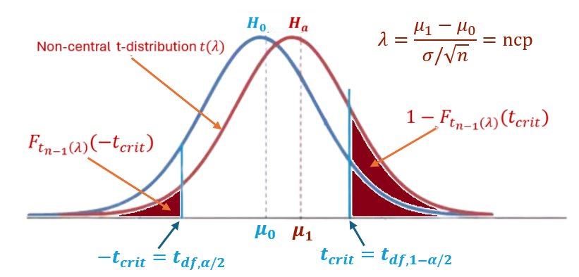
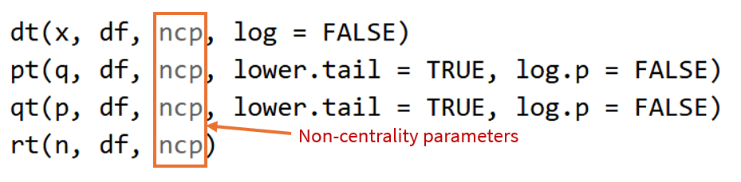

```{css, echo = FALSE}
#TOC::before {
  content: "Table of Contents";
  font-weight: bold;
  font-size: 1.2em;
  display: block;
  color: navy;
  margin-bottom: 10px;
}


div#TOC li {     /* table of content  */
    list-style:upper-roman;
    background-image:none;
    background-repeat:none;
    background-position:0;
}

h1.title {    /* level 1 header of title  */
  font-size: 22px;
  font-weight: bold;
  color: DarkRed;
  text-align: center;
  font-family: "Gill Sans", sans-serif;
}

h4.author { /* Header 4 - and the author and data headers use this too  */
  font-size: 15px;
  font-weight: bold;
  font-family: system-ui;
  color: navy;
  text-align: center;
}

h4.date { /* Header 4 - and the author and data headers use this too  */
  font-size: 18px;
  font-weight: bold;
  font-family: "Gill Sans", sans-serif;
  color: DarkBlue;
  text-align: center;
}

h1 { /* Header 1 - and the author and data headers use this too  */
    font-size: 20px;
    font-weight: bold;
    font-family: "Times New Roman", Times, serif;
    color: darkred;
    text-align: center;
}

h2 { /* Header 2 - and the author and data headers use this too  */
    font-size: 18px;
    font-weight: bold;
    font-family: "Times New Roman", Times, serif;
    color: navy;
    text-align: left;
}

h3 { /* Header 3 - and the author and data headers use this too  */
    font-size: 16px;
    font-weight: bold;
    font-family: "Times New Roman", Times, serif;
    color: navy;
    text-align: left;
}

h4 { /* Header 4 - and the author and data headers use this too  */
    font-size: 14px;
  font-weight: bold;
    font-family: "Times New Roman", Times, serif;
    color: darkred;
    text-align: left;
}

/* Add dots after numbered headers */
.header-section-number::after {
  content: ".";

body {background-color: #ffffff;
      color: #000000;
      font-family: Arial, sans-serif;
      font-size: 1rem;
      line-height: 1.6;
      }

.highlightme { background-color:yellow; }

p { background-color:white; }

}
```

```{r setup, include=FALSE}
# code chunk specifies whether the R code, warnings, and output 
# will be included in the output files.
if (!require("knitr")) {
   install.packages("knitr")
   library(knitr)
}
if (!require("pander")) {
   install.packages("pander")
   library(pander)
}
if (!require("psych")) {
  install.packages("psych")
  library(psych)
}
if (!require("RColorBrewer")) {
  install.packages("RColorBrewer")
  library(RColorBrewer)
}

if (!require("boot")) {
  install.packages("boot")
  library(boot)
}
if (!require("effsize")) {
  install.packages("effsize")
  library(effsize)
}
## library(effsize)
knitr::opts_chunk$set(echo = TRUE,       # include code chunk in the output file
                      warning = FALSE,   # sometimes, you code may produce warning messages,
                                         # you can choose to include the warning messages in
                                         # the output file. 
                      results = TRUE,    # you can also decide whether to include the output
                                         # in the output file.
                      message = FALSE,
                      comment = NA
                      )  
```

\

# Introduction

These notes provide a comprehensive mathematical characterization of hypothesis testing, covering assumptions, procedures, types, performance measures, error types, and practical applications with manual calculations and R verification.


# What Is Hypothesis Testing

**Definition**: Hypothesis testing is a formal statistical procedure used to evaluate competing claims about a population parameter or distribution based on sample data. It follows a structured, probabilistic framework to determine whether observed data provide sufficient evidence to reject a default assumption (null hypothesis) in favor of an alternative claim.

Mathematically, hypothesis testing is a decision rule that maps sample outcomes to one of two actions: "reject Ho" or "fail to reject Ho," while controlling the long-run frequency of incorrect decisions.


## The Logic of Hypothesis Testing

To provide an objective, reproducible standard for evaluating whether observed patterns in data are likely due to chance or represent genuine effects in the population.


**An analogy**: Statistical hypothesis testing vs medical diagnostics

| Steps|        **Statistical Hypothesis Testing**      |      **Medical Diagnostics**        |
|:------------------------- |:------------------------|:------------------------|
| **Formulate Hypotheses** | Ho: No effect vs Ha: Effect exists |  Ho: Healthy vs Ha: Has disease    |
| **Choose Test & Threshold** |  Select a test with $\alpha$=0.05     | Choose related clinical tests |
| **Collect Evidence and Aggregation** |  Gather sample data and Compute test statistic from data | Perform diagnostic test and aggregate lab result value |
| **Make Decision** | Reject Ho if evidence strong enough (check if $p \le 0.05$) | Diagnose disease if test positive (check if result exceeds diagnostic cutoff) |


We can observe that the logical reasoning behind statistical hypothesis testing and medical diagnostics is identical. To better understand the hypothesis testing process, we will examine the following non-numerical examples.


**Medical Example: COVID-19 Testing** - Scenario: Testing for COVID infection

**Step 1**: Ho: Patient is not infected (healthy) v.s. Ha: Patient is infected (sick).

**Step 2**: Choose an appropriate COVID test based on the quality. For example, looking for the test with high specificity and sensitivity. Note: `Specificity = P(T - | No COVID)` and `Sensitivity = P(T + | COVID)`.

**Step 3**: Wait for the test results

**Step 4**: Comparison and decision: If the test results falls in critical region, Reject Ho $\Rightarrow$ diagnose COVID.


## Assumptions and Step for Hypothesis Testing

Every procedure for statistical inference involves certain explicit and implicit assumptions. A family of related procedures shares a core set of common assumptions. As a major family, hypothesis testing encompasses different test types. The assumptions discussed next are common to many tests within this family, aside from those unique to a specific test.


### Some Common Assumptions

* **Data Structure Assumptions**
  + Most tests require **Independence of Observations** for Critical for probability calculations and standard error estimation.
  + All tests require **Random Sampling** so that
    - Data represent a random sample from the population
    - No systematic selection bias
    - Ensures generalizability of results

* **Measurement & Scale Assumptions**
  + **Reliable Measurement** means that
    - Variables are measured without systematic error
    - Measurement instruments are valid and reliable
    - Random measurement error is normally distributed

* **Statistical Model Assumptions**
  +  **Distributional Assumptions** include
    - For **Parametric Tests**, a specific distribution assumed (e.g., normality for t-tests).
    - For **non-parametric tests**, fewer distributional requirements but often assume: continuity, symmetry, and identical shape across groups, etc.
  + **Homogeneity Assumptions**
    - Homogeneity of Variance (Homoscedasticity) is required for tests related to the regression modeling.
    - Homogeneity of Covariance is commonly required for multivariate tests in the multivariate regression modeling.
  
* **Inferential Assumptions**
  + Sample Size Requirements reflect the amount of information in the data set
    - Sufficient Sample Size for applying Central Limit Theorem (CLT), power calculation, etc.
    - Adequate Cell Sizes (for categorical tests) for validity of tests.
  + Linearity Assumptions are required for regression related tests.
  
  
  
#  Formal Hypothesis Testing

This section focus on systematic introduction to hypothesis testing: logical steps, fundamental components, performance assessment.

## Logical Steps

Hypothesis testing follows the basic logical process which is utilized in software development. We will use some examples from introductory statistics to explain these basic steps. As a guideline, I summarize the process into the following 6 steps:


**Step 1: Gather Available Information for Hypothesis Testing**: Information on sample size, the test type (right-tailed, left-tailed, and two-tailed) based on the research/practical question, significance level, etc. 


**Step 2: State the Hypotheses**: Formally define the competing claims.

* **Null Hypothesis ($H_0$)**: The hypothesis of "no effect," "no difference," or "status quo." It is assumed true until evidence suggests otherwise. It must contain a condition of equality ($=$, $\leq$, $\geq$). This means that <font color = "red">**the claimed value is attainable under the null hypothesis!**</font>
  + Example: $H_0: \mu = \mu_0$ (The population mean $\mu$ equals a specific value $\mu_0$)

* **Alternative Hypothesis ($H_1$ or $H_a$)**: The hypothesis you hope to support. It contradicts $H_0$ and represents a "new effect" or "difference." It is defined by the research question ($<$, $>$, or $\neq$).
  + Examples:
    - $H_1: \mu > \mu_0$ (Right-tailed test)
    - $H_1: \mu < \mu_0$ (Left-tailed test)
    - $H_1: \mu \neq \mu_0$ (Two-tailed test)

**Step 3: Select An Appropriate Tests Based on Given Information and Evaluate the Test Statistic**
  
* This is a standardized value that measures the distance between the sample statistic and the hypothesized parameter under $H_0$. For example, in introductory statistics
  + One-sample z-test: 
$$
  z = \frac{\bar{x} - \mu_0}{\sigma/\sqrt{n}}
$$
  + One-sample t-test: 
$$
t = \frac{\bar{x} - \mu_0}{s/\sqrt{n}}
$$
  + Chi-square test: 
$$
\chi^2 = \sum \frac{(O_i - E_i)^2}{E_i}
$$
  

**Step 4: Determine the Critical Value(s) and/or P-value**: Two main approaches (they are conceptually linked) and both approaches requires the information about the type of the test as illustrated in the **alternative hypothesis**.
  
* **Critical Value Approach**: Find the threshold value(s) from the statistical distribution (e.g., $z_{\alpha}$, $t_{\alpha, df}$) that correspond to the significance level $\alpha$ and the test type (right-tailed, left-tailed, or teo-tailed test).  


* **P-value Approach**: Calculate the p-value—the probability of obtaining a test statistic at least as extreme as the one observed, assuming $H_0$ is true. 


**Step 5: Make a Decision**: Compare your result from Step 3 to the test statistic or the given significant level. <font color = "red">**Crucial Note**: You never "accept" $H_0$. You either reject it or fail to reject it. Failing to reject means there is insufficient evidence against $H_0$, not proof that it is true.</font>

* **Using Critical Values**: If |test statistic| > |critical value| $\Rightarrow$ Reject $H_0$; otherwise, Conclude $H_0$.

* **Using P-value**:  If p-value $\le \alpha$ $\Rightarrow$ Reject $H_0$; If p-value $> \alpha$ $\Rightarrow$ Fail to Reject $H_0$.


**Step 6: State the Conclusion in Context**: Translate the statistical decision into a clear, plain-language statement about the research question.

* **If you reject $H_0$**:  There is sufficient statistical evidence at the $\alpha$ level to conclude that [state $H_1$ in context]. **For example**,  <font color = "red">There is sufficient evidence ($\alpha=0.05$) to conclude that the new drug lowers blood pressure more than the placebo."</font>

* **If you fail to reject $H_0$**: "There is insufficient statistical evidence at the $\alpha$ level to conclude that [state $H_1$ in context]." **For example**: <font color = "red">There is insufficient evidence ($\alpha=0.05$) to conclude that the new manufacturing process changes the product's strength."</font>

\

## Sampling Distribution of Test Statistic

One of the critical steps in the logical process above is to find the critical value or p-value to make a decision. Both are dependent on the distribution of the test statistic, more specifically, the **sampling distribution** of the test statistic. In fact, a **test statistic** is essentially a **pivotal quantity** whose distribution is **independent** of the parameters. We can see this pattern in the examples in Step 3 of the logical process for hypothesis testing.

**Exact Pivotal Quantity** - While **exact pivotal quantity** is not a formal textbook term, it emphasizes the property that a function of the sample and the true parameter has a **fully specified**, **exact sampling distribution** (standard normal, t, chi‑square, etc.), which is pivotal for exact inference.

**Asymptotic pivotal quantity** - The name itself conveys the key property: it is a quantity (a function of the data and the parameter) whose distribution **converges** to a fixed, known form (such as standard normal) **as the sample size grows to infinity**. This means, the sampling distribution is only an approximation. Most likelihood based hypothesis tests eventually define an asymptotic pivotal quantity to approximate a fixed sampling distribution independent on parameters and sample data.

We will discuss asymptotic hypothesis testing based on the likelihood in the next module.


## P-value and P-Hacking

The mathematical definition of the p‑value involves conditional probability and is not easy to grasp. An informal definition, given in an American Statistical Association (ASA) statement, reads:

> “Informally, a p‑value is the probability, under a specified statistical model, that a statistical summary of the data would be equal to or more extreme than its observed value.”


## Goodness (Badness) of Tests

This is a fundamental concept in statistics. Here’s a clear breakdown of performance measures and error types in hypothesis testing, framed around the classic **confusion matrix** for a binary test (Ho vs. Ha). Most of the performance measures are defined based on the following confusion matrix.


**A. Decision (Confusion) Matrix**


```{r echo = FALSE, fig.align='center', out.width="60%"}

```

**Comments**: Several practically important facts about the **confusion matrix for hypothesis testing**:

* The conditional probabilities $\alpha$ and $\beta$ (see the mathematical definitions below) are **not estimable** based on a single data set since we don't know **TRUE** status of null and alternative hypotheses. In other words, the **confusion matrix for hypothesis testing** represents **potential** outcomes under different states of nature, **not actual observed proportions**.

* Similar to the interpretation of a $100(1-\alpha)\%$ confidence interval: if we were to take 100 random samples of the same size using the same sampling protocol, and construct 100 confidence intervals at that level, we would expect about $100(1-\alpha)$ of those intervals to contain the true parameter value. The confusion matrix in hypothesis testing also describes **long‑run hypothetical outcomes**. It illustrates:
  + What **would happen** if we repeated the same experiment many times,
  + **Conditional on** either Ho always being true (the left column) or Ha always being true (the right column).

* The parallel frequentist interpretations at $\alpha = 0.05$
  + **Confidence Interval**: If we constructed 100 confidence intervals from 100 independent samples, we'd expect about 95 to contain the true parameter value.
  + **Hypothesis Testing (Confusion Matrix)**: <font color = "darkred">(I) If we performed 100 hypothesis tests when Ho is true, we'd expect about 5 Type I errors [false positives]</font> AND <font color = "blue">(II) If we performed 100 hypothesis tests when Ha is true with effect size $\delta$, we'd expect about $(1-\alpha)×100$ correct rejections [true positives].</font>

* **p-value, significant level, and type I error rate**: These three concepts form the core decision-making framework of frequentist statistics. 
  + **Significance Level ($\alpha$)** is a threshold (design parameter) for decision-making and determined **before** data collection.
  + **p-value** is a data-dependent measure of evidence strength calculated from data **after** data collection.	
  + **Type I Error Probability** is the risk of false positive based on Long-run frequency. It is determined conceptually before or after data collection.	


**B. Mathematical Definitions**

Most of the test performance are defined in the form of conditional probabilities. They can be estimated based on the observed **confusion matrix** defined above. 


* **Type I Error ($\alpha$)**: 

$$
\alpha = P(\text{Reject } H_0 \mid H_0 \text{ true}) 
$$


* **Type II Error ($\beta$)**:

$$
\beta = P(\text{Fail to reject } H_0 \mid H_1 \text{ true}) 
$$

* **Power ($1-\beta$)**:

$$
\text{Power} = P(\text{Reject } H_0 \mid H_1 \text{ true}) = 1 - \beta
$$

The measures above assess performance **locally**, meaning that the power reflects the specific value claimed in the hypothesis. Generally, we use power to compare the performance (goodness or badness) of two or more tests.

If we free the claimed value in the hypothesis, we then turn the local performance measures into global measures. For example, we can define the power function as follows:

* **Power Function**: Assume the claimed value in the hypothesis is an unknown parameter $\theta$. This means the power of the test depends on the choice of $\theta$. Therefore, we can define the power function as:

$$
\pi(\theta) = P(\text{Reject } H_0 \mid \theta) 
$$

# How Hypothesis Testing is Applied in Clinical Trials

**Hypothesis testing** is not just used in clinical trials—it is the mandatory, formal statistical methodology that underpins the entire FDA drug approval process. It provides an objective, quantitative standard for deciding whether the evidence of a drug’s efficacy is strong enough to warrant making it available to patients, all while controlling the risk of false claims. The process is a sequential application of hypothesis tests, with each phase addressing more definitive questions under increasingly stringent statistical controls.

This section outlines the key stages of confirmatory clinical trials, highlighting the use of hypothesis testing in each phase.

## Stages of Clinical Trials

Clinical trials are conducted in a series of phased steps, each designed to answer specific questions about a new medical intervention's safety, efficacy, and appropriate use. Here is a standard outline of the stages.


**Additional Key Stage (Pre-Trial)**

* **Preclinical Research**: Before human testing begins, laboratory (in vitro - outside living organism) and animal (in vivo - in living organism) studies are conducted to gather preliminary efficacy, toxicity, and pharmacokinetic information. This is not considered a "clinical" phase, as it does not involve human participants.

The sponsor submits an **Investigational New Drug (IND)** application with **pre-clinical** data, manufacturing info, and the Phase 1 study plan, requiring FDA approval to start human trials.

\

**Phase 1: Safety & Dosage** - an initial exploratory stage. Data on safety and dosage is submitted, and the FDA must permit the trial to advance to Phase 2 if results are favorable.

* **Primary Goal**: Assess the safety, tolerability, and pharmacokinetics (how the body processes the drug) in a small group (20-100).

* **Participants**: Usually healthy volunteers, though for serious conditions (e.g., cancer), participants may be patients.

* **Key Focus**: Determine a safe dosage range and identify common side effects.


**Phase 2: Efficacy & Side Effects** - an exploratory stage. Efficacy and side effects are assessed; positive findings allow progression to Phase 3.

* **Primary Goal**: Evaluate the intervention's preliminary efficacy and further assess its safety.

* **Participants**: A larger group (up to several hundred) of patients with the target disease or condition.

* **Key Focus**: Gather data on whether the drug works (e.g., shrinks tumors, lowers blood pressure) and monitor short-term side effects. This phase often explores different dosing regimens.


**Phase 3: Confirmatory & Monitoring** - a confirmatory stage. After large-scale trials confirm effectiveness and safety, the sponsor submits a **New Drug Application (NDA)** for FDA review and approval to market the drug.

* **Primary Goal**: Confirm effectiveness, monitor long-term side effects, and compare the new intervention to the current standard treatment.

* **Participants**: Large groups (300 to 3,000+ patients) across multiple research centers.

* **Key Focus**: Provide the definitive evidence of benefit and risk required for regulatory approval (e.g., by the FDA). This is the confirmatory stage where hypothesis testing is formally applied to prove efficacy.


**Regulatory Review and Approval**

* After Phase 3, all data are compiled and submitted to regulatory authorities (e.g., FDA, EMA) for review and a decision on marketing approval.


**Phase 4: Post-Marketing Surveillance** - Ongoing monitoring for long-term effects occurs after the drug is on the market. 

* **Primary Goal**: Monitor the drug's long-term safety, effectiveness, and optimal use in the general population.

* **Participants**: Thousands of patients in real-world settings after the drug is publicly available.

* **Key Focus**: Detect rare or long-term adverse effects and study new populations or uses.


## When and How Hypothesis Testing Is Used

The use of hypothesis testing in Phase I and Phase II trials is fundamentally different from its role in Phase III. The primary goals are safety, dosing, and estimating effects—not confirming them with statistical rigor.

* **Phase I**: Hypothesis testing is minimal. The focus is on estimation and safety.

* **Phase II**: Hypothesis testing is a critical decision-making tool but is applied with exploratory intent. A positive result is a signal to move forward, not a claim for approval.

* **Phase III**: Hypothesis testing is the pre-specified, rigorous experiment designed to confirm the definitive hypothesis for regulators.

In terms of statistical role and rigor, **hypothesis testing** in Phase I/II trials is **flexible**, with the Type I error rate ($\alpha$) often not strictly controlled. In other words, it is an informal tool used primarily for internal decision-making and signal detection. In contrast, **hypothesis testing** in **Phase III** is strict: the Type I error ($\alpha$) is strongly controlled. It is a formal, mandatory, and definitive process used to confirm efficacy and safety for regulatory approval.


To outline of overarching framework of rigorous hypothesis testing, we use focus on its application in phase III trial. We know that all confirmatory clinical trials are designed as controlled experiments with:

* A pre-specified primary outcome (e.g., tumor size reduction, survival time, symptom score).

* A null hypothesis (Ho) that the new treatment is no better than the control (placebo or standard of care).

* An alternative hypothesis (Ha) that the new treatment is better.

* A pre-defined significance level ($\alpha$), almost always $\alpha = 0.05$ for the primary endpoint.

* A pre-specified statistical test (t-test, log-rank test, chi-square, etc.) and analysis plan.


**Comment**: In the context of confirmatory clinical trials, the pre-defined significance level (alpha, $\alpha$) and Type I error are intimately related but distinct concepts. In the **simplest fixed design**: **By setting $\alpha = 0.05$, you are designing the trial to have a maximum allowable Type I error rate of 5%**. In other words, <font color = "red">*if you follow the statistical plan exactly, the actual probability of making a Type I error (falsely rejecting the null) is controlled at 0.05.*</font>


# Illustrative Examples

This section uses two simple tests about populations to illustrate the steps suggested for hypothesis testing. 


## Example 1: One-Sample t-test


**Problem**: A company claims their energy drink increases IQ ($\mu = 100$). Sample of 25 users has mean IQ = 106, SD = 15. Test at $\alpha = 0.05$.

**Manual Calculation**:

* **Step 1**: The information is clearly given in the problem. $n = 25, \bar{x} = 106, s = 15, \mu_0 = 100$, and $\alpha = 0.05$. The claim (*increase IQ*) is that $\mu > 100$


* **Step 2**: Hypotheses
  + $H_0: \mu = 100$ (no effect)
  + $H_1: \mu > 100$ (one-tailed, drink increases IQ)


* **Step 3**: Test Statistic

$$n = 25, \bar{x} = 106, s = 15, \mu_0 = 100$$
$$t = \frac{106 - 100}{15/\sqrt{25}} = \frac{6}{15/5} = \frac{6}{3} = 2.0$$

$$df = n - 1 = 24$$


* **Step 4**: Critical Value for this right-tailed test is

$$t_{\alpha=0.05, df=24} = 1.711$$

* **Step 5**: Decision - since $t = 2.0 > 1.711$, reject $H_0$.

* **Step 6**: Interpretation - Evidence suggests drink increases IQ.


**Verification Using R**:

```{r}
# One-sample t-test in R
set.seed(123)
simulated_iq <- rnorm(25, mean = 106, sd = 15)
result <- t.test(simulated_iq, mu = 100, 
                 alternative = "greater")

# Output
print(result)
###
cat("\nManual t-value: 2.0",
    "\nR t-value:", round(result$statistic, 3),
    "\nCritical t-value (0.05): 1.711",
    "\nR p-value:", round(result$p.value, 4))
```

\

## Example 2: Two-Sample t-test

**Problem**: Compare exam scores for two teaching methods with the following give information:

* **Method A**: $n_1=30$, $\bar{x}_1=78$, $s_1=8$
* **Method B**: $n_2=35$, $\bar{x}_2=72$, $s_2=10$
* **Test** at $\alpha=0.05$ if methods differ.

**Manual Calculation**:


* **Step 1**: The given information is clearly listed above. The claim is $\mu_1 -\mu_2 \ne 0$


* **Step 2: Hypotheses**
  + $H_0: \mu_1 = \mu_2$
  + $H_1: \mu_1 \neq \mu_2$


* **Step 3**: Pooled Variance

$$s_p^2 = \frac{(n_1-1)s_1^2 + (n_2-1)s_2^2}{n_1+n_2-2}$$

$$= \frac{(29)(64) + (34)(100)}{63}$$
$$= \frac{1856 + 3400}{63} = \frac{5256}{63} = 83.43$$

$$s_p = \sqrt{83.43} = 9.134$$


* **Step 4: Test Statistic**

$$t = \frac{\bar{x}_1 - \bar{x}_2}{s_p\sqrt{\frac{1}{n_1} + \frac{1}{n_2}}}$$
$$= \frac{78 - 72}{9.134\sqrt{\frac{1}{30} + \frac{1}{35}}}$$
$$= \frac{6}{9.134\sqrt{0.0333 + 0.0286}}$$

$$= \frac{6}{9.134\sqrt{0.0619}}$$

$$= \frac{6}{9.134 \times 0.2488} = \frac{6}{2.273} = 2.639$$

$$df = n_1 + n_2 - 2 = 63$$

* **Step 5**: Critical Value for this two-tailed test

$$t_{\alpha=0.05,df=63} \approx 2.000$$

* **Step 6**: Decision - Since $|t| = 2.639 > 2.000$, reject $H_0$


**Verification Using R**

```{r}
# Two-sample t-test in R
set.seed(123)
method_A <- rnorm(30, mean = 78, sd = 8)
method_B <- rnorm(35, mean = 72, sd = 10)

# Equal variance assumed
result <- t.test(method_A, method_B, 
                 var.equal = TRUE,
                 alternative = "two.sided")

print(result)
```


#  Power Analysis (Optional)

Effect size, statistical power, and sample size determination form the statistical trinity for designing robust experiments and studies. We will first briefly outline the components of this trinity before presenting an example.

## Effect Size

**Effect Size** is a quantitative measure of the magnitude of the phenomenon or difference you are studying. It's a standardized, scale-free metric that answers "**how much?**" rather than just "**is there an effect**?". While **statistical significance (p-values)** answers "**Is there an effect**?", **effect size** answers "**How large** is the effect?"

In other words,<font color = "darkred"> **effect size** quantifies the magnitude of practical importance and **p-value** measures the statistical significance.</font>

\

The **effect size** is defined differently according to the actual tests. Some common types are listed below:

* **For Differences between Groups**: Cohen's *d* (`mean difference / pooled standard deviation` $=(\mu_1-\mu_2)/\sigma$). Small ~0.2, Medium ~0.5, Large ~0.8.

* **For Associations**: Pearson's *r* (correlation). Small ~0.1, Medium ~0.3, Large ~0.5.

* **For Proportions**: Risk difference, odds ratio, risk ratio. These important measure will be discussed in subsequent courses

* **For Variance Explained**: $R^2$,.

\

**Key Principle**: We must specify a Minimum Clinically/Practically Important Effect. This is the smallest effect that would be meaningful in real-world context. **It's not a statistical choice, but a subject-matter one**.


## Statistical Power

As discussed earlier, the probability that our test will correctly **reject** the null hypothesis (e.g, there is no treatment effect) when the alternative hypothesis (there is treatment effect) is true. In other words, the power is the probability of detect the true treatment effect. 


* $\text{Power} = P(\text{Reject Ho} | \text{Ha}) = 1 - P(\text{Conclude Ho}|\text{Ha}) = 1 - \beta$, where $\beta = P(\text{Conclude Ho}|\text{Ha})$ is the Type II error rate (false negative rate).

* *Convention*: A common target is 80% power ($\beta$ = 0.20). For more sensitive or high-stakes studies, 90% is often used.

**In plain English**: For a **preset effect** size, power is the chance the sample (based on an experiment) will successfully detect it. Low power means the study has a low chance of finding a real effect, **even if one exists**. 


## Sample Size Determination

**Sample Size Determination** is the process of calculating the number of participants or observations needed in a study **to achieve a specified power** for a given **effect size** and **significance level**. Sample size determination is the foundation of rigorous clinical research. It ensures studies are properly sized to detect meaningful effects without exposing participants to unnecessary risk or wasting resources.

It's calculating "How many people do we need to test to have a good chance of proving our treatment works, assuming it actually works as well as we hope?"

The general logical process for determine the sample size at a given significant level ($\alpha$) is to

* start with the smallest effect (size) that matters;
* decide the power (i.e., how sure we need to be able to detect the effect);
* calculate the sample size required.


## The Trinity Relationship

The **trinity relationship** refers to the fundamental interdependence among effect size, statistical power, and sample size in hypothesis testing. Once we fix any two of these, the third is essentially determined (given a significance level $\alpha$ and a test/model).

The next few bullet points explain how the three components interact. To facilitate understanding, we use animated figures based on one-sample test of a normal population mean with know population standard deviation $\sigma$:

$$
H_0: \mu \le \mu_0 \quad \text{v.s.}  \quad H_a:    \mu > \mu_0
$$
The effect size is $(\mu - \mu_0)/(\sigma/\sqrt{n})$ and the test statistic $T=(\bar{x}-\mu_0)/(\sigma/\sqrt{n})$.


* **Effect Size** $\Longleftrightarrow$ **Sample Size**
  + <font color = "red">**Caution**</font>: <font color= "blue">Effect size is **independent of** sample size. However, it impacts the power to detect the effect size. To be more specific, **larger sample sizes increase the power to detect a given effect size, while smaller sample sizes reduce it**.</font> 
    -  Smaller effect $\Rightarrow$ larger sample needed
    -  Larger effect $\Rightarrow$ smaller sample sufficient
  + Detecting a tiny effect requires a lot of data.

* **Sample Size** $\Longleftrightarrow$ **Power**
  + Larger sample sizes reduce the denominator in the test statistic, which decreases the variance of the sampling distributions under $H_0$   and $H_a$ (i.e., the density curves become narrower). This in turn increases power.
    - Larger sample $\Rightarrow$ higher power
    - Smaller sample $\Rightarrow$ lower power
  + Power increases monotonically with n.

```{r echo = FALSE, fig.align='center', out.width="70%"}

```


* **Effect Size** $\Longleftrightarrow$ **Power**
  + Larger effect $\Rightarrow$ higher power (for fixed n)
  + Smaller effect $\Rightarrow$ lower power
  + Stronger signals are easier to detect.

```{r echo = FALSE, fig.align='center', out.width="70%"}

```


## Power Calculation

The **noncentrality parameter** (NCP) is a standardized measure of how far the alternative hypothesis ($H_a$) is from the null hypothesis ($H_0$) in terms of standard errors of the corresponding sample statistics. The actual formula of NCP is dependent on the specific test. The following are few NCPs for tests that commonly used in power analysis

* **One-sample t-test**:  $H_0:$ $\mu = \mu_0$ vs $H_a:$  $\mu \ne (>, <) \quad\mu_0$
  + Standard error of sample statistic $\bar{x}$ is $\sigma/\sqrt{n}$
  + Difference between $H_a$ and $H_0$:  $\delta = \mu - \mu_0$;
  + The NCP is defined by
  
$$
\lambda = \frac{\mu - \mu_0}{\sigma/\sqrt{n}} \quad \text{this is differs the test statistic} \quad T = \frac{\bar{x}-\mu_0}{s/\sqrt{n}}.
$$

* **Two-sample t-test**: $H_0$: $\mu_1 - \mu_2 = 0$  vs  $H_a$: $\mu_1 - \mu_2 \ne (>, <) \quad 0$, both population variances are summed to be equal.
  + Standard error of sample statistic $\bar{x}_1 - \bar{x}_2$ based on the pooled sample is $\sigma_p/\sqrt{1/n_1+1/n_2}$
  + Difference between $H_a$ and $H_0$:  $\delta = (\mu_1 - \mu_2)-0 = \mu_1 - \mu_2$;
  + The NCP is defined by

$$
\lambda = \frac{\delta}{\sigma/\sqrt{1/n_1+1/n_2}} \quad \text{this is differs the test statistic} \quad T = \frac{\bar{x}_1-\bar{x}_2}{s_p/\sqrt{1/n_1+1/n_2}}.
$$

We will not list the noncentrality parameters (NCPs) for other tests for now. The key takeaway is to apply the definition of the NCP to the specific distribution in order to derive the corresponding NCP formula. Next, we use the one-sample t-test as an example to derive the power formula.


Consider one-sample two-sided t-test:

$$
H_0: \mu = \mu_0, \qquad H_1: \mu \neq \mu_0 \quad (\text{two-sided})
$$

The test statistic

$$
T = \frac{\bar{X} - \mu_0}{S/\sqrt{n}}
$$

Effect size (Cohen's $d$ for one sample):

$$
\delta = \frac{\mu_1 - \mu_0}{\sigma}
$$

Under $H_a$, $T$ follows a non-central $t$-distribution with $n-1$ degrees of freedom and non-centrality parameter:


$$
\lambda = \sqrt{n}\,\delta = \sqrt{n} \cdot \frac{\mu_1 - \mu_0}{\sigma} = \frac{\mu_1 - \mu_0}{\sigma/\sqrt{n} }
$$


For significance level $\alpha$:

$$
\text{Reject } H_0 \text{ if } |T| > t_{1-\alpha/2,\, n-1}
$$

where $t_{1-\alpha/2,\, n-1}$ is the $1-\alpha/2$ quantile of the central $t$-distribution with $n-1$ df.


Let $F_{t_{n-1}(\lambda)}(\cdot)$ denote the CDF of the non-central $t$-distribution with df $n-1$ and NCP $\lambda$. Then:

$$
\boxed{\text{Power} = 1 - F_{t_{n-1}(\lambda)}\bigl(t_{1-\alpha/2,\, n-1}\bigr) + F_{t_{n-1}(\lambda)}\bigl(-t_{1-\alpha/2,\, n-1}\bigr)}
$$

```{r echo = FALSE, fig.align='center', out.width="65%"}

```

The above figure shows that, for a two-tailed t-test, the power is the two tail areas (shaded region in dark red) of non-central t-distribution defined by the two critical values under the regular t-distribution under $H_0$.


In R, we only need to provide the value of the non-centrality parameter `ncp` for find the tail areas and other related values as well.

```{r echo = FALSE, fig.align='center', out.width="50%"}

```


The formula for sample size determination is a recursive equation which is not easy to use in manual calculation. We can approximate using z-scores in the following

$$
n \approx\left( \frac{(z_{1-\alpha/2} - z_{1-\beta})\sigma}{\delta}\right)^2.
$$


**Power Calculation in Numerical Example** using R function `power.t.test()` and manual calculation respectively.

Consider the following one-sample two-tailed test: 

$$
H_0: \mu = 100, \qquad H_1: \mu \neq 100 \quad (\text{e.g.} \quad \mu = 106)\quad (\text{two-sided})
$$

and the following given information

$$
n = 25, \alpha = 0.05, \sigma = 15, \text{ two-tailed test}
$$


$$
\lambda= \frac{106 - 100}{15/\sqrt{25}} = \frac{6}{3} = 2 \quad \text{ and } \quad \delta = 106-100 = 6.
$$

Using power tables or software: Power $\approx$ 0.80


**Power Calculation Using R**

```{r}
# Power calculation for one-sample t-test
power_calc <- power.t.test(n = 25, 
                          delta = 6,    # true difference between the means in H0 and Ha
                          sd = 15,      
                          sig.level = 0.05,
                          type = "one.sample",
                          alternative = "two.sided")
print(power_calc)

# Sample size calculation
sample_size <- power.t.test(power = 0.90, 
                            delta = 6,
                           sd = 15,
                           sig.level = 0.05,
                           type = "one.sample",
                           alternative = "two.sided")
cat("\nRequired sample size for 90% power:", ceiling(sample_size$n))
```


**Manual Calculation** - using R as a calculator and the base t and Z distributions in base R library.

```{r}
# given info
n = 25
power = 0.90
sig = 15
delta = 6
lambda = 2
sig.level = 0.05
##
crit = qt(0.975, n-1)
##
power = 1-pt(crit, df = 24, ncp = lambda) + pt(-crit, df = 24, ncp = lambda)
n =((qnorm(0.975)-qnorm(0.10))*sig/delta)^2 
data.frame(cbind(power = power, n = n))
```


Manual calculation and `power.t.test()` yield the same results, but manual calculation results in a relatively conservative sample size.

