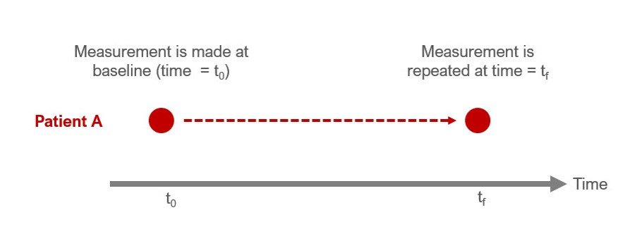

<style type="text/css">
h1.title {
  font-size: 20px;
  color: DarkRed;
  text-align: center;
}
h4.author { /* Header 4 - and the author and data headers use this too  */
    font-size: 18px;
  font-family: "Times New Roman", Times, serif;
  color: DarkRed;
  text-align: center;
}
h4.date { /* Header 4 - and the author and data headers use this too  */
  font-size: 18px;
  font-family: "Times New Roman", Times, serif;
  color: DarkBlue;
  text-align: center;
}
h1 { /* Header 3 - and the author and data headers use this too  */
    font-size: 22px;
    font-family: "Times New Roman", Times, serif;
    color: darkred;
    text-align: center;
}
h2 { /* Header 3 - and the author and data headers use this too  */
    font-size: 18px;
    font-family: "Times New Roman", Times, serif;
    color: navy;
    text-align: left;
}

h3 { /* Header 3 - and the author and data headers use this too  */
    font-size: 15px;
    font-family: "Times New Roman", Times, serif;
    color: navy;
    text-align: left;
}

h4 { /* Header 4 - and the author and data headers use this too  */
    font-size: 18px;
    font-family: "Times New Roman", Times, serif;
    color: darkred;
    text-align: left;
}
</style>

```{r setup, include=FALSE}
# code chunk specifies whether the R code, warnings, and output 
# will be included in the output files.
if (!require("ISwR")) {
   install.packages("ISwR")
   library(ISwR)
}
if (!require("MASS")) {
   install.packages("MASS")
   library(MASS)
}
if (!require("knitr")) {
   install.packages("knitr")
   library(knitr)
}
if (!require("forecast")) {
   install.packages("forecast")
   library(forecast)
}
if (!require("tufte")) {
   install.packages("tufte")
   library(tufte)
}
if (!require("pwr")) {
   install.packages("pwr")
   library(pwr)
}

knitr::opts_chunk$set(echo = TRUE,       
                      warnings = FALSE,   
                      results = TRUE,   
                      message = FALSE,
                      comment = NA)
```


# Introduction

Estimating the sample size for a prospective study is one of the first most important tasks in classical statistics. In clinical studies, researchers need to determine the number of subjects to enroll in a clinical trial to guarantee the reliability of the study results. If the sample size is too small, it will not be able to achieve the power of the analysis. If the size excessively larger than needed, it will waste resources.


Estimating the optimal number of patients is necessary for developing a Statistical Analysis Plan (SAP) in all prospective study. In retrospective studies, we can determine how much power of the analysis (for example, the power of detecting a difference if one existed). 


This chapter focuses on how to 

1) estimate sample size for a prospective study (e.g., randomized controlled trial) 

2) determine how much power we have to detect a difference if one existed (post hoc analysis)


# Sample size estimation

Before enrolling patients in a clinical trial, we want to make sure the we have the optimal number of patients for the study. Different statistical procedures require different optimal sample sizes to attain the target power. Next we discuss sample size determination for several commonly used statistical procedures.

Before move forward, let recall two error probabilities associated with a statistical test of hypothesis $\text{H}_{\text{0}}$:

$\alpha = \text{P[type I error]} = \text{P[reject Ho | Ho is true]}$ =  false positive rate

$\beta = \text{P[type II error]} = \text{P[fail to reject Ho | Ho is false]}$ = false negative.

$\text{power of a test} = 1 - \beta =\text{P[reject Ho | Ho is false]}$

Several observations about $\alpha$ and $\beta$:

* $alpha$ and $\beta$ are negatively dependent on each other (not linearly dependent). 

* Estimated $alpha$ and $\beta$ are dependent on the sample size.


> In general, if more than one test for testing a given hypothesis $Ho$ under the same $\alpha$, the one that achieves the lowest $\beta$ is the best test. This tells the relationship among estimated $\alpha$, $\beta$, power, and the sample size $n$.


Sample size estimations for **two proportions**

This is a common sample size calculation when you have two groups and the outcome is dichotomous (e.g., Yes / No)
Assume that we have a study that aims to estimate the efficacy of Treatment A versus Treatment B. The main end point is a dichotomous variable: "Response" or "No response." 

The null hypothesis is:

 $H_{0}$: There is no difference in the proportion of responders between Treatment A and Treatment B

The alternative hypothesis is:

 $H_{a}$: There is a difference in the proportion of responders between Treatment A and Treatment B

\

To determine the sample size needed to detect a meaningful difference in the proportion of responders between Treatment A and Treatment B, we need the following information: 

* **$\alpha$ level** (type I error) is the threshold where we make the determination whether something is statistically significantly different. We normally use an alpha level of 0.05 (type I error). 

* **Effect size** is the standardized difference one would expect to see between treatment groups. This is an estimate and something that is usually based on past studies. 

* **Power (1 - $\beta$)** is the ability to correctly reject the null hypothesis if the actual effect of the population is equal to or greater than the specified effect size. 


We'll set the two-tailed alpha level to 0.05 estimate size $h$ using the following equation:

 $$
 h = \varphi_{1} - \varphi_{2}
 $$
where $\varphi_{i} = 2 * arcsine(\sqrt{p_{i}})$ and $p_{i}$ denotes the proportion in treatment $i$ that were classified as "responders." In generally,  the power is set to 80%. 


With these pieces of information, we can estimate the sample size for a study with two proportions as the outcome using the following formula:


$$
\begin{aligned}
n_{i} = \frac{(Z_{\alpha/2} + Z_{1 - \beta})^2 + (p_{1}(1 - p_{1})) + (p_{2}(1 - p_{2}))}{(p_{1} - p_{2})^2}
\end{aligned}
$$


where $n_{i}$ is the sample size for one group. 


Use the `pwr.2p.test()` function in `library("pwr")`to find out optimal sample size that meet the requirements on the alpha level (`alpha = 0.05`), effect size $h$, and power level (`power = 80%`). 


**Example 1**: We consider Treatment A and Treatment B in a survey study. Set Treatment B as the reference (e.g., control) with 50% response rate. Assume that Treatment A is slightly better with a response rate of 60%. With these pieces of information, we can estimate the sample size required to detect a difference in "response" rate between Treatment A and Treatment B that is 10% ($p_{1}$ - $p_{2}$) with an alpha of 5% and power of 80%. 


```{r, echo = TRUE}
### alpha = sig.level option and is equal to 0.05
### power = 0.80
### p1 = 0.60 
### p2 = 0.50
power1 <-pwr.2p.test(h = ES.h(p1 = 0.60, p2 = 0.50), sig.level = 0.05, power = .80)
power1
```

The effect size `h` is 0.201, and the sample `n` is 387.2 or 388 rounded to the nearest whole number. This `n` is only for one group. Hence, based on the parameters of our study, we need approximately 388 patients in Treatment A and 388 patients in Treatment B to detect a difference of 10% response or greater with an alpha of 0.05 and power of 80%. 


# Power analysis for **two proportions**


Power (1 - $\beta$) is the ability to correctly reject the null hypothesis if the actual effect of the population is equal to or greater than the specified effect size. In other words, if you conclude that there is no difference in the sample, then there is no true difference in the population conditioned on the specified effect size


We can also use the plot feature to see how the power level changes with varying sample sizes. As the sample size goes up, power increases. As the sample size goes down, power decreases. This is important to understand. As we increase our sample size, we reduce the uncertainty around the estimates. By reducing this uncertainty, we gain greater precision in our estimates, which results in greater confidence in our ability to avoid making a type II error. 


```{r}
### We can plot the power relative to different levels of the sample size. 
plot(power1)
```


Let's change the $p_{i}$ and see how the power level change; we are fixing our sample size at 388 for each group with an alpha of 0.05. 

We create a sequence of values by varying the proportion of "responders" for Treatment A. We will change these from 50% to 100% in intervals of 5%. 


```{r, echo = TRUE}
p1 <- seq(0.5, 1.0, 0.05)
power1 <-pwr.2p.test(h = ES.h(p1 = p1, p2 = 0.50),
                     n = 388,
                     sig.level = 0.05)
powerchange <- data.frame(p1, power = power1$power * 100)
plot(powerchange$p1, 
     powerchange$power, 
     type = "b", 
     xlab = "Proportion of Responders in Treatment A", 
     ylab = "Power (%)")
```

We can also write a function for this:

```{r, echo = TRUE}
iteration <- function(p_i, P_i, i_i, p2, n, alpha) {
              p1 <- seq(p_i, P_i, i_i)
              power1 <-pwr.2p.test(h = ES.h(p1 = p1, p2 = p2),
                                   n = n,
                                   sig.level = alpha)
              powerchange <- data.frame(p1, power = power1$power * 100)
              powerchange
}

iteration(0.5, 1.0, 0.05, 0.50, 388, 0.05)
```

# Sample size estimations for **two averages**


This is another common sample size estimation for two groups when the outcome is a continuous variable.

Now let's estimate the sample size for a study where we are comparing the averages between two groups. Let's suppose that we are working on a randomized controlled trial that seeks to evaluate the difference in the average change in hemogloblin A1c (HbA1c) from baseline between Treatment A and Treatment B. 

\

The null hypothesis is:

 $H_{0}$: There is no difference in the average change in HbA1c from baseline between Treatment A and Treatment B

The alternative hypothesis is:

 $H_{a}$: There is a difference in the average change in HbA1c from baseline between Treatment A and Treatment B

To determine the sample size needed to detect a meaningful difference in the average HbA1c change from baseline between Treatment A and Treatment B, we can use the following formula:


$$
\begin{aligned}
n_{i} = \frac{2 \sigma^2 * (Z_{\alpha/2} + Z_{1 - \beta})^2}{({\mu_{1} - \mu_{2}})^2}
\end{aligned}
$$

where $n_{i}$ is the sample size for one of the groups, $\mu_{1}$ and $\mu_{2}$ are the average changes in HbA1c from baseline for Treatment A and Treatment B, respectively.


As usual, we'll set the two-tailed alpha level to 0.05. The effect size, also known as Cohen's $d$, is estimated using the following equation:

$$
\begin{aligned}
d = \frac{\mu_{1} - \mu_{2}}{\sigma_{pooled}}
\end{aligned}
$$

The pooled standard deviation is estimated using the following formula:


$$
\begin{aligned}
\sigma_{pooled} = \sqrt{\frac{sd_{1}^2 + sd_{2}^2}{2}}
\end{aligned}
$$

Once again, the R `pwr` package can make this task easy for us. However, we'll need to estimate the Cohen's $d$. 

**Example 2**: Since we haven't started the study, we have to make some assumptions of about each treatment strategy's change in HbA1c. Let's assume that the expected average change in HbA1c from baseline for Treatment A was 1.5% with a standard deviation of 0.25%. Additionally, let's assume that the expected average change in HbA1c from baseline for Treatment B was 1.0% with a standard deviation of 0.20. 

First, we'll calculate the pooled standard deviation ($\sigma_{pooled}$):

```{r, echo = TRUE}
sd1 = 0.25
sd2 = 0.30
sd.pooled = sqrt((sd1^2 +sd2^2) / 2)
sd.pooled
```

Once we have the $\sigma_{pooled}$, we can estimate the Cohen's $d$:

```{r, echo = TRUE}
mu1 = 1.5
mu2 = 1.0
d = (mu1 - mu2) / sd.pooled
d
```

The Cohen's $d$ is 1.81, which is considered a large effect size. 


Now, we can take advantage of the `pwr` package and estimate the sample size needed to detect a difference of 0.5% (1.5% - 1.0%) in the average HbA1c change from baseline between Treatment A and Treatment B with 80% power and a significance threshold of 5%. 

```{r, echo = TRUE}
### d = Cohen's d
### power = 0.80
### alpha = 0.05
n.i <- pwr.t.test(d = d, power = 0.80, sig.level = 0.05)
n.i
```

Based on our study parameters, we need 6 patients in each group to detect a difference of 0.5% or greater with 80% power and a significance threshold of 5%. 


# Power analysis for two averages


**Power** (1 - $\beta$) is the ability to correctly reject the null hypothesis if the actual effect of the population is equal to or greater than the specified effect size. 

We can plot how the power will change as the sample size changes. As the sample size increases, power increases. This should make sense. Like our previous example with two proportions, as we increase our sample size, we reduce the uncertainty around the estimates. By reducing this uncertainty, we gain greater precision in our estimates, which results in greater confidence in our ability to avoid making a type II error. 


```{r, echo = TRUE, warning = FALSE}
### We can plot the power relative to different levels of the sample size. 
n <- seq(1, 10, 1)
nchange <- pwr.t.test(d = d, n = n, sig.level = 0.05)
nchange.df <- data.frame(n, power = nchange$power * 100)
nchange.df
```

```{r}
plot(nchange.df$n, 
     nchange.df$power, 
     type = "b", 
     xlab = "Sample size, n", 
     ylab = "Power (%)")
```


```{r, fig.margin = TRUE, echo= FALSE}
plot(n.i)
```

As the sample size increases, our power increases. This makes sense because we have more patients to detect differences that may be smaller. But we fixed our effect size (Cohen's $d$), so as we increase the sample size, our power to detect that difference ultimately increases. 

Let’s change the $\mu_{i}$ and see how the power level change; we are fixing our sample size at 6 for each group with an alpha of 0.05.


We create a sequence of values by varying the average change in HbA1c from baseline for Treatment A. We will change these from 0% to 2% in intervals of 0.1%. 

```{r, echo = TRUE}
mu1 <- seq(0.0, 2.0, 0.1)

d <- (mu1 - mu2) / sd.pooled

power1 <- pwr.t.test(d = d, n = 6, sig.level = 0.05)
powerchange <- data.frame(d, power = power1$power * 100)
powerchange
```

```{r}
plot(powerchange$d, 
     powerchange$power, 
     type = "b", 
     xlab = "Cohen's d", 
     ylab = "Power (%)")
```

This figure shows how the power changes with Cohen's $d$. It has a symmetrical patter because of negative and positive range associated with Cohen's $d$. But the story is the same. As the effect size increases (negative and positive signs do not matter; we only care about the absolute values), the power increases. This makes sense because we only have enough power to detect large differences with the current sample size (which is fixed in this case). If the differences are small, then we do not have enough power with the current sample size of 6. 


# Sample size estimation for **paired data (before and after)**

So far, we discussed how to perform sample size estimations for "between-groups" comparisons. However, many studies investigate the "within-group" changes. This are paired data, which means that the observation for one data point is dependent on another observation. A common study design where paired data is collected are longitudinal studies. Theses types of studies involve repeated measure. For example a pretest posttest study design will measure a data point for a patient at baseline and then repeat that measurement at another point in time. In the figure, Patient A has two measurements at $t_{0}$ and $t_{f}$. Since these measurements were made in the same person, the change is "within" the patient. Alternatively, we can think of this as a "repeated" measure since the patient had the measurement performed twice. 

```{r , echo=FALSE, fig.cap="Figure caption: Pretest-Posttest (repeated measures) framework", out.width = '100%'}

```

When you have a study where you are performing a paired t test, you can use the same `pwr.t.test()` function for a two sample test from the `pwr` package. 

Let's assume that we want to conduct a prospective study measure the weight change of a cohort of patients who started a diet. You want to enroll enough patients to detect a 5 lb reduction in the weight 3 weeks after the diet started. Let's assume that at baseline the expected average weight for the cohort was 130 lbs with a standard deviation of 11. After 3 weeks of diet, the expected average weight was 125 lbs with a standard deviation of 12. 

We can estimate the effect size (Cohen's $d_{z}$) for a paired t test. 


$$
\begin{aligned}
d_{z} = \frac{ | \mu_{z} |}{\sigma_{z}} = \frac{| \mu_{x} - \mu_{y} | }{ \sqrt{\sigma_{x}^{2} + \sigma_{y}^{2} - 2 \rho_{x, y} \sigma_{x} \sigma_{y}}}
\end{aligned}
$$

where $x$ denotes "before" (or baseline), $y$ denotes "after", $d_{z}$ denotes the Cohen's $d$ for paired analysis $\rho$ denotes the correlation between the measures before and after the diet. (For simplicity, I use 0.50 if I don't have prior information about this correlation.) 


```{r, echo = TRUE}
### Parameters for paired analysis or a pretest-posttest study design

mu_x <- 130     ### Average weight before the diet (baseline)
mu_y <- 125     ### Average weight after the diet

sd_x <- 11      ### Standard deviation before the diet
sd_y <- 12      ### Standard deviation after the diet

rho <- 0.5      ### Correlation between measures before and after the diet

sd_z <- sqrt(sd_x^2 + sd_y^2 - 2*rho*sd_x*sd_y)
  
d_z <- abs(mu_x - mu_y) / sd_z
d_z
```

The Cohen's $d_{z}$ is 0.433. We can input this into the `pwr.t.test()` function. 


```{r}
n.paired <- pwr.t.test(d = d_z, power = 0.80, sig.level = 0.05, type = "paired")
n.paired
```


We need 44 patients with two measurements (before and after) they implement their diet to detect a difference of 5 lbs or greater with 80% power and a significance level of 0.05. 


# Power analysis of **paired samples (paired t test)**

We can plot how the power will change as the sample size changes for the paired t test analysis. As the sample size increases, power increases. This should make sense. Like our previous examples, as we increase our sample size, we reduce the uncertainty around the estimates. By reducing this uncertainty, we gain greater precision in our estimates, which results in greater confidence in our ability to avoid making a type II error. 


```{r, echo = TRUE}
### We can plot the power relative to different levels of the sample size for paired analysis. 
n_z <- seq(1, 80, 5)
n_z.change <- pwr.t.test(d = d_z, n = n_z, sig.level = 0.05, type = "paired")

n_z.change.df <- data.frame(n_z, power = n_z.change$power * 100)
n_z.change.df
```


```{r, echo = TRUE, fig.cap = "We increase the sample size from 1 to 80 at 5-unit intervals."}
plot(n_z.change.df$n, 
     n_z.change.df$power, 
     type = "b", 
     xlab = "Sample size, n", 
     ylab = "Power (%)")

```


As the sample size increases, we generate more power to detect a difference of 5 lbs with a significance level of 0.05 and a fixed sample size of 44 patients with two measurements (before and after) they implement their diet. 

Let's see how power changes when we change the effect size. Let's change the average weight after the patients implement their diet. Instead of an average of 125 lbs, let's see how the power will change when we reduce that to 100 lbs. 

```{r, echo = TRUE, fig.cap = "We vary the average weight $\\mu_{y}$ between 50 lbs and 130 lbs in intervals of 5 lbs."}
### Vary the mu_y from 50 lbs to 130 lbs in intervals of 5 lbs.
mu_y <- seq(50, 130, 5)

d_z <- abs(mu_x - mu_y) / sd_z

n_z.change <- pwr.t.test(d = d_z, n = 44, sig.level = 0.05)
n_z.change.df <- data.frame(d_z, power = n_z.change$power * 100)
n_z.change.df

plot(n_z.change.df$d_z, 
     n_z.change.df$power, 
     type = "b", 
     xlab = "Cohen's d_z", 
     ylab = "Power (%)",
     xlim = c(0, 2))
```

When we increase the effect size (Cohen's $d_{z}$), our power goes up; recall that the sample size is fixed at 44 and significance level is 0.05. But when the effect size gets smaller (or when the average weight loss shrinks), we lose power to detect a difference because our sample size is too small. We'll need to increase our sample size to have a reasonable power to detect small differences. 

We can also see how power changes when we vary $\rho$. If we set $\rho$ = 0, then the Cohen's $d_{z}$ = 0.307. If we set $\rho$ = 1, then the Cohen's $d_{z}$ = 5.

```{r, echo = TRUE}
mu_x <- 130     ### Average weight before the diet (baseline)
mu_y <- 125     ### Average weight after the diet

sd_x <- 11      ### Standard deviation before the diet
sd_y <- 12      ### Standard deviation after the diet

sd_z_1 <- sqrt(sd_x^2 + sd_y^2 - 2*1*sd_x*sd_y)
sd_z_0 <- sqrt(sd_x^2 + sd_y^2 - 2*0*sd_x*sd_y)

d_z_1 <- abs(mu_x - mu_y) / sd_z_1
d_z_0 <- abs(mu_x - mu_y) / sd_z_0

d_z_1
d_z_0
```

So, higher $\rho$ results in large $d_{z}$ and smaller $\rho$ results in small $d_{z}$ values. 

Let's see how power changes when we change the $\rho$ range from 0 to 1 in intervals of 0.1 units. 


```{r, echo = TRUE}
rho <- seq(0.0, 1.0, 0.1)

sd_z <- sqrt(sd_x^2 + sd_y^2 - 2*rho*sd_x*sd_y)

d_z <- abs(mu_x - mu_y) / sd_z

rho.change <- pwr.t.test(d = d_z, n = 44, sig.level = 0.05)
rho.change.df <- data.frame(d_z, power = rho.change$power * 100)
rho.change.df
```


```{r, echo = TRUE, fig.cap = "We vary $\\rho$ from 0 to 1 at intervals of 0.1 unit."}
plot(rho.change.df$d_z, 
     rho.change.df$power, 
     type = "b", 
     xlab = "Cohen's d_z", 
     ylab = "Power (%)",
     xlim = c(0, 1.5))
```

As $\rho$ increases, our power increases. This makes sense because we are nearing "perfect" correlation, which would require less sample to detect a difference if one existed. As the correlation becomes less "perfect" our power drops suggesting that we need to increase our sample size to make up for this poor correlation. 


# Power analysis with **unequal sample sizes**


It is common for the sample size to be different. The `pwr.t2n.test()` is a useful tool to help estimate the power given the sample sizes of the study. 


It is common to perform power analysis on a study where the sample sizes between groups are different. 

Suppose you have a retrospective study where the patients were prescribed Treatment A and Treatment B. There were 130 patients in Treatment A ($n_{A}$ = 130) and 120 patients in Treatment B ($n_{B}$ = 120). The average change in HbA1c was 1.5% with a standard deviation of 1.25% in Treatment A, and the average change in HbA1c was 1.4% with a standard deviation of 1.01% in Treatment B. 

First, we'll calculate the pooled standard deviation ($\sigma_{pooled}$):

```{r, echo = TRUE}
sd1 <- 1.25
sd2 <- 1.01
sd_pooled <- sqrt((sd1^2 +sd2^2) / 2)
sd_pooled
```

Once we have the $\sigma_{pooled}$, we can estimate the Cohen's $d$:

```{r, echo = TRUE}
mu1 <- 1.5
mu2 <- 1.4
d <- (mu1 - mu2) / sd_pooled
d
```

Now, we can estimate the power with the different sample sizes across the groups ($n_{A}$ = 130, $n_{B}$ = 120).


```{r, echo = TRUE}
n1 <- 130
n2 <- 120

power.diff_n <- pwr.t2n.test(d = d, n1 = n1, n2 = n2, sig.level = 0.05)
power.diff_n
```


Since the average HbA1c change from baseline for Treatment A is 1.5% and 1.4% for Treatment B, the average difference in the HbA1c change from baseline is 0.1%. This is a difference (difference between the groups) of the differences (difference from baseline within the group) calculation. 


You only have 11% power to detect a difference of 0.10% or greater in the HbA1c change from baseline. This means that you are underpowered to detect a difference of 0.10% or greater in the HbA1c change from baseline with $n_{A}$ = 130, $n_{B}$ = 120, and a significance level of 0.05. When studies are underpowered, there is a high potential for type II error. The only way to address this problem is to enroll more patients or expand the sample by relaxing inclusion criteria. But this may increase the threats to the study's internal validity.


# Conclusions
Sample size estimations and power analysis are very useful tools to determine how many patients you need in your study and how confident you are that you didn't make a type II error. Depending on the type of study, you will need to use different functions from the `pwr` package. I highly encourage you to explore the other functions of the `pwr` package to see if those fit the study design you have planned. 

