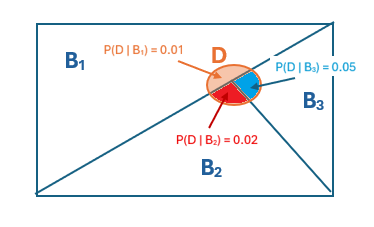

```{css, echo = FALSE}
#TOC::before {
  content: "Table of Contents";
  font-weight: bold;
  font-size: 1.2em;
  display: block;
  color: navy;
  margin-bottom: 10px;
}


div#TOC li {     /* table of content  */
    list-style:upper-roman;
    background-image:none;
    background-repeat:none;
    background-position:0;
}

h1.title {    /* level 1 header of title  */
  font-size: 22px;
  font-weight: bold;
  color: DarkRed;
  text-align: center;
  font-family: "Gill Sans", sans-serif;
}

h4.author { /* Header 4 - and the author and data headers use this too  */
  font-size: 15px;
  font-weight: bold;
  font-family: system-ui;
  color: navy;
  text-align: center;
}

h4.date { /* Header 4 - and the author and data headers use this too  */
  font-size: 18px;
  font-weight: bold;
  font-family: "Gill Sans", sans-serif;
  color: DarkBlue;
  text-align: center;
}

h1 { /* Header 1 - and the author and data headers use this too  */
    font-size: 20px;
    font-weight: bold;
    font-family: "Times New Roman", Times, serif;
    color: darkred;
    text-align: center;
}

h2 { /* Header 2 - and the author and data headers use this too  */
    font-size: 18px;
    font-weight: bold;
    font-family: "Times New Roman", Times, serif;
    color: navy;
    text-align: left;
}

h3 { /* Header 3 - and the author and data headers use this too  */
    font-size: 16px;
    font-weight: bold;
    font-family: "Times New Roman", Times, serif;
    color: navy;
    text-align: left;
}

h4 { /* Header 4 - and the author and data headers use this too  */
    font-size: 14px;
  font-weight: bold;
    font-family: "Times New Roman", Times, serif;
    color: darkred;
    text-align: left;
}

/* Add dots after numbered headers */
.header-section-number::after {
  content: ".";

body { background-color:white; }

.highlightme { background-color:yellow; }

p { background-color:white; }

}
```

```{r setup, include=FALSE}
# code chunk specifies whether the R code, warnings, and output 
# will be included in the output files.
if (!require("knitr")) {
   install.packages("knitr")
   library(knitr)
}
if (!require("pander")) {
   install.packages("pander")
   library(pander)
}
if (!require("psych")) {
  install.packages("psych")
  library(psych)
}
if (!require("RColorBrewer")) {
  install.packages("RColorBrewer")
  library(RColorBrewer)
}

if (!require("boot")) {
  install.packages("boot")
  library(boot)
}
if (!require("effsize")) {
  install.packages("effsize")
  library(effsize)
}
## library(effsize)
knitr::opts_chunk$set(echo = TRUE,       # include code chunk in the output file
                      warning = FALSE,   # sometimes, you code may produce warning messages,
                                         # you can choose to include the warning messages in
                                         # the output file. 
                      results = TRUE,    # you can also decide whether to include the output
                                         # in the output file.
                      message = FALSE,
                      comment = NA
                      )  
```

\

# Introduction

Bayesian reasoning is a cornerstone of probabilistic inference, allowing us to update beliefs as new data arrives. In simple terms, Bayes' rule can incorporate prior (auxiliary) information into models to improve their performance. Its applications range from traditional statistical modeling in fields such as medical diagnosis, spam filtering, and finance, to modern data science and machine learning.

This module first reviews Bayes' rule for dependent events, then extends it to dependent discrete and continuous random variables. Finally, we relax the assumption of conditional dependence to introduce the well‑known naive Bayes predictive models, one of the most practically important predictive models in machine learning and data science.


# Bayes’ Rule for Dependent Events

**Mathematical Formulation**

Let$A$and$B$be two dependent events with $P(B) > 0$. Bayes’ rule follows from the definition of conditional probability:

$$
P(A|B) = \frac{P(B|A)P(A)}{P(B)}
$$

*$P(A)$: Prior probability of $A$ (initial belief, prior information, auxiliary information).
*$P(B|A)$: Likelihood of observing $B$ given $A$. The observed information from data.
*$P(B)$: Marginal probability of $B$, often computed using the law of total probability}.
*$P(A|B)$: Posterior probability of $A$ given evidence $B$. The model with incorporated auxiliary information


If $A$ has multiple mutually exclusive states $A_1, A_2, \dots, A_n$:

$$
P(A_i|B) = \frac{P(B|A_i)P(A_i)}{\sum_{j=1}^n P(B|A_j)P(A_j)}
$$

**Example: Medical Diagnosis**

**Problem**: Some assumptions about the population and the performance of the test:

A disease affects $1\%$ of a population. This is general information can be found at population level.

Test sensitivity $P(\text{Positive}|\text{Disease}) = 0.95$. This information is based on the clinical trials in which the participants' disease status is known.

Test specificity $P(\text{Negative}|\text{No Disease}) = 0.90$. This information is also based on the clinical trials.

Given a positive test, what is the probability the patient has the disease? This information is needed for physician to make clinical decision.

**Solution**: 

* *Some Notations*:
  + $D+$: event **has disease** 
  + $D-$: event **has no disease**
  + $T+$: event **test positive**
  + $T-$: event **test negative**

* *Given Info*:
  + $P(D+) = 0.01$
  + $P(T+ | D+) = 0.95$
  + $P(T- | D-) = 0.90$

* We want to find $P(D+|T+)$.

First, compute $P(T+|D+) = 0.95$.

$$P(T+|D-) = 1 - P(\text{Negative}|\text{No Disease}) = 0.10$$.

Using the following **law of total probability**:

$$
P(T+) = P(T+\cap D+) + P(T+ \cap D-) = P(T+|D+)P(D+) + P(T+|D-)P(D-)
$$

$$
P(T+) = 0.95 \times 0.01 + 0.10 \times 0.99 = 0.0095 + 0.099 = 0.1085
$$

Bayes’ rule:

$$
P(D+|T+) = \frac{P(T+|D+)P(D+)}{P(T+)} = \frac{0.95 \times 0.01}{0.1085} \approx 0.0876 = 8.76\%
$$

Despite the positive test, the posterior probability is low because the prior is very low.

\


**Example 2: Bayes rule on multiple event**:  Suppose a factory has three machines $B_1, B_2, B_3$ making widgets. Denote $D = \text{Defective}$. Given the following information

* Machine $B_1$ makes 50\% of widgets: $P(B_1)=0.5$.
* Machine $B_2$ makes 30\%: $P(B_2)=0.3$.
* Machine $B_3$ makes 20\%: $P(B_3)=0.2$.

Defect rates of each machine are given by:

* $P(\text{D} \mid B_1) = 0.01$: 1\% of the products produced by machine $B_1$ were defective.
* $P(\text{D} \mid B_2) = 0.02$: 2\% of the products produced by machine $B_2$ were defective.
* $P(\text{D} \mid B_3) = 0.05$: 5\% of the products produced by machine $B_3$ were defective.

```{r fig.align='center', out.width="40%"}

```

**Question**: Given a defective widget, what is the probability it came from machine $B_3$, $P(B_3 \mid \text{D})$?


**Solution**: First of all, the desired conditional probability can be re-expressed as

$$
P(B_3 \mid \text{D}) = \frac{P(B_3 \cap D)}{P(D)} = \frac{P(D \mid B_3) P(B_3)}{P(D)}
$$
The probabilities on the numerator are given. We need to find the probability $P(D)$ using the **law of total probability** in the following. From the above Venn diagram, we see that


$$
\begin{aligned}
P(D) & =P(B_1 \cap D) + P(B_2 \cap D) + P(B_3 \cap D) \\
     &= P(D \mid B_1)P(B_1) + P(D \mid B_2)P(B_2) + P(D \mid B_3)P(B_3) \\
     &= (0.01)(0.5) + (0.02)(0.3) + (0.05)(0.2) \\
     &= 0.005 + 0.006 + 0.01 \\
     &= 0.021.
\end{aligned}
$$

Therefore,

$$
P(B_3 \mid \text{D}) = \frac{P(D \mid B_3) P(B_3)}{P(D)} = \frac{0.05\times 0.2}{0.021} = \frac{0.01}{0.021} = 0.476.
$$


# Bayes’ Rule for Discrete Random Variables

For discrete random variables $X$ and $Y$, with pmf $p_X(x)$ and conditional pmf $p_{Y|X}(y|x)$:

$$
p_{X|Y}(x|y) = \frac{p_{Y|X}(y|x) p_X(x)}{p_Y(y)}, \quad p_Y(y) = \sum_{x'} p_{Y|X}(y|x') p_X(x')
$$

This is directly analogous to the event-based version.

**Example: Manufacturing Quality Control**

Let $X$ be the **true quality grade** of an item (discrete random variable):  

$$
X \in \{ \text{Excellent}, \text{Good}, \text{Fair}, \text{Poor} \}
$$

Let $Y$ be the **inspection result** (discrete random variable):  

$$
Y \in \{ \text{Pass}, \text{Fail} \}
$$

* Given **prior distribution** of quality (based on historical data)

$$
\begin{aligned}
P(X = \text{Excellent}) &= 0.20 \\
P(X = \text{Good}) &= 0.50 \\
P(X = \text{Fair}) &= 0.25 \\
P(X = \text{Poor}) &= 0.05
\end{aligned}
$$

* Inspection accuracy (**likelihood**) based on data: Probability of passing inspection given true quality.

$$
\begin{aligned}
P(Y = \text{Pass} \mid X = \text{Excellent}) &= 0.99 \\
P(Y = \text{Pass} \mid X = \text{Good}) &= 0.90 \\
P(Y = \text{Pass} \mid X = \text{Fair}) &= 0.70 \\
P(Y = \text{Pass} \mid X = \text{Poor}) &= 0.10
\end{aligned}
$$

and

$$
\begin{aligned}
P(Y = \text{Fail} \mid X = \text{Excellent}) &= 0.01 \\
P(Y = \text{Fail} \mid X = \text{Good}) &= 0.10 \\
P(Y = \text{Fail} \mid X = \text{Fair}) &= 0.30 \\
P(Y = \text{Fail} \mid X = \text{Poor}) &= 0.90
\end{aligned}
$$

**Question**: **Given** an item **fails inspection** ($Y = \text{Fail}$). What is the probability distribution over its true quality grade $X$? In other words, we want to find the distribution of conditional distribution $X\mid \text{Fails}$:

$$
P(X = x \mid Y = \text{Fail}) \quad \text{for } x \in \{\text{Ex}, \text{Good}, \text{Fair}, \text{Poor}\}
$$

**Solution**: Using the Bayes rule,

$$
P(X = x \mid Y = \text{Fail}) = \frac{P[(X=x)\cap \text{Fails}]}{P(\text{Fails})} = \frac{P[\text{Fails}\mid (X=x)]\times P(X=x)}{P(\text{Fails})}
$$

For any $x \in \{\text{Ex}, \text{Good}, \text{Fair}, \text{Poor}\}$, the numerator is calculated from the given condition. We need to use the **law of total probability** to find $P(\text{Fails})$ in the following.

$$
P(Y = \text{Fail}) = \sum_{\text{all } x} P(Y = \text{Fail} \mid X = x) P(X = x)
$$

which is explicitly given by

$$
\begin{aligned}
P(Y = \text{Fail}) &= (0.01 \times 0.20) + (0.10 \times 0.50) + (0.30 \times 0.25) + (0.90 \times 0.05) \\
&= 0.002 + 0.05 + 0.075 + 0.045 \\
&= 0.172
\end{aligned}
$$

Next, we calculate $P(X = x \mid Y = \text{Fail}) \quad \text{for } x \in \{\text{Ex}, \text{Good}, \text{Fair}, \text{Poor}\}$ bellow:

**Excellent}**  
$$
P(X = \text{Ex} \mid Y = \text{Fail}) = \frac{0.01 \times 0.20}{0.172} = \frac{0.002}{0.172} \approx 0.0116
$$

**Good**

$$
P(X = \text{Good} \mid Y = \text{Fail}) = \frac{0.10 \times 0.50}{0.172} = \frac{0.05}{0.172} \approx 0.2907
$$

**Fair**

$$
P(X = \text{Fair} \mid Y = \text{Fail}) = \frac{0.30 \times 0.25}{0.172} = \frac{0.075}{0.172} \approx 0.4360
$$

**Poor**  

$$
P(X = \text{Poor} \mid Y = \text{Fail}) = \frac{0.90 \times 0.05}{0.172} = \frac{0.045}{0.172} \approx 0.2616
$$

Because we have to worked with so many probabilities, next, we summarize the probabilities obtained above in a table.

| Quality Class  | Prior $P(x)$|$P(\text{Fail} \mid X)$| Posterior $P(X \mid \text{Fail})$|
|:-----------|:--------------|:----------------|:------------------------|
| **Excellent** |  0.20 |  0.01 |  0.0116 (1.16\%) | 
| **Good** |  0.50 |  0.10 |  0.2907 (29.07\%) | 
| **Fair** |  0.25 |  0.30 |  0.4360 (43.60\%) | 
| **Poor** |  0.05 |  0.90 |  0.2616 (26.16\%) | 


The last column contains the (posterior) distribution that we want to find.

<font color = "darkred">We can use **the posterior distribution** from the table above to answer a membership classification or prediction:</font> <font color = "blue">For a randomly selected product that failed the inspection, based on the calculated **posterior distribution** (the last column of the table above), the product is classified into the quality class of **Fair**.</font> This means Bayes' rule can be used as a **classifier**, or **predictive model**.


# Bayes’ Rule for Continuous Random Variables

For continuous random variables $X$ and $Y$, we use probability density functions (pdfs):

$$
f_{X|Y}(x|y) = \frac{f_{Y|X}(y|x) f_X(x)}{f_Y(y)} \propto f_{Y|X}(y|x) f_X(x), \quad f_Y(y) = \int f_{Y|X}(y|x) f_X(x) dx
$$

$\propto$ is read **proportional to**. We can write $f_{X|Y}(x|y)  \propto f_{Y|X}(y|x) f_X(x)$ because $f_Y(y)$ is a normalizing coefficient (that makes $f_{X|Y}(x|y)$ a valid density).


To understand the above idea, let's consider normal random variable $Y$ with density function:

$Y\mid \theta \sim \mathcal{N}(\theta, \sigma_0^2)$ with known $\sigma_0^2$ and unknown mean $\theta$. Assume that $\theta$ is random and also follows normal distribution $\theta \sim \mathcal{N}(\mu_0, \tau_0^2)$, where both $\mu_0$ and $\tau_0$ are known constants. <font color = "red">Don't be surprise! In Bayesian statistics, **all unknown parameters are random**. The distribution of the unknown parameter is called **prior distribution** .</font>

Given observation $Y = y$, then the **posterior distribution** of $\theta$ given $Y = y$ is (See the derivation in the appendix):

$$
\theta|Y=y \sim \mathcal{N}\left( \frac{\sigma_0^{-2}y + \tau_0^{-2}\mu_0}{\sigma_0^{-2} + \tau_0^{-2}}, \ (\sigma_0^{-2} + \tau_0^{-2})^{-1} \right)
$$

<font color = "red">Note that the **precision of a distribution** is defined as the **inverse of the variance**.</font> Let $\eta_0 = \sigma_0^{-2}$ and $\lambda_0 = \tau_0^{-2}$. The above expression can be written as

$$
\theta|Y=y \sim \mathcal{N}\left( \frac{\eta_0y + \lambda_0 \mu_0}{\eta_0 + \lambda_0}, \ (\eta_0 + \lambda_0)^{-1} \right),
$$

which can further rewritten as

$$
\theta|Y=y \sim \mathcal{N}\left( \frac{\eta_0 }{\eta_0 + \lambda_0} y + \frac{\lambda_0 }{\eta_0 + \lambda_0}\mu_0, \ \frac{1}{\eta_0 + \lambda_0} \right),
$$

**Interpretation**: If $Y|\theta$ and $\theta$ are both normal random variables, then $\theta\mid Y$ is also a normal random variable. The Bayesian Estimator of the population mean is $E[\theta \mid Y]$:

$$
{\mu}_{\text{Bayes}} = E[\theta \mid Y] = \frac{\eta_0 }{\eta_0 + \lambda_0} y + \frac{\lambda_0 }{\eta_0 + \lambda_0}\mu_0
$$

$$
= \frac{\eta_0 }{\eta_0 + \lambda_0} E[y] + \frac{\lambda_0 }{\eta_0 + \lambda_0}\mu_0. 
$$

Therefore,

$$
\hat{\mu}_{\text{Bayes}} =\frac{\eta_0 }{\eta_0 + \lambda_0} \bar{y} + \frac{\lambda_0 }{\eta_0 + \lambda_0}\mu_0. 
$$

That is, <font color = "red">**the Bayesian estimator of population mean (i.e., the posterior mean) is equal to the weighted average of the sample mean ($\bar{x}$) and the prior mean ($\mu_0$)**.</font>  This is the basis for Bayesian parameter estimation, where $\theta$ is an unknown parameter and $Y$ is observed data. The above formulas look complex. Next, we use an numerical example to explain the how to use the above theorem to solve practical questions.


**Example: Estimating the mean speed of cars from sensor readings**: We want to estimate the **true mean speed** $S$ of cars passing a point, using **radar measurements** $R$. We have prior knowledge about $S$, and we get sample measurements $\bar{r}$ (average of $n$ radar readings). Let:

* $S$ = true mean speed (unknown parameter, treated as a random variable in Bayesian inference).

* $R_i$ = $i$-th radar speed measurement.


Assume radar measurement errors are normally distributed around the true speed:

$$
R_i \mid S \sim \mathcal{N}(S, \sigma^2)
$$

where $\sigma$ is known measurement standard deviation (here $\sigma = 2$ mph). We get $n$ independent measurements: $r_1, r_2, \dots, r_n$, and compute their sample mean $\bar{r}$.

**Prior Distribution for $S$**

We need a prior for the true mean speed $S$ before seeing data. From historical traffic data, we believe typical mean speeds are around $\mu_0 = 60$ mph, with some uncertainty expressed by standard deviation $\tau = 5$ mph. Thus, we choose a normal prior:

$$
S \sim \mathcal{N}(\mu_0, \tau^2)
$$


$$
S \sim \mathcal{N}(60, 25)
$$

**Likelihood of the Data**

Given $S$, the sample mean $\bar{R}$ of $n$ measurements has distribution:

$$
\bar{R} \mid S \sim \mathcal{N}\left(S, \frac{\sigma^2}{n}\right)
$$

because:

$$
\bar{R} = \frac{1}{n} \sum_{i=1}^n R_i, \quad \text{Var}(\bar{R} \mid S) = \frac{\sigma^2}{n}.
$$

Let observed $\bar{r} = 62$ mph from $n = 10$ measurements, and known $\sigma = 2$ mph.

Then:

$$
\frac{\sigma^2}{n} = \frac{4}{10} = 0.4
$$

so

$$
\bar{R} \mid S \sim \mathcal{N}(S, 0.4).
$$

**Posterior Distribution for $S$ using Bayes' Rule**

For a normal prior and normal likelihood, the posterior is also normal. Let:

* Prior mean $\mu_0 = 60$, prior variance $\tau^2 = 25$.

* Sample mean $\bar{r} = 62$, conditional variance $v = \sigma^2/n = 0.4$.


The posterior mean $\mu_n$ is:

$$
\mu_n = \frac{ \frac{\mu_0}{\tau^2} + \frac{\bar{r}}{v} }{ \frac{1}{\tau^2} + \frac{1}{v} }
$$

$$
\mu_n = \frac{ \frac{60}{25} + \frac{62}{0.4} }{ \frac{1}{25} + \frac{1}{0.4} }
$$

$$
\frac{60}{25} = 2.4, \quad \frac{62}{0.4} = 155
$$

Numerator: $2.4 + 155 = 157.4$. Denominator: $\frac{1}{25} + \frac{1}{0.4} = 0.04 + 2.5 = 2.54$.

So:

$$
\mu_n = \frac{157.4}{2.54} \approx 61.97 \ \text{mph}.
$$

Posterior variance $\tau_n^2$:

$$
\frac{1}{\tau_n^2} = \frac{1}{\tau^2} + \frac{1}{v} = 2.54
$$

$$
\tau_n^2 = \frac{1}{2.54} \approx 0.3937
$$

$$
\tau_n \approx 0.627 \ \text{mph}.
$$

Thus, the posterior distribution is:

$$
S \mid \bar{r} \sim \mathcal{N}(61.97, 0.3937).
$$

**Interpretation**

We started with prior $\mathcal{N}(60, 25)$, which was quite uncertain $\tau = 5$ mph).

After $n = 10$ measurements with sample mean $62$ mph (slightly above prior mean), the posterior is much tighter $\tau_n \approx 0.627$ mph) and centered near $61.97$ mph.

The data moved our estimate from $60$ toward $62$, but not all the way because the prior had some weight.

If $n$ were larger, the posterior would be even tighter and influenced more by the data.

**Final Result in Bayesian Estimation Form**

Bayes' rule:

$$
p(S \mid \bar{r}) \propto p(\bar{r} \mid S) \cdot p(S)
$$

$$
p(\bar{r} \mid S) = \frac{1}{\sqrt{2\pi v}} \exp\left[-\frac{\bar{r} - S)^2}{2v}\right], \quad v = \frac{\sigma^2}{n}
$$

$$
p(S) = \frac{1}{\sqrt{2\pi \tau^2}} \exp\left[-\frac{(S - \mu_0)^2}{2\tau^2}\right]
$$

Multiplying and completing the square gives the posterior normal derived above. Thus:

$$
\text{Posterior mean speed estimate} = 61.97 \ \text{mph}
$$

$$
95\% \ \text{credible interval} \approx 61.97 \pm 1.96 \times 0.627 \approx (60.74, 63.20) \ \text{mph}.
$$

$$
\boxed{61.97 \ \text{mph}}
$$

(with posterior std $\approx 0.627$ mph)


This is a closed-form update: the posterior mean is a weighted average of prior mean and data.


# Naive Bayes Prediction

**Idea**: A supervised classification method based on Bayes’ rule, with a ``naive'' assumption: features are conditionally independent given the class label}.

For a feature vector$\mathbf{X} = (X_1, X_2, \dots, X_d)$and class$C \in \{1, \dots, K\}$:

From Bayes’ rule:

$$
P(C=k|\mathbf{X}) \propto P(C=k) \prod_{j=1}^d P(X_j|C=k)
$$

The class with the highest posterior probability is chosen.

**Why ``Naive''?**

The conditional independence assumption is often false in practice, but Naive Bayes still performs well in many applications (text classification, spam detection) because we only need the **ranking** of probabilities to be correct for classification.

**Example: Text Classification (Spam vs. Ham)**

**Problem**: Classify email as spam ($S$) or ham ($H$) based on word counts.

**Training data**:

Vocabulary: \{"buy", "cheap", "meeting", "free"\}

Suppose in spam emails:

$P(\text{"buy"}|S) = 0.3$,$P(\text{"cheap"}|S) = 0.2$,$P(\text{"meeting"}|S) = 0.01$,$P(\text{"free"}|S) = 0.4$

In ham emails:\\

$P(\text{"buy"}|H) = 0.01$,$P(\text{"cheap"}|H) = 0.01$,$P(\text{"meeting"}|H) = 0.2$,$P(\text{"free"}|H) = 0.05$

Prior:$P(S) = 0.4$,$P(H) = 0.6$.

New email: ``buy cheap meeting'' (ignore other words).

We compute:

$$
P(S|\text{"buy","cheap","meeting"}) \propto 0.4 \times (0.3 \times 0.2 \times 0.01) = 0.4 \times 0.0006 = 0.00024
$$

$$
P(H|\text{"buy","cheap","meeting"}) \propto 0.6 \times (0.01 \times 0.01 \times 0.2) = 0.6 \times 0.00002 = 0.000012
$$

Since$0.00024 > 0.000012$, classify as SPAM}.

**Practical Considerations**: 

* For continuous features, use Gaussian Naive Bayes (assume $P(X_j|C=k)$ is Gaussian).

* Laplace smoothing for discrete features to avoid zero probabilities.

* Works well with high-dimensional data (e.g., text).


# Summary

* **Bayes’ Rule**: Foundation for updating beliefs with evidence.
* **Variants**: Events $\rightarrow$ discrete random variables $\rightarrow$ continuous random variables (parameter estimation).
* **Naive Bayes**: Simple, fast classification using conditional independence assumption; widely used in text analysis and beyond.


The power of Bayesian methods lies in combining prior knowledge with observed data, making them essential for predictive analysis in uncertain environments.


# Appendix 

## Bayesian Derivation: Posterior Distribution for Normal Mean

**1. Problem setup**

We have:

$$
Y \mid \theta \; \sim \; \mathcal{N}(\theta, \sigma_0^2), \quad \sigma_0^2 \text{ known}.
$$

$$
\theta \; \sim \; \mathcal{N}(\mu_0, \tau_0^2), \quad \mu_0, \tau_0^2 \text{ known}.
$$

Given data $Y = y$, we want the posterior distribution:

$$
p(\theta \mid Y = y).
$$

**2. Bayes' Rule**

$$
p(\theta \mid y) = \frac{ p(y \mid \theta) \cdot p(\theta)}{p(y)}.
$$

To make $p(\theta \mid y)$ a valid density, i.e., $\int p(\theta | y) = 1$, equivalently,

$$
p(y) = \int_{-\infty}^{\infty} p(y\mid \theta) p(\theta)d\theta.
$$


The likelihood (given $\theta$):

$$
p(y \mid \theta) = \frac{1}{\sqrt{2\pi \sigma_0^2}} \exp\left[ -\frac{(y - \theta)^2}{2\sigma_0^2} \right].
$$

The prior:

$$
p(\theta) = \frac{1}{\sqrt{2\pi \tau_0^2}} \exp\left[ -\frac{(\theta - \mu_0)^2}{2\tau_0^2} \right].
$$

**3. Combine exponents**

$$
p(\theta \mid y) \propto \exp\left[ -\frac{(y - \theta)^2}{2\sigma_0^2} - \frac{(\theta - \mu_0)^2}{2\tau_0^2} \right].
$$

Expand the quadratics in $\theta$:

First term:

$$
-\frac{(y - \theta)^2}{2\sigma_0^2} = -\frac{\theta^2}{2\sigma_0^2} + \frac{y \theta}{\sigma_0^2} - \frac{y^2}{2\sigma_0^2}.
$$

Second term:

$$
-\frac{(\theta - \mu_0)^2}{2\tau_0^2} = -\frac{\theta^2}{2\tau_0^2} + \frac{\mu_0 \theta}{\tau_0^2} - \frac{\mu_0^2}{2\tau_0^2}.
$$

**4. Collect terms in $\theta$**


The exponent (ignoring constants not depending on $\theta$):

Quadratic in $\theta$:  

$$
-\frac{1}{2} \left( \frac{1}{\sigma_0^2} + \frac{1}{\tau_0^2} \right) \theta^2.
$$

Linear in $\theta$:  

$$
+ \left( \frac{y}{\sigma_0^2} + \frac{\mu_0}{\tau_0^2} \right) \theta.
$$

Constants in $y, \mu_0$:  

$$
-\frac{y^2}{2\sigma_0^2} - \frac{\mu_0^2}{2\tau_0^2}.
$$

Define:

$$
v = \left( \frac{1}{\sigma_0^2} + \frac{1}{\tau_0^2} \right)^{-1}, \quad \text{(posterior variance)}
$$

$$
m = v \cdot \left( \frac{y}{\sigma_0^2} + \frac{\mu_0}{\tau_0^2} \right), \quad \text{(posterior mean)}
$$

**5. Complete the square**

Let 
$$
A = \frac{1}{\sigma_0^2} + \frac{1}{\tau_0^2}, \quad B = \frac{y}{\sigma_0^2} + \frac{\mu_0}{\tau_0^2}.
$$

The exponent in $\theta$ is:

$$
-\frac{1}{2} A \theta^2 + B\theta.
$$

Complete the square:

$$
-\frac{1}{2} A \left[ \theta^2 - \frac{2B}{A} \theta \right] 
= -\frac{1}{2} A \left[ \left( \theta - \frac{B}{A} \right)^2 - \frac{B^2}{A^2} \right].
$$

Thus:
$$
-\frac{1}{2} A \theta^2 + B\theta = -\frac{1}{2} A \left( \theta - \frac{B}{A} \right)^2 + \frac{B^2}{2A}.
$$

So:
$$
p(\theta \mid y) \propto \exp\left[ -\frac{1}{2} A \left( \theta - \frac{B}{A} \right)^2 \right].
$$

**6. Identify posterior distribution**

This is a normal density:

$$
\theta \mid Y = y \sim \mathcal{N}\left( \frac{B}{A}, \; A^{-1} \right),
$$
where  
$$
A = \frac{1}{\sigma_0^2} + \frac{1}{\tau_0^2}, \quad B = \frac{y}{\sigma_0^2} + \frac{\mu_0}{\tau_0^2}.
$$

Mean:
$$
\mu_{\text{post}} = \frac{B}{A} = \frac{ \frac{y}{\sigma_0^2} + \frac{\mu_0}{\tau_0^2} }{ \frac{1}{\sigma_0^2} + \frac{1}{\tau_0^2} }.
$$

Variance:
$$
\sigma_{\text{post}}^2 = \frac{1}{ \frac{1}{\sigma_0^2} + \frac{1}{\tau_0^2} }.
$$

**7. Final expression**

Using precision notation ($\eta_0 = 1/\sigma_0^2$, $\lambda_0 = 1/\tau_0^2$):

$$
\theta \mid Y = y \; \sim \; \mathcal{N}\left( \frac{\eta_0 y + \lambda_0 \mu_0}{\eta_0 + \lambda_0}, \; \frac{1}{\eta_0 + \lambda_0} \right).
$$

In original notation:

$$
\boxed{\theta \mid Y = y \sim \mathcal{N}\left( \frac{\sigma_0^{-2}y + \tau_0^{-2}\mu_0}{\sigma_0^{-2} + \tau_0^{-2}}, \; (\sigma_0^{-2} + \tau_0^{-2})^{-1} \right)}.
$$

